# Architecture Overview

<cite>
**Referenced Files in This Document**
- [main.dart](file://lib/main.dart)
- [app_binding.dart](file://lib/bindings/app_binding.dart)
- [route_permission_middleware.dart](file://lib/middlewares/route_permission_middleware.dart)
- [undefined_page.dart](file://lib/pages/undefined_page.dart)
- [api_client.dart](file://lib/services/api_client.dart)
- [app_service.dart](file://lib/services/app_service.dart)
- [database_service.dart](file://lib/services/database_service.dart)
- [jpush_service.dart](file://lib/services/jpush_service.dart)
- [sse_client.dart](file://lib/services/sse_client.dart)
- [ios_shared_session_service.dart](file://lib/services/ios_shared_session_service.dart)
- [ios_widget_navigation_service.dart](file://lib/services/ios_widget_navigation_service.dart)
- [cache_controller.dart](file://lib/modules/cache/controllers/cache_controller.dart)
- [dashboard_controller.dart](file://lib/modules/dashboard/controllers/dashboard_controller.dart)
- [download_module.dart](file://lib/modules/download/download_module.dart)
- [setting_module.dart](file://lib/modules/setting/setting_module.dart)
- [index.dart](file://lib/modules/index.dart)
- [login_profile_dao.dart](file://lib/database/daos/login_profile_dao.dart)
- [media_detail_cache_dao.dart](file://lib/database/daos/media_detail_cache_dao.dart)
- [plugin_cache_dao.dart](file://lib/database/daos/plugin_cache_dao.dart)
- [plugin_palette_dao.dart](file://lib/database/daos/plugin_palette_dao.dart)
- [search_history_dao.dart](file://lib/database/daos/search_history_dao.dart)
- [app_database.dart](file://lib/database/app_database.dart)
- [app_log.dart](file://lib/applog/app_log.dart)
- [totp_service.dart](file://altman_totp/lib/services/totp_service.dart)
- [totp_manage_page.dart](file://altman_totp/lib/page/totp_manage_page.dart)
- [totp_scan_page.dart](file://altman_totp/lib/page/totp_scan_page.dart)
- [totp_db.dart](file://altman_totp/lib/data/totp_db.dart)
- [totp_edit_sheet.dart](file://altman_totp/lib/widget/totp_edit_sheet.dart)
- [AppDelegate.swift](file://ios/Runner/AppDelegate.swift)
- [MainActivity.kt](file://android/app/src/main/java/com/example/moviepilot_mobile/MainActivity.kt)
- [Podfile](file://ios/Podfile)
- [pubspec.yaml](file://pubspec.yaml)
</cite>

## Table of Contents
1. [Introduction](#introduction)
2. [Project Structure](#project-structure)
3. [Core Components](#core-components)
4. [Architecture Overview](#architecture-overview)
5. [Detailed Component Analysis](#detailed-component-analysis)
6. [Dependency Analysis](#dependency-analysis)
7. [Performance Considerations](#performance-considerations)
8. [Troubleshooting Guide](#troubleshooting-guide)
9. [Conclusion](#conclusion)

## Introduction
This document presents the architecture of MoviePilot Mobile, a cross-platform application built with Flutter. The system follows MVVM (Model-View-ViewModel) with GetX for state management and dependency injection, modular feature organization, and layered abstractions for platform-specific integrations. It integrates with a MoviePilot server via REST APIs, supports push notifications through JPush, and provides two-factor authentication capabilities via a dedicated TOTP plugin.

## Project Structure
The project is organized into a set of cohesive layers and modules:
- Application bootstrap and DI: main entrypoint and global binding initialization
- Feature modules: domain-focused modules under lib/modules organized by controllers, models, pages, services, and widgets
- Cross-cutting concerns: services for networking, SSE, push notifications, iOS-specific integrations
- Persistence: DAOs and generated database layer
- Platform glue: iOS and Android native entrypoints and configuration
- Plugin extension: TOTP plugin as a separate package

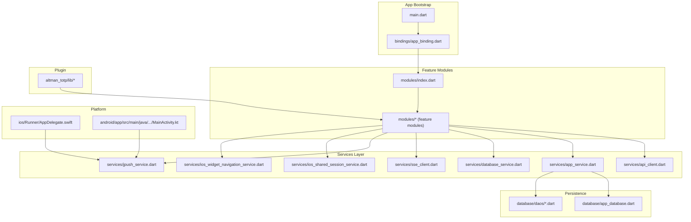

**Diagram sources**
- [main.dart](file://lib/main.dart)
- [app_binding.dart](file://lib/bindings/app_binding.dart)
- [index.dart](file://lib/modules/index.dart)
- [api_client.dart](file://lib/services/api_client.dart)
- [app_service.dart](file://lib/services/app_service.dart)
- [database_service.dart](file://lib/services/database_service.dart)
- [sse_client.dart](file://lib/services/sse_client.dart)
- [jpush_service.dart](file://lib/services/jpush_service.dart)
- [ios_shared_session_service.dart](file://lib/services/ios_shared_session_service.dart)
- [ios_widget_navigation_service.dart](file://lib/services/ios_widget_navigation_service.dart)
- [app_database.dart](file://lib/database/app_database.dart)
- [login_profile_dao.dart](file://lib/database/daos/login_profile_dao.dart)
- [AppDelegate.swift](file://ios/Runner/AppDelegate.swift)
- [MainActivity.kt](file://android/app/src/main/java/com/example/moviepilot_mobile/MainActivity.kt)
- [totp_service.dart](file://altman_totp/lib/services/totp_service.dart)

**Section sources**
- [main.dart](file://lib/main.dart)
- [app_binding.dart](file://lib/bindings/app_binding.dart)
- [index.dart](file://lib/modules/index.dart)

## Core Components
- MVVM with GetX: Controllers act as ViewModels, managing UI state and coordinating with Services and Repositories. Views bind to controller state via reactive bindings.
- Dependency Injection: Global bindings initialize services and repositories, enabling loose coupling and testability.
- Modular Design: Feature modules encapsulate domain logic, pages, and resources, promoting separation of concerns.
- Cross-Platform Abstraction: Services isolate platform-specific integrations (networking, push, iOS widgets), while DAOs abstract persistence.

Key implementation anchors:
- Application bootstrap and DI: [main.dart](file://lib/main.dart), [app_binding.dart](file://lib/bindings/app_binding.dart)
- Middleware for routing permissions: [route_permission_middleware.dart](file://lib/middlewares/route_permission_middleware.dart)
- Feature module registry: [index.dart](file://lib/modules/index.dart)
- Services layer: [api_client.dart](file://lib/services/api_client.dart), [app_service.dart](file://lib/services/app_service.dart), [database_service.dart](file://lib/services/database_service.dart), [jpush_service.dart](file://lib/services/jpush_service.dart), [sse_client.dart](file://lib/services/sse_client.dart), [ios_shared_session_service.dart](file://lib/services/ios_shared_session_service.dart), [ios_widget_navigation_service.dart](file://lib/services/ios_widget_navigation_service.dart)
- Persistence DAOs: [login_profile_dao.dart](file://lib/database/daos/login_profile_dao.dart), [media_detail_cache_dao.dart](file://lib/database/daos/media_detail_cache_dao.dart), [plugin_cache_dao.dart](file://lib/database/daos/plugin_cache_dao.dart), [plugin_palette_dao.dart](file://lib/database/daos/plugin_palette_dao.dart), [search_history_dao.dart](file://lib/database/daos/search_history_dao.dart), [app_database.dart](file://lib/database/app_database.dart)
- Platform entrypoints: [AppDelegate.swift](file://ios/Runner/AppDelegate.swift), [MainActivity.kt](file://android/app/src/main/java/com/example/moviepilot_mobile/MainActivity.kt)
- TOTP plugin: [totp_service.dart](file://altman_totp/lib/services/totp_service.dart), [totp_manage_page.dart](file://altman_totp/lib/page/totp_manage_page.dart), [totp_scan_page.dart](file://altman_totp/lib/page/totp_scan_page.dart), [totp_db.dart](file://altman_totp/lib/data/totp_db.dart), [totp_edit_sheet.dart](file://altman_totp/lib/widget/totp_edit_sheet.dart)

**Section sources**
- [main.dart](file://lib/main.dart)
- [app_binding.dart](file://lib/bindings/app_binding.dart)
- [route_permission_middleware.dart](file://lib/middlewares/route_permission_middleware.dart)
- [index.dart](file://lib/modules/index.dart)
- [api_client.dart](file://lib/services/api_client.dart)
- [app_service.dart](file://lib/services/app_service.dart)
- [database_service.dart](file://lib/services/database_service.dart)
- [jpush_service.dart](file://lib/services/jpush_service.dart)
- [sse_client.dart](file://lib/services/sse_client.dart)
- [ios_shared_session_service.dart](file://lib/services/ios_shared_session_service.dart)
- [ios_widget_navigation_service.dart](file://lib/services/ios_widget_navigation_service.dart)
- [login_profile_dao.dart](file://lib/database/daos/login_profile_dao.dart)
- [media_detail_cache_dao.dart](file://lib/database/daos/media_detail_cache_dao.dart)
- [plugin_cache_dao.dart](file://lib/database/daos/plugin_cache_dao.dart)
- [plugin_palette_dao.dart](file://lib/database/daos/plugin_palette_dao.dart)
- [search_history_dao.dart](file://lib/database/daos/search_history_dao.dart)
- [app_database.dart](file://lib/database/app_database.dart)
- [AppDelegate.swift](file://ios/Runner/AppDelegate.swift)
- [MainActivity.kt](file://android/app/src/main/java/com/example/moviepilot_mobile/MainActivity.kt)
- [totp_service.dart](file://altman_totp/lib/services/totp_service.dart)
- [totp_manage_page.dart](file://altman_totp/lib/page/totp_manage_page.dart)
- [totp_scan_page.dart](file://altman_totp/lib/page/totp_scan_page.dart)
- [totp_db.dart](file://altman_totp/lib/data/totp_db.dart)
- [totp_edit_sheet.dart](file://altman_totp/lib/widget/totp_edit_sheet.dart)

## Architecture Overview
The system employs a layered architecture:
- Presentation Layer: Pages and widgets bound to controllers via GetX reactive state
- Domain Layer: Controllers orchestrate business logic and coordinate Services/Repositories
- Service Layer: Encapsulates external integrations (REST, SSE, push, iOS-specific)
- Persistence Layer: DAOs manage local caching and offline data
- Platform Layer: iOS and Android native entrypoints integrate with system services

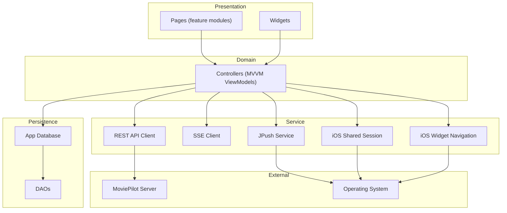

**Diagram sources**
- [api_client.dart](file://lib/services/api_client.dart)
- [sse_client.dart](file://lib/services/sse_client.dart)
- [jpush_service.dart](file://lib/services/jpush_service.dart)
- [ios_shared_session_service.dart](file://lib/services/ios_shared_session_service.dart)
- [ios_widget_navigation_service.dart](file://lib/services/ios_widget_navigation_service.dart)
- [app_database.dart](file://lib/database/app_database.dart)
- [login_profile_dao.dart](file://lib/database/daos/login_profile_dao.dart)

## Detailed Component Analysis

### MVVM Implementation with GetX
- Controllers (ViewModels): Manage UI state and business logic for each screen/module
- Reactive Bindings: Views observe controller state changes
- Services Integration: Controllers call services for data fetching and side effects
- Example anchors:
  - Dashboard controller: [dashboard_controller.dart](file://lib/modules/dashboard/controllers/dashboard_controller.dart)
  - Cache controller: [cache_controller.dart](file://lib/modules/cache/controllers/cache_controller.dart)

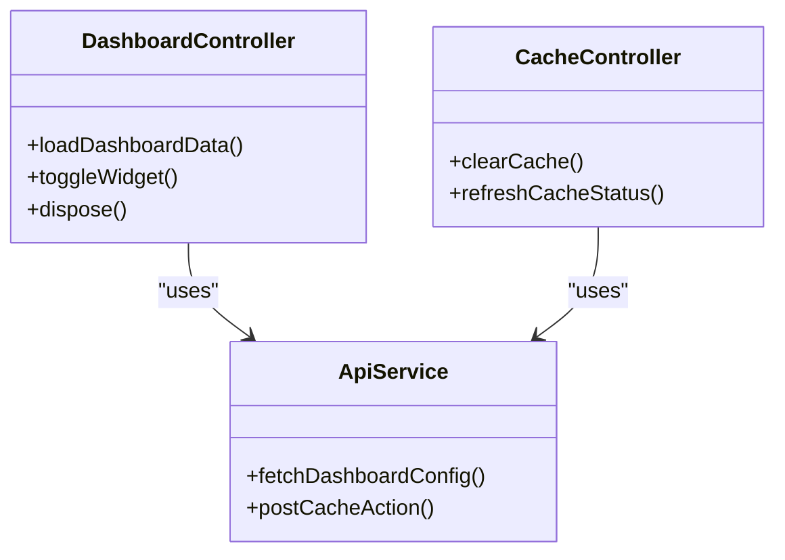

**Diagram sources**
- [dashboard_controller.dart](file://lib/modules/dashboard/controllers/dashboard_controller.dart)
- [cache_controller.dart](file://lib/modules/cache/controllers/cache_controller.dart)
- [api_client.dart](file://lib/services/api_client.dart)

**Section sources**
- [dashboard_controller.dart](file://lib/modules/dashboard/controllers/dashboard_controller.dart)
- [cache_controller.dart](file://lib/modules/cache/controllers/cache_controller.dart)

### GetX State Management and Dependency Injection
- Global bindings initialize services and repositories at startup
- Controllers access injected instances via GetX’s binding mechanism
- Example anchors:
  - App binding: [app_binding.dart](file://lib/bindings/app_binding.dart)
  - Main entrypoint: [main.dart](file://lib/main.dart)

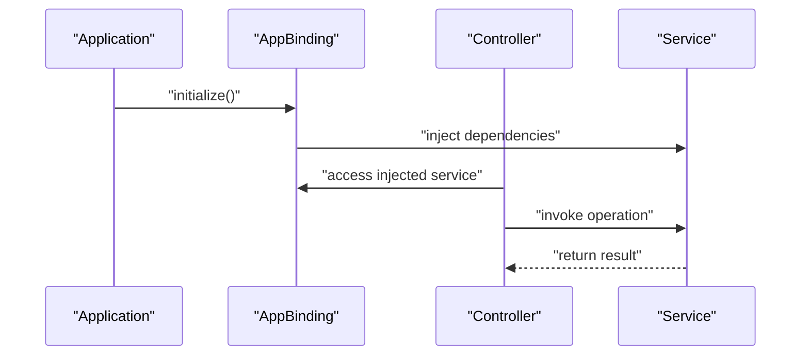

**Diagram sources**
- [app_binding.dart](file://lib/bindings/app_binding.dart)
- [main.dart](file://lib/main.dart)

**Section sources**
- [app_binding.dart](file://lib/bindings/app_binding.dart)
- [main.dart](file://lib/main.dart)

### Modular Design Approach
- Feature modules encapsulate related controllers, models, pages, services, and widgets
- Module registry centralizes module discovery and navigation
- Example anchors:
  - Module index: [index.dart](file://lib/modules/index.dart)
  - Download module: [download_module.dart](file://lib/modules/download/download_module.dart)
  - Setting module: [setting_module.dart](file://lib/modules/setting/setting_module.dart)

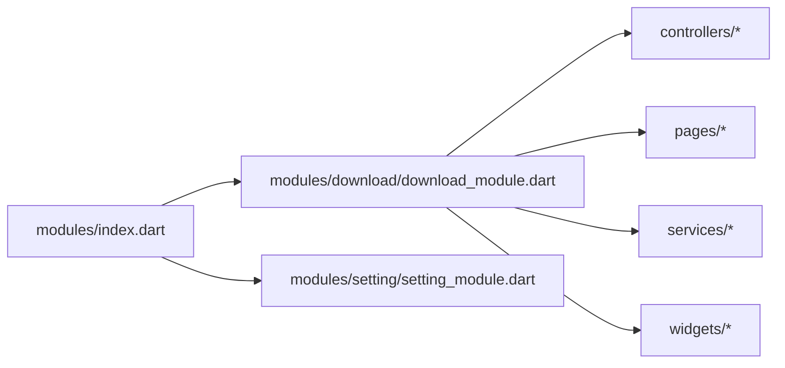

**Diagram sources**
- [index.dart](file://lib/modules/index.dart)
- [download_module.dart](file://lib/modules/download/download_module.dart)
- [setting_module.dart](file://lib/modules/setting/setting_module.dart)

**Section sources**
- [index.dart](file://lib/modules/index.dart)
- [download_module.dart](file://lib/modules/download/download_module.dart)
- [setting_module.dart](file://lib/modules/setting/setting_module.dart)

### Cross-Platform Abstraction Layers
- Platform entrypoints:
  - iOS: [AppDelegate.swift](file://ios/Runner/AppDelegate.swift)
  - Android: [MainActivity.kt](file://android/app/src/main/java/com/example/moviepilot_mobile/MainActivity.kt)
- iOS-specific services:
  - Shared session: [ios_shared_session_service.dart](file://lib/services/ios_shared_session_service.dart)
  - Widget navigation: [ios_widget_navigation_service.dart](file://lib/services/ios_widget_navigation_service.dart)
- Push notifications:
  - JPush service: [jpush_service.dart](file://lib/services/jpush_service.dart)

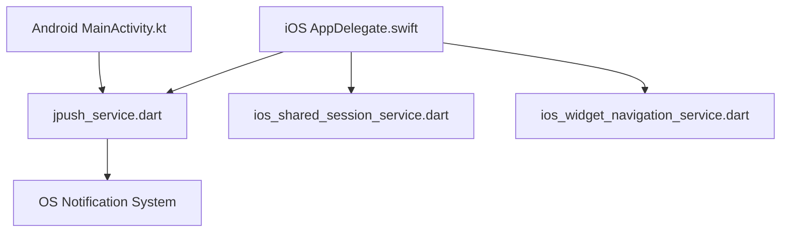

**Diagram sources**
- [AppDelegate.swift](file://ios/Runner/AppDelegate.swift)
- [MainActivity.kt](file://android/app/src/main/java/com/example/moviepilot_mobile/MainActivity.kt)
- [jpush_service.dart](file://lib/services/jpush_service.dart)
- [ios_shared_session_service.dart](file://lib/services/ios_shared_session_service.dart)
- [ios_widget_navigation_service.dart](file://lib/services/ios_widget_navigation_service.dart)

**Section sources**
- [AppDelegate.swift](file://ios/Runner/AppDelegate.swift)
- [MainActivity.kt](file://android/app/src/main/java/com/example/moviepilot_mobile/MainActivity.kt)
- [jpush_service.dart](file://lib/services/jpush_service.dart)
- [ios_shared_session_service.dart](file://lib/services/ios_shared_session_service.dart)
- [ios_widget_navigation_service.dart](file://lib/services/ios_widget_navigation_service.dart)

### Plugin Architecture
- TOTP plugin as a separate package with its own services, pages, data, and widgets
- Integrates with the main app via module boundaries and shared models
- Example anchors:
  - TOTP service: [totp_service.dart](file://altman_totp/lib/services/totp_service.dart)
  - TOTP manage page: [totp_manage_page.dart](file://altman_totp/lib/page/totp_manage_page.dart)
  - TOTP scan page: [totp_scan_page.dart](file://altman_totp/lib/page/totp_scan_page.dart)
  - TOTP DB: [totp_db.dart](file://altman_totp/lib/data/totp_db.dart)
  - TOTP edit sheet: [totp_edit_sheet.dart](file://altman_totp/lib/widget/totp_edit_sheet.dart)

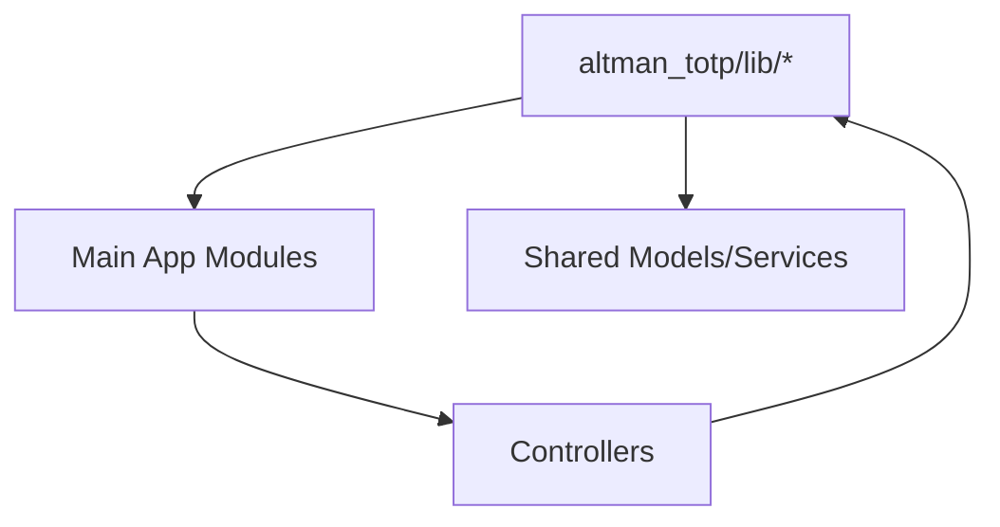

**Diagram sources**
- [totp_service.dart](file://altman_totp/lib/services/totp_service.dart)
- [totp_manage_page.dart](file://altman_totp/lib/page/totp_manage_page.dart)
- [totp_scan_page.dart](file://altman_totp/lib/page/totp_scan_page.dart)
- [totp_db.dart](file://altman_totp/lib/data/totp_db.dart)
- [totp_edit_sheet.dart](file://altman_totp/lib/widget/totp_edit_sheet.dart)

**Section sources**
- [totp_service.dart](file://altman_totp/lib/services/totp_service.dart)
- [totp_manage_page.dart](file://altman_totp/lib/page/totp_manage_page.dart)
- [totp_scan_page.dart](file://altman_totp/lib/page/totp_scan_page.dart)
- [totp_db.dart](file://altman_totp/lib/data/totp_db.dart)
- [totp_edit_sheet.dart](file://altman_totp/lib/widget/totp_edit_sheet.dart)

### Middleware System
- Route permission middleware enforces access control for routes
- Integrates with routing and navigation layers
- Example anchor:
  - [route_permission_middleware.dart](file://lib/middlewares/route_permission_middleware.dart)

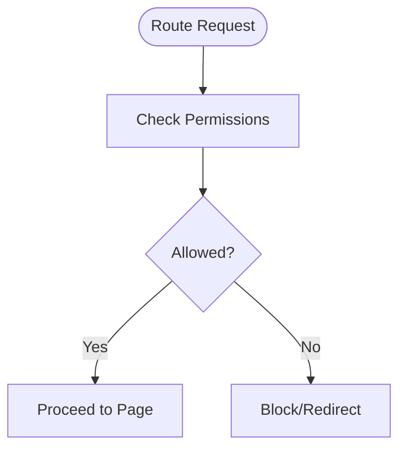

**Diagram sources**
- [route_permission_middleware.dart](file://lib/middlewares/route_permission_middleware.dart)

**Section sources**
- [route_permission_middleware.dart](file://lib/middlewares/route_permission_middleware.dart)

### Service Layer Organization
- REST client: [api_client.dart](file://lib/services/api_client.dart)
- App service: [app_service.dart](file://lib/services/app_service.dart)
- Database service: [database_service.dart](file://lib/services/database_service.dart)
- SSE client: [sse_client.dart](file://lib/services/sse_client.dart)
- Push notification service: [jpush_service.dart](file://lib/services/jpush_service.dart)
- iOS-specific services: [ios_shared_session_service.dart](file://lib/services/ios_shared_session_service.dart), [ios_widget_navigation_service.dart](file://lib/services/ios_widget_navigation_service.dart)

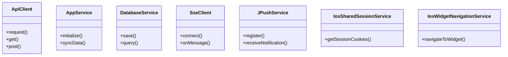

**Diagram sources**
- [api_client.dart](file://lib/services/api_client.dart)
- [app_service.dart](file://lib/services/app_service.dart)
- [database_service.dart](file://lib/services/database_service.dart)
- [sse_client.dart](file://lib/services/sse_client.dart)
- [jpush_service.dart](file://lib/services/jpush_service.dart)
- [ios_shared_session_service.dart](file://lib/services/ios_shared_session_service.dart)
- [ios_widget_navigation_service.dart](file://lib/services/ios_widget_navigation_service.dart)

**Section sources**
- [api_client.dart](file://lib/services/api_client.dart)
- [app_service.dart](file://lib/services/app_service.dart)
- [database_service.dart](file://lib/services/database_service.dart)
- [sse_client.dart](file://lib/services/sse_client.dart)
- [jpush_service.dart](file://lib/services/jpush_service.dart)
- [ios_shared_session_service.dart](file://lib/services/ios_shared_session_service.dart)
- [ios_widget_navigation_service.dart](file://lib/services/ios_widget_navigation_service.dart)

### Data Flow Patterns and Persistence
- DAOs encapsulate local caching and offline-first strategies
- App service coordinates between remote APIs and local caches
- Example anchors:
  - Login profile DAO: [login_profile_dao.dart](file://lib/database/daos/login_profile_dao.dart)
  - Media detail cache DAO: [media_detail_cache_dao.dart](file://lib/database/daos/media_detail_cache_dao.dart)
  - Plugin cache DAO: [plugin_cache_dao.dart](file://lib/database/daos/plugin_cache_dao.dart)
  - Plugin palette DAO: [plugin_palette_dao.dart](file://lib/database/daos/plugin_palette_dao.dart)
  - Search history DAO: [search_history_dao.dart](file://lib/database/daos/search_history_dao.dart)
  - App database: [app_database.dart](file://lib/database/app_database.dart)

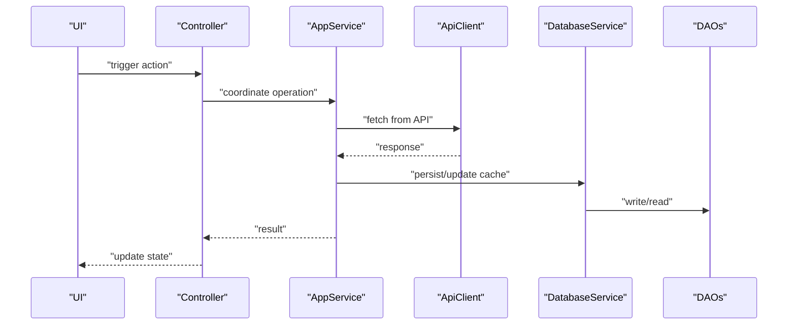

**Diagram sources**
- [app_service.dart](file://lib/services/app_service.dart)
- [api_client.dart](file://lib/services/api_client.dart)
- [database_service.dart](file://lib/services/database_service.dart)
- [login_profile_dao.dart](file://lib/database/daos/login_profile_dao.dart)
- [media_detail_cache_dao.dart](file://lib/database/daos/media_detail_cache_dao.dart)
- [plugin_cache_dao.dart](file://lib/database/daos/plugin_cache_dao.dart)
- [plugin_palette_dao.dart](file://lib/database/daos/plugin_palette_dao.dart)
- [search_history_dao.dart](file://lib/database/daos/search_history_dao.dart)
- [app_database.dart](file://lib/database/app_database.dart)

**Section sources**
- [app_service.dart](file://lib/services/app_service.dart)
- [api_client.dart](file://lib/services/api_client.dart)
- [database_service.dart](file://lib/services/database_service.dart)
- [login_profile_dao.dart](file://lib/database/daos/login_profile_dao.dart)
- [media_detail_cache_dao.dart](file://lib/database/daos/media_detail_cache_dao.dart)
- [plugin_cache_dao.dart](file://lib/database/daos/plugin_cache_dao.dart)
- [plugin_palette_dao.dart](file://lib/database/daos/plugin_palette_dao.dart)
- [search_history_dao.dart](file://lib/database/daos/search_history_dao.dart)
- [app_database.dart](file://lib/database/app_database.dart)

### Integration Points with External Services
- MoviePilot server: REST APIs via [api_client.dart](file://lib/services/api_client.dart)
- Push notifications: JPush via [jpush_service.dart](file://lib/services/jpush_service.dart)
- Two-factor authentication: TOTP plugin via [totp_service.dart](file://altman_totp/lib/services/totp_service.dart)
- SSE streaming: [sse_client.dart](file://lib/services/sse_client.dart)

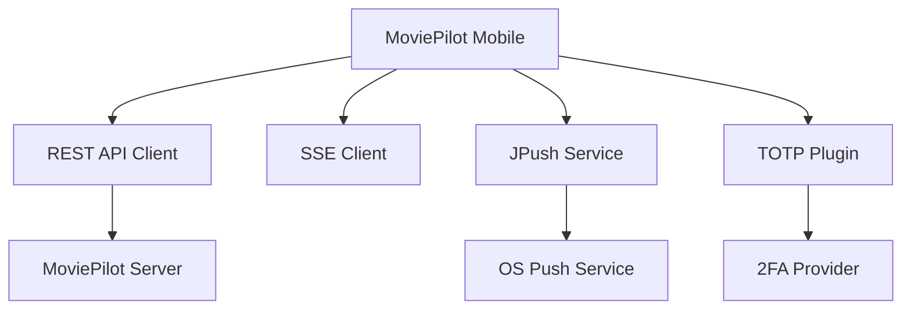

**Diagram sources**
- [api_client.dart](file://lib/services/api_client.dart)
- [sse_client.dart](file://lib/services/sse_client.dart)
- [jpush_service.dart](file://lib/services/jpush_service.dart)
- [totp_service.dart](file://altman_totp/lib/services/totp_service.dart)

**Section sources**
- [api_client.dart](file://lib/services/api_client.dart)
- [sse_client.dart](file://lib/services/sse_client.dart)
- [jpush_service.dart](file://lib/services/jpush_service.dart)
- [totp_service.dart](file://altman_totp/lib/services/totp_service.dart)

## Dependency Analysis
- Coupling: Controllers depend on Services and Repositories; Services depend on platform integrations and external APIs
- Cohesion: Each module encapsulates a bounded context; DAOs isolate persistence concerns
- External dependencies: iOS pods, Android Gradle plugins, Dart packages declared in [pubspec.yaml](file://pubspec.yaml)
- Platform dependencies: iOS podfile [Podfile](file://ios/Podfile)

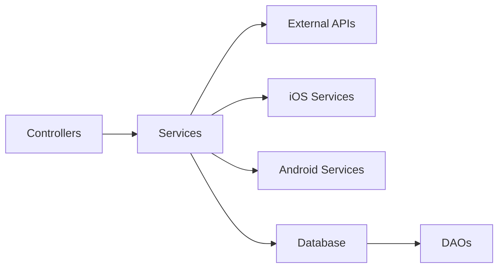

**Diagram sources**
- [api_client.dart](file://lib/services/api_client.dart)
- [app_service.dart](file://lib/services/app_service.dart)
- [database_service.dart](file://lib/services/database_service.dart)
- [jpush_service.dart](file://lib/services/jpush_service.dart)
- [ios_shared_session_service.dart](file://lib/services/ios_shared_session_service.dart)
- [ios_widget_navigation_service.dart](file://lib/services/ios_widget_navigation_service.dart)
- [app_database.dart](file://lib/database/app_database.dart)
- [login_profile_dao.dart](file://lib/database/daos/login_profile_dao.dart)

**Section sources**
- [pubspec.yaml](file://pubspec.yaml)
- [Podfile](file://ios/Podfile)

## Performance Considerations
- Reactive UI updates minimize unnecessary rebuilds; leverage GetX’s selective listening
- Offline-first caching reduces network latency; DAOs support efficient reads/writes
- SSE streaming enables real-time updates; ensure proper connection lifecycle management
- Push notifications should be registered conditionally and scoped to user preferences
- Avoid tight coupling between modules to maintain scalability and testability

## Troubleshooting Guide
- Logging: Centralized logging via [app_log.dart](file://lib/applog/app_log.dart)
- Undefined page fallback: [undefined_page.dart](file://lib/pages/undefined_page.dart)
- Network errors: Inspect [api_client.dart](file://lib/services/api_client.dart) and server connectivity
- Push registration: Verify [jpush_service.dart](file://lib/services/jpush_service.dart) initialization and platform entitlements
- TOTP issues: Review [totp_service.dart](file://altman_totp/lib/services/totp_service.dart) and device security settings

**Section sources**
- [app_log.dart](file://lib/applog/app_log.dart)
- [undefined_page.dart](file://lib/pages/undefined_page.dart)
- [api_client.dart](file://lib/services/api_client.dart)
- [jpush_service.dart](file://lib/services/jpush_service.dart)
- [totp_service.dart](file://altman_totp/lib/services/totp_service.dart)

## Conclusion
MoviePilot Mobile adopts a clean, modular architecture leveraging MVVM with GetX for state management and DI, a robust service layer for cross-platform integrations, and DAO-driven persistence. The system’s boundaries clearly separate presentation, domain, service, and persistence concerns, while the plugin architecture and middleware system enable extensibility and controlled access. These design choices align with cross-platform constraints and deliver a scalable foundation for ongoing feature development.