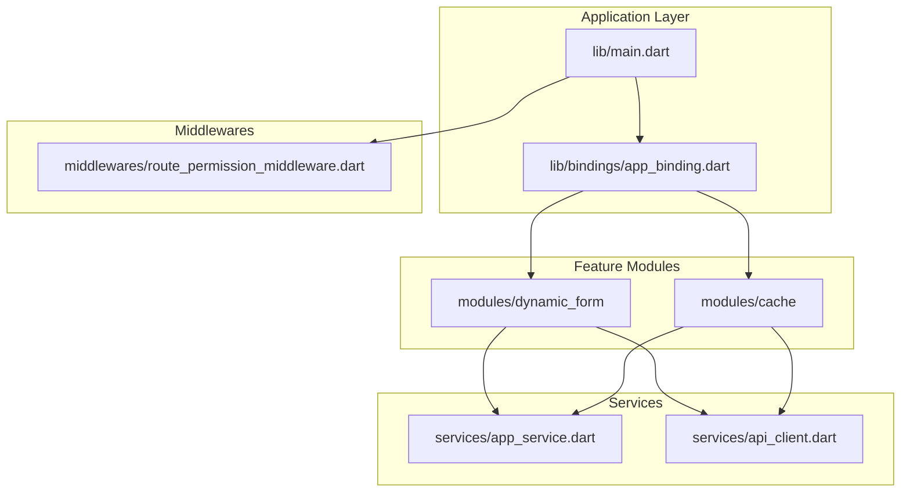
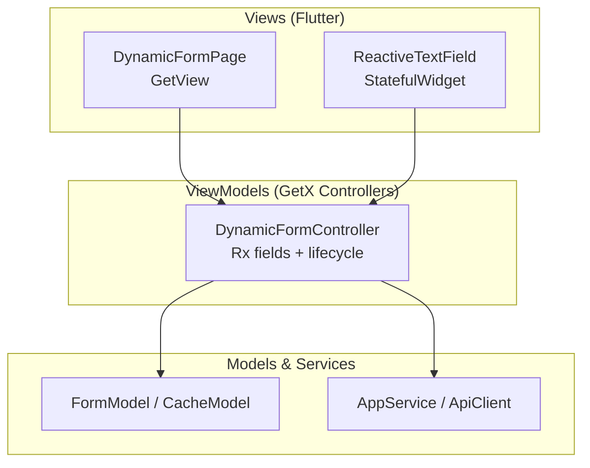
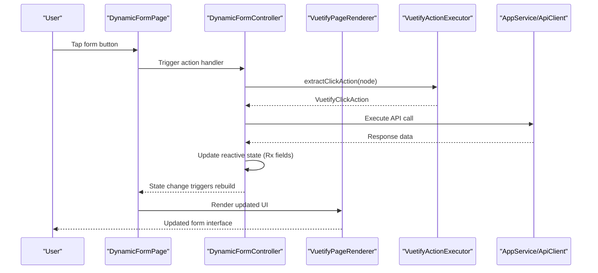
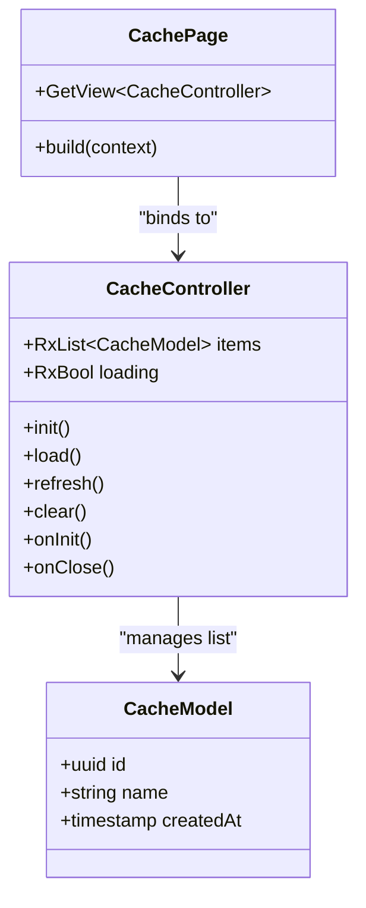
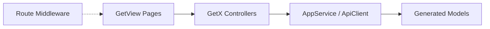

# MVVM Pattern Implementation

<cite>
**Referenced Files in This Document**
- [main.dart](file://lib/main.dart)
- [app_binding.dart](file://lib/bindings/app_binding.dart)
- [dynamic_form_controller.dart](file://lib/modules/dynamic_form/controllers/dynamic_form_controller.dart)
- [dynamic_form_page.dart](file://lib/modules/dynamic_form/pages/dynamic_form_page.dart)
- [reactive_text_field.dart](file://lib/modules/downloader/widgets/reactive_text_field.dart)
- [vuetify_renderer.dart](file://lib/modules/dynamic_form/widgets/vuetify_renderer.dart)
- [vuetify_actions.dart](file://lib/modules/dynamic_form/utils/vuetify_actions.dart)
- [cache_controller.dart](file://lib/modules/cache/controllers/cache_controller.dart)
- [cache_page.dart](file://lib/modules/cache/pages/cache_page.dart)
- [route_permission_middleware.dart](file://lib/middlewares/route_permission_middleware.dart)
- [app_service.dart](file://lib/services/app_service.dart)
- [api_client.dart](file://lib/services/api_client.dart)
</cite>

## Table of Contents
1. [Introduction](#introduction)
2. [Project Structure](#project-structure)
3. [Core Components](#core-components)
4. [Architecture Overview](#architecture-overview)
5. [Detailed Component Analysis](#detailed-component-analysis)
6. [Dependency Analysis](#dependency-analysis)
7. [Performance Considerations](#performance-considerations)
8. [Troubleshooting Guide](#troubleshooting-guide)
9. [Conclusion](#conclusion)

## Introduction
This document explains how MoviePilot Mobile implements the MVVM (Model-View-ViewModel) pattern using Flutter and the GetX framework for reactive state management. The application separates UI views from business logic controllers, enabling testability, maintainability, and clear separation of concerns. Controllers act as ViewModels, managing reactive state via GetX's Rx primitives and lifecycle hooks. Views bind to reactive data using GetView and Obx widgets, ensuring automatic UI updates when state changes.

## Project Structure
The application follows a modular structure with distinct layers:
- lib/main.dart: Application entry point and global initialization
- lib/bindings/app_binding.dart: Global dependency injection and controller binding
- lib/modules/: Feature-based modules containing pages, controllers, models, and widgets
- lib/services/: Business services and API clients
- lib/middlewares/: Route guards and middleware for navigation control
- lib/widgets/: Reusable UI components and reactive widgets

**Diagram sources**
- [main.dart](file://lib/main.dart)
- [app_binding.dart](file://lib/bindings/app_binding.dart)
- [dynamic_form_controller.dart](file://lib/modules/dynamic_form/controllers/dynamic_form_controller.dart)
- [cache_controller.dart](file://lib/modules/cache/controllers/cache_controller.dart)
- [app_service.dart](file://lib/services/app_service.dart)
- [api_client.dart](file://lib/services/api_client.dart)
- [route_permission_middleware.dart](file://lib/middlewares/route_permission_middleware.dart)

**Section sources**
- [main.dart](file://lib/main.dart)
- [app_binding.dart](file://lib/bindings/app_binding.dart)

## Core Components
- Controllers as ViewModels: Manage reactive state, orchestrate business logic, and expose observable properties for UI binding. Examples include DynamicFormController and CacheController.
- GetView-based Views: Pages extending GetView<ControllerType> receive injected controllers and bind to reactive state using Obx.
- Reactive Widgets: Custom widgets like ReactiveTextField demonstrate two-way binding with RxString for real-time UI updates.
- Services and Models: AppService and ApiClient encapsulate business logic and network operations; models are generated via freezed and json_serializable.
- Dependency Injection: app_binding.dart registers controllers and services globally using Get.lazyPut and Get.put.

Key implementation patterns:
- Reactive state: Rx<T> fields for observables (e.g., RxBool, RxList, RxMap)
- Lifecycle: onInit(), onReady(), onClose() hooks for initialization and cleanup
- Binding: Get.find<T>() to locate controllers and Get.put<T>() for registration
- Navigation: Get.offAllNamed() and Get.back() for route transitions

**Section sources**
- [dynamic_form_controller.dart](file://lib/modules/dynamic_form/controllers/dynamic_form_controller.dart)
- [dynamic_form_page.dart](file://lib/modules/dynamic_form/pages/dynamic_form_page.dart)
- [reactive_text_field.dart](file://lib/modules/downloader/widgets/reactive_text_field.dart)
- [cache_controller.dart](file://lib/modules/cache/controllers/cache_controller.dart)
- [cache_page.dart](file://lib/modules/cache/pages/cache_page.dart)
- [app_binding.dart](file://lib/bindings/app_binding.dart)

## Architecture Overview
The MVVM architecture integrates Flutter widgets as Views, GetX controllers as ViewModels, and services/models as Model. GetView pages bind to controller state, while reactive widgets update automatically when Rx values change.

**Diagram sources**
- [dynamic_form_page.dart](file://lib/modules/dynamic_form/pages/dynamic_form_page.dart)
- [dynamic_form_controller.dart](file://lib/modules/dynamic_form/controllers/dynamic_form_controller.dart)
- [reactive_text_field.dart](file://lib/modules/downloader/widgets/reactive_text_field.dart)
- [app_service.dart](file://lib/services/app_service.dart)
- [api_client.dart](file://lib/services/api_client.dart)

## Detailed Component Analysis

### Dynamic Form Module (MVVM Example)
This module exemplifies MVVM with GetX:
- ViewModel: DynamicFormController manages reactive form state, loading, and action execution
- View: DynamicFormPage binds to controller using GetView and renders dynamic form nodes
- Reactive Widgets: VuetifyPageRenderer builds UI from FormNode structures and integrates with controller actions
- Actions: VuetifyActionExecutor extracts API actions from form events and executes them via services

**Diagram sources**
- [dynamic_form_page.dart](file://lib/modules/dynamic_form/pages/dynamic_form_page.dart)
- [dynamic_form_controller.dart](file://lib/modules/dynamic_form/controllers/dynamic_form_controller.dart)
- [vuetify_renderer.dart](file://lib/modules/dynamic_form/widgets/vuetify_renderer.dart)
- [vuetify_actions.dart](file://lib/modules/dynamic_form/utils/vuetify_actions.dart)
- [app_service.dart](file://lib/services/app_service.dart)
- [api_client.dart](file://lib/services/api_client.dart)

Implementation highlights:
- Reactive state management: The controller exposes Rx fields for UI binding and updates them after API responses
- Lifecycle handling: onReady() initializes data loading; onInit()/onClose() manage resources
- Two-way binding: ReactiveTextField synchronizes TextEditingController with RxString
- Dynamic rendering: VuetifyPageRenderer converts structured FormNode trees into Flutter widgets

**Section sources**
- [dynamic_form_controller.dart](file://lib/modules/dynamic_form/controllers/dynamic_form_controller.dart)
- [dynamic_form_page.dart](file://lib/modules/dynamic_form/pages/dynamic_form_page.dart)
- [reactive_text_field.dart](file://lib/modules/downloader/widgets/reactive_text_field.dart)
- [vuetify_renderer.dart](file://lib/modules/dynamic_form/widgets/vuetify_renderer.dart)
- [vuetify_actions.dart](file://lib/modules/dynamic_form/utils/vuetify_actions.dart)

### Cache Module (MVVM Example)
The cache module demonstrates similar MVVM patterns:
- ViewModel: CacheController manages reactive cache-related state and operations
- View: CachePage binds to controller using GetView and displays cache data
- Services: AppService and ApiClient handle backend interactions; models represent cache entries

**Diagram sources**
- [cache_controller.dart](file://lib/modules/cache/controllers/cache_controller.dart)
- [cache_page.dart](file://lib/modules/cache/pages/cache_page.dart)

**Section sources**
- [cache_controller.dart](file://lib/modules/cache/controllers/cache_controller.dart)
- [cache_page.dart](file://lib/modules/cache/pages/cache_page.dart)

### Reactive Data Binding Patterns
- GetView binding: Pages extend GetView<ControllerType> and access controller via Get.find() or override getter
- Obx/Builder: Reactive widgets rebuild when Rx fields change; used implicitly by GetView and explicitly in custom widgets
- Two-way binding: ReactiveTextField maintains synchronization between TextEditingController and RxString
- Conditional rendering: UI adapts based on reactive booleans (e.g., loading states)

**Section sources**
- [dynamic_form_page.dart](file://lib/modules/dynamic_form/pages/dynamic_form_page.dart)
- [reactive_text_field.dart](file://lib/modules/downloader/widgets/reactive_text_field.dart)

### Controller Lifecycle Management
Controllers implement lifecycle hooks:
- onInit(): Initialize Rx fields and subscriptions
- onReady(): Perform async initialization (e.g., loading data)
- onClose(): Dispose resources and cancel subscriptions

These hooks ensure proper resource management and predictable initialization order.

**Section sources**
- [dynamic_form_controller.dart](file://lib/modules/dynamic_form/controllers/dynamic_form_controller.dart)
- [cache_controller.dart](file://lib/modules/cache/controllers/cache_controller.dart)

### Dependency Injection and Separation of Concerns
- Global DI: app_binding.dart registers controllers and services using Get.lazyPut and Get.put
- Loose coupling: Views depend on interfaces (GetView) rather than concrete implementations
- Service isolation: AppService and ApiClient encapsulate business logic and network operations
- Middleware: route_permission_middleware.dart enforces navigation policies without mixing with business logic

**Section sources**
- [app_binding.dart](file://lib/bindings/app_binding.dart)
- [route_permission_middleware.dart](file://lib/middlewares/route_permission_middleware.dart)
- [app_service.dart](file://lib/services/app_service.dart)
- [api_client.dart](file://lib/services/api_client.dart)

## Dependency Analysis
The application exhibits low coupling and high cohesion:
- Views depend on controllers via GetView abstraction
- Controllers depend on services for business logic
- Services depend on models for data representation
- Middlewares enforce cross-cutting concerns without touching business logic

**Diagram sources**
- [dynamic_form_page.dart](file://lib/modules/dynamic_form/pages/dynamic_form_page.dart)
- [cache_page.dart](file://lib/modules/cache/pages/cache_page.dart)
- [dynamic_form_controller.dart](file://lib/modules/dynamic_form/controllers/dynamic_form_controller.dart)
- [cache_controller.dart](file://lib/modules/cache/controllers/cache_controller.dart)
- [app_service.dart](file://lib/services/app_service.dart)
- [api_client.dart](file://lib/services/api_client.dart)
- [route_permission_middleware.dart](file://lib/middlewares/route_permission_middleware.dart)

**Section sources**
- [dynamic_form_page.dart](file://lib/modules/dynamic_form/pages/dynamic_form_page.dart)
- [cache_page.dart](file://lib/modules/cache/pages/cache_page.dart)
- [app_binding.dart](file://lib/bindings/app_binding.dart)

## Performance Considerations
- Reactive granularity: Prefer fine-grained Rx fields to minimize unnecessary rebuilds
- Lazy loading: Use Get.lazyPut for controllers to defer instantiation until needed
- Efficient rendering: VuetifyPageRenderer uses ListView.builder for scalable form rendering
- Resource cleanup: Implement onClose() to dispose subscriptions and controllers
- Network caching: Leverage services to avoid redundant API calls

## Troubleshooting Guide
Common issues and resolutions:
- Controller not found: Ensure controller is registered in app_binding.dart and accessed via Get.find() with correct tag
- UI not updating: Verify reactive fields are properly declared as Rx<T> and updated within controller lifecycle
- Memory leaks: Implement onClose() to dispose resources and cancel subscriptions
- Navigation errors: Confirm route middleware permissions and correct route names

**Section sources**
- [app_binding.dart](file://lib/bindings/app_binding.dart)
- [dynamic_form_controller.dart](file://lib/modules/dynamic_form/controllers/dynamic_form_controller.dart)
- [route_permission_middleware.dart](file://lib/middlewares/route_permission_middleware.dart)

## Conclusion
MoviePilot Mobile successfully applies MVVM with GetX to achieve clean separation of concerns, reactive UI updates, and maintainable code. Controllers serve as ViewModels, managing state and business logic while views remain declarative and testable. The modular structure, combined with dependency injection and middleware, supports scalability and robustness across features like dynamic forms and caching.