# Configuration & Customization

<cite>
**Referenced Files in This Document**
- [main.dart](file://lib/main.dart)
- [pubspec.yaml](file://pubspec.yaml)
- [l10n.yaml](file://l10n.yaml)
- [app_en.arb](file://lib/l10n/app_en.arb)
- [app_zh.arb](file://lib/l10n/app_zh.arb)
- [app_localizations.dart](file://lib/l10n/app_localizations.dart)
- [app_theme.dart](file://lib/theme/app_theme.dart)
- [environment.toml](file://.codex/environments/environment.toml)
- [settings_config.dart](file://lib/modules/settings/models/settings_config.dart)
- [settings_advanced_config.dart](file://lib/modules/settings/models/settings_advanced_config.dart)
- [settings_basic_config.dart](file://lib/modules/settings/models/settings_basic_config.dart)
- [settings_organize_config.dart](file://lib/modules/settings/models/settings_organize_config.dart)
- [settings_search_download_config.dart](file://lib/modules/settings/models/settings_search_download_config.dart)
- [settings_site_options_config.dart](file://lib/modules/settings/models/settings_site_options_config.dart)
- [settings_site_sync_config.dart](file://lib/modules/settings/models/settings_site_sync_config.dart)
- [settings_controller.dart](file://lib/modules/settings/controllers/settings_controller.dart)
- [settings_advanced_list_controller.dart](file://lib/modules/settings/controllers/settings_advanced_list_controller.dart)
- [settings_advanced_detail_controller.dart](file://lib/modules/settings/controllers/settings_advanced_detail_controller.dart)
- [settings_basic_controller.dart](file://lib/modules/settings/controllers/settings_basic_controller.dart)
- [settings_organize_scrape_controller.dart](file://lib/modules/settings/controllers/settings_organize_scrape_controller.dart)
- [settings_search_download_controller.dart](file://lib/modules/settings/controllers/settings_search_download_controller.dart)
- [settings_site_options_controller.dart](file://lib/modules/settings/controllers/settings_site_options_controller.dart)
- [settings_site_sync_controller.dart](file://lib/modules/settings/controllers/settings_site_sync_controller.dart)
- [settings_sub_list_controller.dart](file://lib/modules/settings/controllers/settings_sub_list_controller.dart)
- [AndroidManifest.xml](file://android/app/src/main/AndroidManifest.xml)
- [styles.xml](file://android/app/src/main/res/values/styles.xml)
- [styles.xml (night)](file://android/app/src/main/res/values-night/styles.xml)
- [AppDelegate.swift](file://ios/Runner/AppDelegate.swift)
- [Info.plist](file://ios/Runner/Info.plist)
- [GeneratedPluginRegistrant.java](file://android/app/src/main/java/io/flutter/plugins/GeneratedPluginRegistrant.java)
- [GeneratedPluginRegistrant.h](file://ios/Runner/GeneratedPluginRegistrant.h)
- [GeneratedPluginRegistrant.m](file://ios/Runner/GeneratedPluginRegistrant.m)
- [flutter_export_environment.sh](file://ios/Flutter/flutter_export_environment.sh)
- [FlutterInputs.xcfilelist](file://macos/Runner/Configs/FlutterInputs.xcfilelist)
- [FlutterOutputs.xcfilelist](file://macos/Runner/Configs/FlutterOutputs.xcfilelist)
- [requirements.txt](file://requirements.txt)
</cite>

## Table of Contents
1. [Introduction](#introduction)
2. [Project Structure](#project-structure)
3. [Core Components](#core-components)
4. [Architecture Overview](#architecture-overview)
5. [Detailed Component Analysis](#detailed-component-analysis)
6. [Dependency Analysis](#dependency-analysis)
7. [Performance Considerations](#performance-considerations)
8. [Troubleshooting Guide](#troubleshooting-guide)
9. [Conclusion](#conclusion)
10. [Appendices](#appendices)

## Introduction
This document explains how MoviePilot Mobile manages configuration and customization. It covers environment configuration, feature flags, runtime configuration, localization and internationalization, theming and branding, UI personalization, environment-specific settings, validation, extension points, security considerations, sensitive data handling, and configuration migration strategies. The goal is to help developers and operators configure, extend, and maintain the application effectively across development and production environments.

## Project Structure
MoviePilot Mobile is a Flutter application with platform-specific integrations for Android and iOS, plus macOS support. Configuration surfaces appear in several places:
- Application bootstrap and environment wiring in the main entrypoint
- Localization resources and generation pipeline
- Theme and UI customization via a dedicated theme module
- Settings-driven configuration models and controllers for user-facing customization
- Platform manifests and Gradle/Xcode configuration for environment-specific builds
- Environment definition files for deployment orchestration

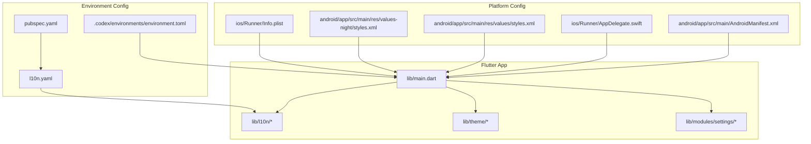

**Diagram sources**
- [main.dart](file://lib/main.dart)
- [l10n.yaml](file://l10n.yaml)
- [environment.toml](file://.codex/environments/environment.toml)
- [AndroidManifest.xml](file://android/app/src/main/AndroidManifest.xml)
- [styles.xml](file://android/app/src/main/res/values/styles.xml)
- [styles.xml (night)](file://android/app/src/main/res/values-night/styles.xml)
- [AppDelegate.swift](file://ios/Runner/AppDelegate.swift)
- [Info.plist](file://ios/Runner/Info.plist)

**Section sources**
- [main.dart](file://lib/main.dart)
- [pubspec.yaml](file://pubspec.yaml)
- [l10n.yaml](file://l10n.yaml)
- [environment.toml](file://.codex/environments/environment.toml)
- [AndroidManifest.xml](file://android/app/src/main/AndroidManifest.xml)
- [styles.xml](file://android/app/src/main/res/values/styles.xml)
- [styles.xml (night)](file://android/app/src/main/res/values-night/styles.xml)
- [AppDelegate.swift](file://ios/Runner/AppDelegate.swift)
- [Info.plist](file://ios/Runner/Info.plist)

## Core Components
- Environment configuration management: centralized via a TOML environment definition and integrated into the Flutter build/runtime via pubspec and platform manifests.
- Feature flags: exposed through settings models and controllers to enable/disable features at runtime.
- Runtime configuration: user-facing settings organized by functional areas (basic, advanced, organize, search/download, site sync/options).
- Localization and internationalization: ARB-backed translations with generated localization delegates and locale resolution.
- Theming and branding: a dedicated theme module for color palettes, typography, and platform-specific styles.
- Security and sensitive data: platform keystore/signing and secure storage integration points for secrets.
- Migration strategies: settings models define current schema; future migrations can evolve models and apply upgrades in controllers.

**Section sources**
- [settings_config.dart](file://lib/modules/settings/models/settings_config.dart)
- [settings_advanced_config.dart](file://lib/modules/settings/models/settings_advanced_config.dart)
- [settings_basic_config.dart](file://lib/modules/settings/models/settings_basic_config.dart)
- [settings_organize_config.dart](file://lib/modules/settings/models/settings_organize_config.dart)
- [settings_search_download_config.dart](file://lib/modules/settings/models/settings_search_download_config.dart)
- [settings_site_options_config.dart](file://lib/modules/settings/models/settings_site_options_config.dart)
- [settings_site_sync_config.dart](file://lib/modules/settings/models/settings_site_sync_config.dart)
- [app_theme.dart](file://lib/theme/app_theme.dart)
- [l10n.yaml](file://l10n.yaml)
- [app_en.arb](file://lib/l10n/app_en.arb)
- [app_zh.arb](file://lib/l10n/app_zh.arb)

## Architecture Overview
The configuration architecture combines Flutter’s localization and theme systems with a settings-driven model and environment-specific platform configuration.

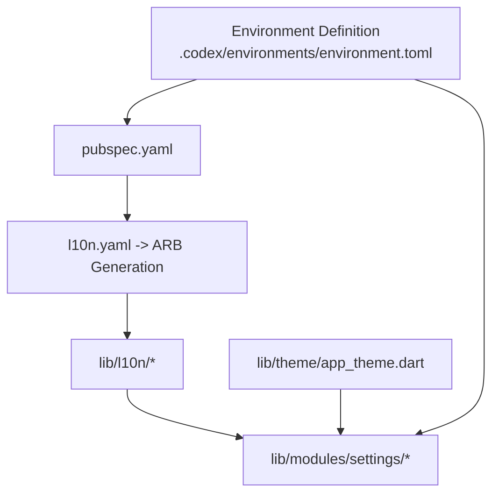

**Diagram sources**
- [environment.toml](file://.codex/environments/environment.toml)
- [pubspec.yaml](file://pubspec.yaml)
- [l10n.yaml](file://l10n.yaml)
- [app_localizations.dart](file://lib/l10n/app_localizations.dart)
- [app_theme.dart](file://lib/theme/app_theme.dart)
- [settings_config.dart](file://lib/modules/settings/models/settings_config.dart)

## Detailed Component Analysis

### Environment Configuration Management
- Centralized environment definition: a TOML file stores environment variables and feature flags for deployment orchestration.
- Flutter integration: pubspec.yaml defines build-time and localization settings; platform manifests (Android/iOS) consume environment variables for signing and runtime behavior.
- Build-time vs runtime: environment variables are embedded during build; runtime toggles are managed via settings models.

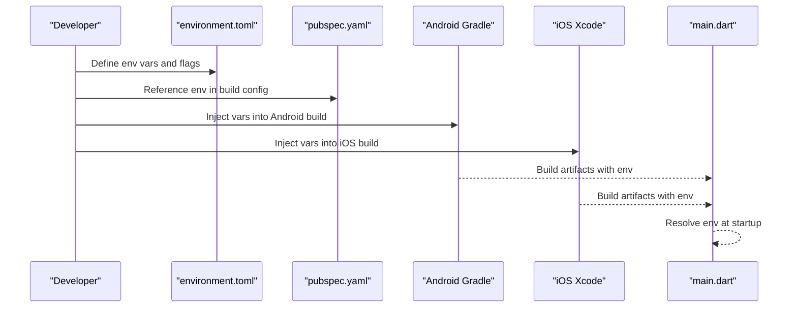

**Diagram sources**
- [environment.toml](file://.codex/environments/environment.toml)
- [pubspec.yaml](file://pubspec.yaml)
- [AndroidManifest.xml](file://android/app/src/main/AndroidManifest.xml)
- [AppDelegate.swift](file://ios/Runner/AppDelegate.swift)
- [main.dart](file://lib/main.dart)

**Section sources**
- [environment.toml](file://.codex/environments/environment.toml)
- [pubspec.yaml](file://pubspec.yaml)
- [AndroidManifest.xml](file://android/app/src/main/AndroidManifest.xml)
- [AppDelegate.swift](file://ios/Runner/AppDelegate.swift)
- [main.dart](file://lib/main.dart)

### Feature Flags and Runtime Configuration
- Feature flags: represented as booleans or enums in settings models; toggled via settings controllers.
- Functional areas:
  - Basic configuration: foundational options.
  - Advanced configuration: power-user options grouped by feature area.
  - Organize and scrape configuration: post-processing and library management.
  - Search and download configuration: scraping and automation preferences.
  - Site options and site synchronization: external service integration settings.
- Controllers coordinate persistence, validation, and UI updates.

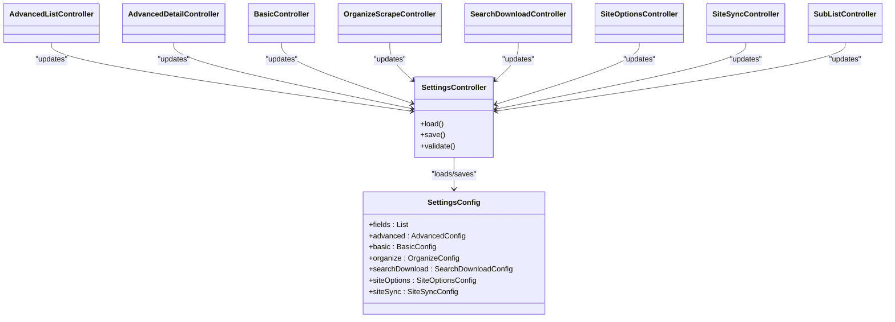

**Diagram sources**
- [settings_config.dart](file://lib/modules/settings/models/settings_config.dart)
- [settings_advanced_config.dart](file://lib/modules/settings/models/settings_advanced_config.dart)
- [settings_basic_config.dart](file://lib/modules/settings/models/settings_basic_config.dart)
- [settings_organize_config.dart](file://lib/modules/settings/models/settings_organize_config.dart)
- [settings_search_download_config.dart](file://lib/modules/settings/models/settings_search_download_config.dart)
- [settings_site_options_config.dart](file://lib/modules/settings/models/settings_site_options_config.dart)
- [settings_site_sync_config.dart](file://lib/modules/settings/models/settings_site_sync_config.dart)
- [settings_controller.dart](file://lib/modules/settings/controllers/settings_controller.dart)
- [settings_advanced_list_controller.dart](file://lib/modules/settings/controllers/settings_advanced_list_controller.dart)
- [settings_advanced_detail_controller.dart](file://lib/modules/settings/controllers/settings_advanced_detail_controller.dart)
- [settings_basic_controller.dart](file://lib/modules/settings/controllers/settings_basic_controller.dart)
- [settings_organize_scrape_controller.dart](file://lib/modules/settings/controllers/settings_organize_scrape_controller.dart)
- [settings_search_download_controller.dart](file://lib/modules/settings/controllers/settings_search_download_controller.dart)
- [settings_site_options_controller.dart](file://lib/modules/settings/controllers/settings_site_options_controller.dart)
- [settings_site_sync_controller.dart](file://lib/modules/settings/controllers/settings_site_sync_controller.dart)
- [settings_sub_list_controller.dart](file://lib/modules/settings/controllers/settings_sub_list_controller.dart)

**Section sources**
- [settings_config.dart](file://lib/modules/settings/models/settings_config.dart)
- [settings_advanced_config.dart](file://lib/modules/settings/models/settings_advanced_config.dart)
- [settings_basic_config.dart](file://lib/modules/settings/models/settings_basic_config.dart)
- [settings_organize_config.dart](file://lib/modules/settings/models/settings_organize_config.dart)
- [settings_search_download_config.dart](file://lib/modules/settings/models/settings_search_download_config.dart)
- [settings_site_options_config.dart](file://lib/modules/settings/models/settings_site_options_config.dart)
- [settings_site_sync_config.dart](file://lib/modules/settings/models/settings_site_sync_config.dart)
- [settings_controller.dart](file://lib/modules/settings/controllers/settings_controller.dart)
- [settings_advanced_list_controller.dart](file://lib/modules/settings/controllers/settings_advanced_list_controller.dart)
- [settings_advanced_detail_controller.dart](file://lib/modules/settings/controllers/settings_advanced_detail_controller.dart)
- [settings_basic_controller.dart](file://lib/modules/settings/controllers/settings_basic_controller.dart)
- [settings_organize_scrape_controller.dart](file://lib/modules/settings/controllers/settings_organize_scrape_controller.dart)
- [settings_search_download_controller.dart](file://lib/modules/settings/controllers/settings_search_download_controller.dart)
- [settings_site_options_controller.dart](file://lib/modules/settings/controllers/settings_site_options_controller.dart)
- [settings_site_sync_controller.dart](file://lib/modules/settings/controllers/settings_site_sync_controller.dart)
- [settings_sub_list_controller.dart](file://lib/modules/settings/controllers/settings_sub_list_controller.dart)

### Localization Setup and Internationalization
- Translation source files: ARB files under lib/l10n define localized keys and fallbacks.
- Localization generation: l10n.yaml drives the code generation pipeline to produce strongly-typed delegates.
- Locale resolution: the generated delegate resolves locales at runtime; platform-specific resources support light/dark themes.

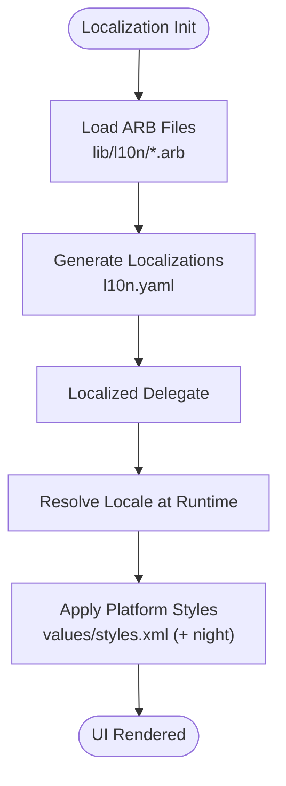

**Diagram sources**
- [l10n.yaml](file://l10n.yaml)
- [app_en.arb](file://lib/l10n/app_en.arb)
- [app_zh.arb](file://lib/l10n/app_zh.arb)
- [app_localizations.dart](file://lib/l10n/app_localizations.dart)
- [styles.xml](file://android/app/src/main/res/values/styles.xml)
- [styles.xml (night)](file://android/app/src/main/res/values-night/styles.xml)

**Section sources**
- [l10n.yaml](file://l10n.yaml)
- [app_en.arb](file://lib/l10n/app_en.arb)
- [app_zh.arb](file://lib/l10n/app_zh.arb)
- [app_localizations.dart](file://lib/l10n/app_localizations.dart)
- [styles.xml](file://android/app/src/main/res/values/styles.xml)
- [styles.xml (night)](file://android/app/src/main/res/values-night/styles.xml)

### Theme Customization and Branding
- Central theme module: app_theme.dart encapsulates color schemes, typography, and brand tokens.
- Platform-specific styles: Android values and values-night styles.xml tailor UI appearance per mode.
- Branding assets: logos and images under assets/images support branding across UI.

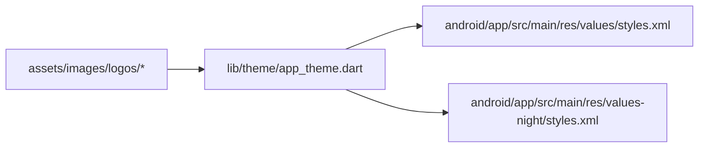

**Diagram sources**
- [app_theme.dart](file://lib/theme/app_theme.dart)
- [styles.xml](file://android/app/src/main/res/values/styles.xml)
- [styles.xml (night)](file://android/app/src/main/res/values-night/styles.xml)

**Section sources**
- [app_theme.dart](file://lib/theme/app_theme.dart)
- [styles.xml](file://android/app/src/main/res/values/styles.xml)
- [styles.xml (night)](file://android/app/src/main/res/values-night/styles.xml)

### Environment-Specific Configurations (Dev vs Prod)
- Android: environment variables injected via Gradle; signing configs and manifest placeholders configured for build variants.
- iOS: environment variables exported via shell scripts and consumed by Xcode build settings; Info.plist entries reflect environment.
- macOS: similar environment wiring via Flutter configuration lists.

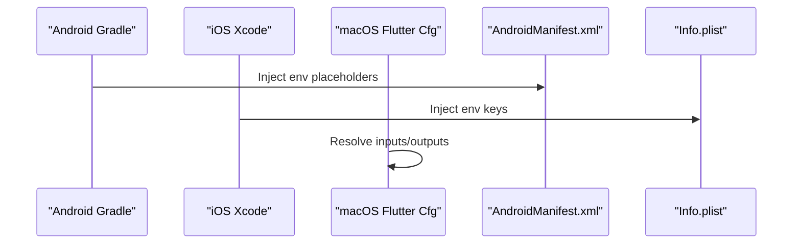

**Diagram sources**
- [AndroidManifest.xml](file://android/app/src/main/AndroidManifest.xml)
- [flutter_export_environment.sh](file://ios/Flutter/flutter_export_environment.sh)
- [Info.plist](file://ios/Runner/Info.plist)
- [FlutterInputs.xcfilelist](file://macos/Runner/Configs/FlutterInputs.xcfilelist)
- [FlutterOutputs.xcfilelist](file://macos/Runner/Configs/FlutterOutputs.xcfilelist)

**Section sources**
- [AndroidManifest.xml](file://android/app/src/main/AndroidManifest.xml)
- [flutter_export_environment.sh](file://ios/Flutter/flutter_export_environment.sh)
- [Info.plist](file://ios/Runner/Info.plist)
- [FlutterInputs.xcfilelist](file://macos/Runner/Configs/FlutterInputs.xcfilelist)
- [FlutterOutputs.xcfilelist](file://macos/Runner/Configs/FlutterOutputs.xcfilelist)

### Configuration Validation
- Settings models define field-level validation rules and constraints.
- Controllers orchestrate validation before persisting changes.
- Runtime checks ensure invalid combinations are prevented.

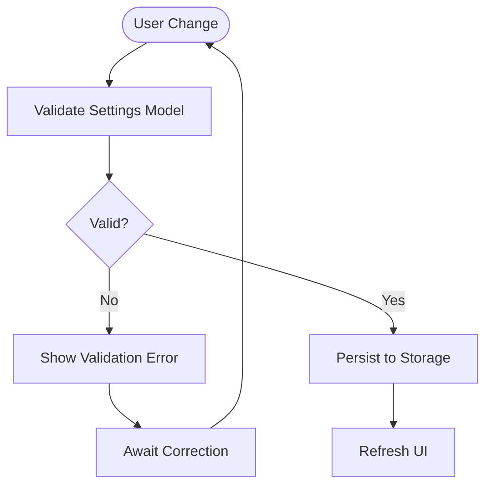

**Diagram sources**
- [settings_config.dart](file://lib/modules/settings/models/settings_config.dart)
- [settings_controller.dart](file://lib/modules/settings/controllers/settings_controller.dart)

**Section sources**
- [settings_config.dart](file://lib/modules/settings/models/settings_config.dart)
- [settings_controller.dart](file://lib/modules/settings/controllers/settings_controller.dart)

### Extension Points and Advanced User Settings
- Settings controllers expose extension hooks for custom fields and actions.
- Field configuration supports diverse input types and rendering hints.
- Advanced controllers handle complex workflows (e.g., advanced list/detail, organize/scrape, site sync/options).

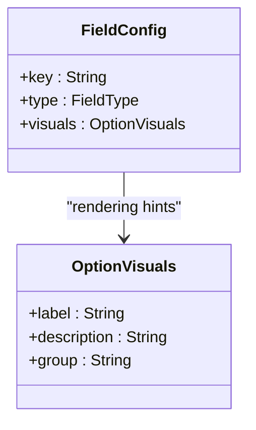

**Diagram sources**
- [settings_field_config.dart](file://lib/modules/settings/models/settings_field_config.dart)
- [settings_option_visuals.dart](file://lib/modules/settings/models/settings_option_visuals.dart)

**Section sources**
- [settings_field_config.dart](file://lib/modules/settings/models/settings_field_config.dart)
- [settings_option_visuals.dart](file://lib/modules/settings/models/settings_option_visuals.dart)

### Configuration Security and Sensitive Data Handling
- Secrets and credentials: platform keystore/signing and secure storage integration points are used to protect sensitive data.
- Environment variables: avoid embedding secrets directly in source; rely on platform-managed keystores and secure storage APIs.
- Plugin registration: GeneratedPluginRegistrant integrates plugins securely at build time.

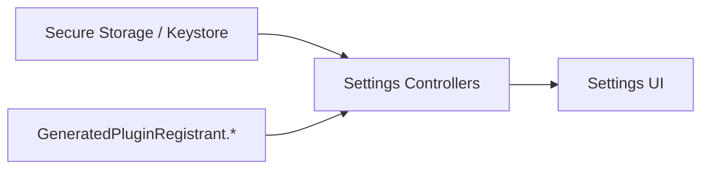

**Diagram sources**
- [GeneratedPluginRegistrant.java](file://android/app/src/main/java/io/flutter/plugins/GeneratedPluginRegistrant.java)
- [GeneratedPluginRegistrant.h](file://ios/Runner/GeneratedPluginRegistrant.h)
- [GeneratedPluginRegistrant.m](file://ios/Runner/GeneratedPluginRegistrant.m)

**Section sources**
- [GeneratedPluginRegistrant.java](file://android/app/src/main/java/io/flutter/plugins/GeneratedPluginRegistrant.java)
- [GeneratedPluginRegistrant.h](file://ios/Runner/GeneratedPluginRegistrant.h)
- [GeneratedPluginRegistrant.m](file://ios/Runner/GeneratedPluginRegistrant.m)

### Configuration Migration Strategies
- Current schema: settings models define the present configuration surface.
- Migration approach: evolve models and controllers to handle schema changes; apply upgrades on load with backward compatibility checks.
- Recommendations: version fields, safe defaults, and rollback strategies for breaking changes.

**Section sources**
- [settings_config.dart](file://lib/modules/settings/models/settings_config.dart)
- [settings_advanced_config.dart](file://lib/modules/settings/models/settings_advanced_config.dart)
- [settings_basic_config.dart](file://lib/modules/settings/models/settings_basic_config.dart)
- [settings_organize_config.dart](file://lib/modules/settings/models/settings_organize_config.dart)
- [settings_search_download_config.dart](file://lib/modules/settings/models/settings_search_download_config.dart)
- [settings_site_options_config.dart](file://lib/modules/settings/models/settings_site_options_config.dart)
- [settings_site_sync_config.dart](file://lib/modules/settings/models/settings_site_sync_config.dart)

## Dependency Analysis
Configuration dependencies span Flutter localization, theme, settings models, and platform build systems.

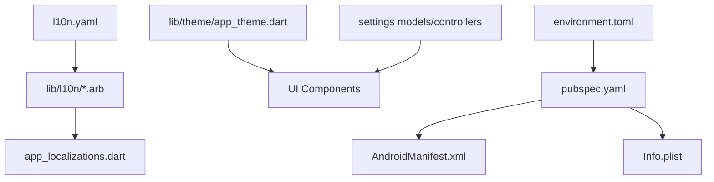

**Diagram sources**
- [l10n.yaml](file://l10n.yaml)
- [app_en.arb](file://lib/l10n/app_en.arb)
- [app_zh.arb](file://lib/l10n/app_zh.arb)
- [app_localizations.dart](file://lib/l10n/app_localizations.dart)
- [app_theme.dart](file://lib/theme/app_theme.dart)
- [settings_config.dart](file://lib/modules/settings/models/settings_config.dart)
- [environment.toml](file://.codex/environments/environment.toml)
- [pubspec.yaml](file://pubspec.yaml)
- [AndroidManifest.xml](file://android/app/src/main/AndroidManifest.xml)
- [Info.plist](file://ios/Runner/Info.plist)

**Section sources**
- [l10n.yaml](file://l10n.yaml)
- [app_localizations.dart](file://lib/l10n/app_localizations.dart)
- [app_theme.dart](file://lib/theme/app_theme.dart)
- [settings_config.dart](file://lib/modules/settings/models/settings_config.dart)
- [environment.toml](file://.codex/environments/environment.toml)
- [pubspec.yaml](file://pubspec.yaml)
- [AndroidManifest.xml](file://android/app/src/main/AndroidManifest.xml)
- [Info.plist](file://ios/Runner/Info.plist)

## Performance Considerations
- Keep localization keys minimal and hierarchical to reduce bundle size.
- Defer heavy initialization until after environment is resolved.
- Cache validated settings to avoid repeated computation.
- Use platform-specific resource qualifiers to optimize theme rendering.

## Troubleshooting Guide
- Localization not applied:
  - Verify l10n.yaml targets correct ARB paths.
  - Confirm app_localizations.dart was regenerated after ARB changes.
- Theme inconsistencies:
  - Check platform styles.xml and values-night/styles.xml for overrides.
- Settings not persisting:
  - Ensure controllers call save() and validate() before applying.
- Environment variables missing:
  - Confirm Gradle/Xcode build injects placeholders and Info.plist entries.

**Section sources**
- [l10n.yaml](file://l10n.yaml)
- [app_localizations.dart](file://lib/l10n/app_localizations.dart)
- [styles.xml](file://android/app/src/main/res/values/styles.xml)
- [styles.xml (night)](file://android/app/src/main/res/values-night/styles.xml)
- [settings_controller.dart](file://lib/modules/settings/controllers/settings_controller.dart)
- [AndroidManifest.xml](file://android/app/src/main/AndroidManifest.xml)
- [Info.plist](file://ios/Runner/Info.plist)

## Conclusion
MoviePilot Mobile’s configuration and customization framework combines environment-driven settings, robust localization, and a flexible theming system. By leveraging settings models and controllers, developers can introduce feature flags, personalize UI, and manage environment-specific behavior while maintaining strong validation and security practices. Migration strategies should evolve models carefully to preserve backward compatibility.

## Appendices
- Additional platform configuration files:
  - Android Gradle and properties files for build customization.
  - iOS CocoaPods and entitlements for secure capabilities.
  - macOS Flutter configuration lists for environment resolution.

**Section sources**
- [requirements.txt](file://requirements.txt)