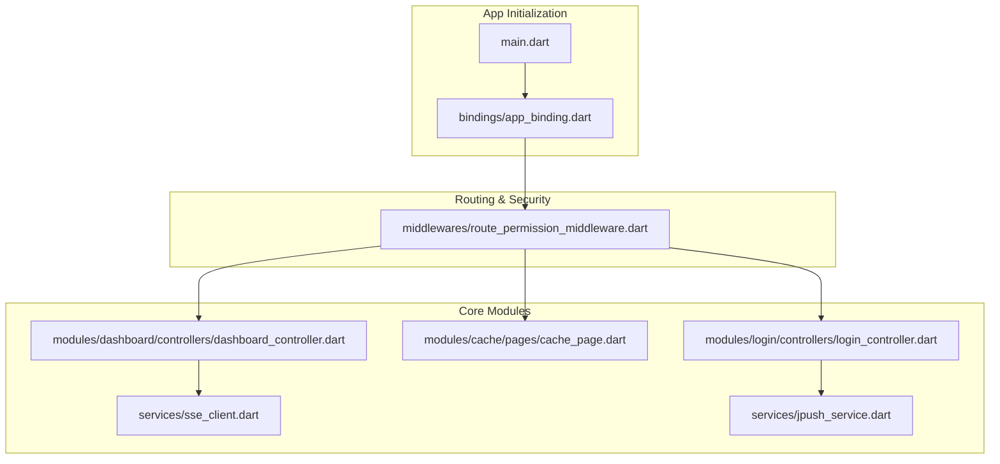
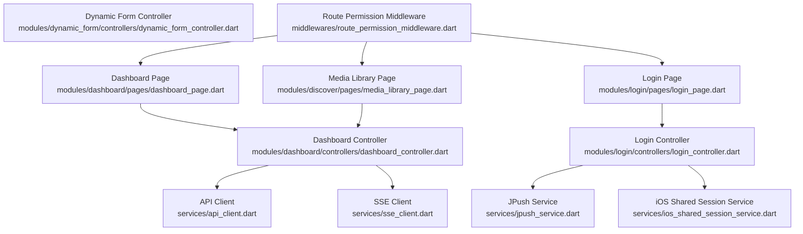
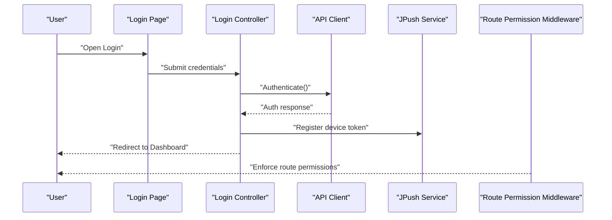
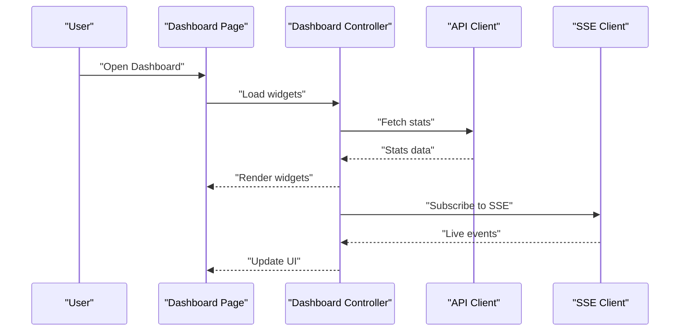
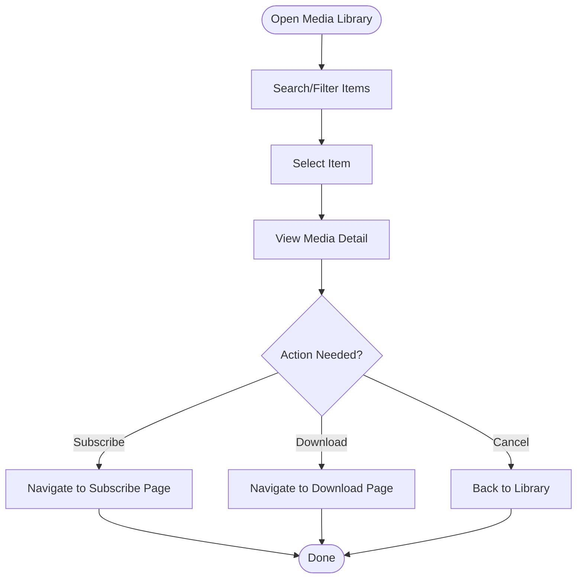
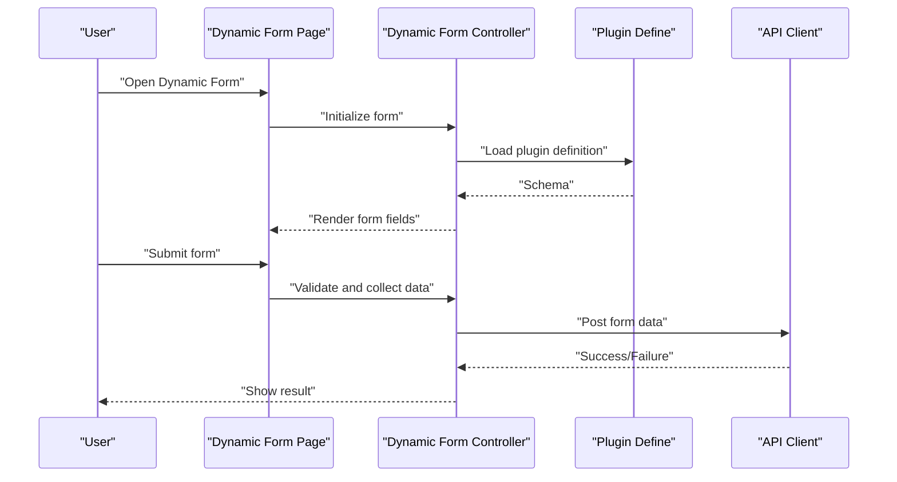
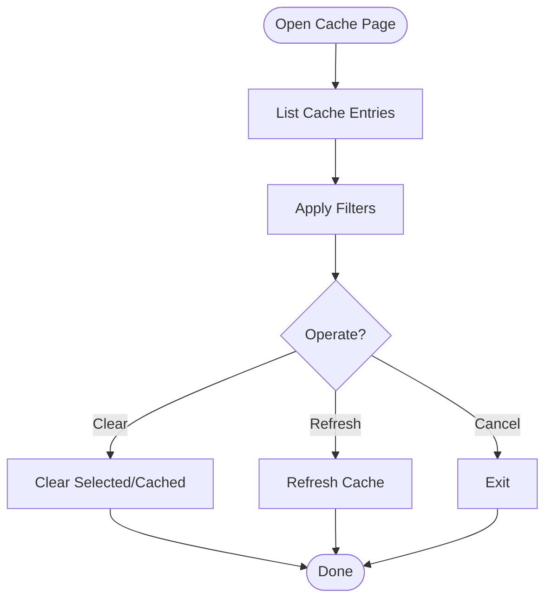
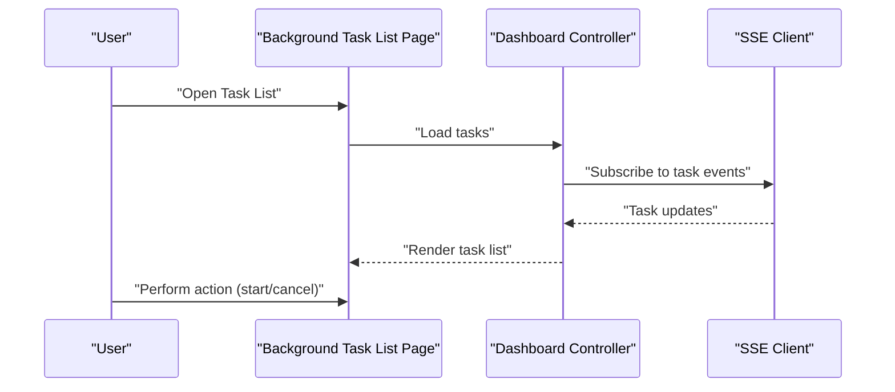
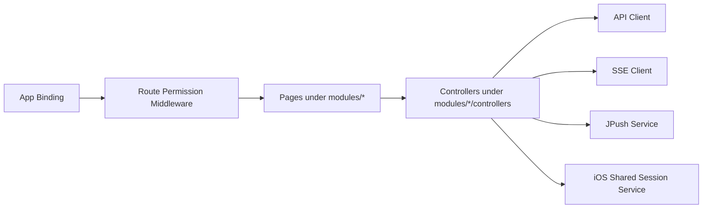

# Core Features

<cite>
**Referenced Files in This Document**
- [main.dart](file://lib/main.dart)
- [app_binding.dart](file://lib/bindings/app_binding.dart)
- [route_permission_middleware.dart](file://lib/middlewares/route_permission_middleware.dart)
- [api_client.dart](file://lib/services/api_client.dart)
- [dashboard_controller.dart](file://lib/modules/dashboard/controllers/dashboard_controller.dart)
- [dashboard_page.dart](file://lib/modules/dashboard/pages/dashboard_page.dart)
- [background_task_list_page.dart](file://lib/modules/dashboard/pages/background_task_list_page.dart)
- [cache_controller.dart](file://lib/modules/cache/controllers/cache_controller.dart)
- [cache_page.dart](file://lib/modules/cache/pages/cache_page.dart)
- [login_controller.dart](file://lib/modules/login/controllers/login_controller.dart)
- [login_page.dart](file://lib/modules/login/pages/login_page.dart)
- [setting_module.dart](file://lib/modules/setting/setting_module.dart)
- [settings_controller.dart](file://lib/modules/settings/controllers/settings_controller.dart)
- [plugin_define.dart](file://lib/modules/plugin/defines/plugin_define.dart)
- [dynamic_form_page.dart](file://lib/modules/dynamic_form/pages/dynamic_form_page.dart)
- [dynamic_form_controller.dart](file://lib/modules/dynamic_form/controllers/dynamic_form_controller.dart)
- [media_library_page.dart](file://lib/modules/discover/pages/media_library_page.dart)
- [media_detail_page.dart](file://lib/modules/media_detail/pages/media_detail_page.dart)
- [subscribe_page.dart](file://lib/modules/subscribe/pages/subscribe_page.dart)
- [download_page.dart](file://lib/modules/download/pages/download_page.dart)
- [workflow_page.dart](file://lib/modules/workflow/pages/workflow_page.dart)
- [sse_client.dart](file://lib/services/sse_client.dart)
- [jpush_service.dart](file://lib/services/jpush_service.dart)
- [ios_shared_session_service.dart](file://lib/services/ios_shared_session_service.dart)
</cite>

## Table of Contents
1. [Introduction](#introduction)
2. [Project Structure](#project-structure)
3. [Core Components](#core-components)
4. [Architecture Overview](#architecture-overview)
5. [Detailed Component Analysis](#detailed-component-analysis)
6. [Dependency Analysis](#dependency-analysis)
7. [Performance Considerations](#performance-considerations)
8. [Troubleshooting Guide](#troubleshooting-guide)
9. [Conclusion](#conclusion)

## Introduction
This document describes MoviePilot Mobile's core feature set with a focus on user authentication and session management, dashboard and system monitoring, media library management, plugin system with dynamic forms, cache management, and background task handling. It explains each feature's purpose, typical user workflows, and how components integrate with one another. Where applicable, we include diagrams mapped to actual source files to illustrate key interactions.

## Project Structure
MoviePilot Mobile follows a modular architecture under lib/modules, with shared services, bindings, and middlewares supporting cross-cutting concerns. The application initializes through a binding that wires dependencies and sets up routing and permissions middleware. Services encapsulate network communication, SSE streaming, push notifications, and platform-specific integrations.

**Diagram sources**
- [main.dart](file://lib/main.dart)
- [app_binding.dart](file://lib/bindings/app_binding.dart)
- [route_permission_middleware.dart](file://lib/middlewares/route_permission_middleware.dart)
- [dashboard_controller.dart](file://lib/modules/dashboard/controllers/dashboard_controller.dart)
- [cache_page.dart](file://lib/modules/cache/pages/cache_page.dart)
- [login_controller.dart](file://lib/modules/login/controllers/login_controller.dart)
- [sse_client.dart](file://lib/services/sse_client.dart)
- [jpush_service.dart](file://lib/services/jpush_service.dart)

**Section sources**
- [main.dart](file://lib/main.dart)
- [app_binding.dart](file://lib/bindings/app_binding.dart)
- [route_permission_middleware.dart](file://lib/middlewares/route_permission_middleware.dart)

## Core Components
- Authentication and Session Management: Provides login and session lifecycle handling, integrating with push notification services for secure updates.
- Dashboard and System Monitoring: Offers system health widgets, statistics, and background task visibility.
- Media Library Management: Enables browsing, searching, and viewing details of media items.
- Plugin System with Dynamic Forms: Supports dynamic form rendering and submission via plugin definitions.
- Cache Management: Manages cache entries and filters for efficient data retrieval.
- Background Task Handling: Streams real-time events and manages scheduled tasks.

**Section sources**
- [login_controller.dart](file://lib/modules/login/controllers/login_controller.dart)
- [dashboard_controller.dart](file://lib/modules/dashboard/controllers/dashboard_controller.dart)
- [media_library_page.dart](file://lib/modules/discover/pages/media_library_page.dart)
- [dynamic_form_page.dart](file://lib/modules/dynamic_form/pages/dynamic_form_page.dart)
- [cache_page.dart](file://lib/modules/cache/pages/cache_page.dart)
- [sse_client.dart](file://lib/services/sse_client.dart)

## Architecture Overview
The app uses a layered architecture:
- Presentation Layer: Pages and widgets under modules.
- Domain Controllers: Orchestrate UI logic and coordinate services.
- Services: Network client, SSE, push notifications, and platform integrations.
- Middleware: Route protection and permission enforcement.
- Binding: Central DI container wiring dependencies.

**Diagram sources**
- [dashboard_page.dart](file://lib/modules/dashboard/pages/dashboard_page.dart)
- [login_page.dart](file://lib/modules/login/pages/login_page.dart)
- [media_library_page.dart](file://lib/modules/discover/pages/media_library_page.dart)
- [dashboard_controller.dart](file://lib/modules/dashboard/controllers/dashboard_controller.dart)
- [login_controller.dart](file://lib/modules/login/controllers/login_controller.dart)
- [dynamic_form_controller.dart](file://lib/modules/dynamic_form/controllers/dynamic_form_controller.dart)
- [api_client.dart](file://lib/services/api_client.dart)
- [sse_client.dart](file://lib/services/sse_client.dart)
- [jpush_service.dart](file://lib/services/jpush_service.dart)
- [ios_shared_session_service.dart](file://lib/services/ios_shared_session_service.dart)
- [route_permission_middleware.dart](file://lib/middlewares/route_permission_middleware.dart)

## Detailed Component Analysis

### Authentication and Session Management
Purpose:
- Authenticate users and manage session state.
- Integrate with push notification service for secure event delivery.
- Coordinate iOS shared session handling for platform-specific behaviors.

User Workflow:
1. User navigates to Login Page.
2. Credentials are submitted via Login Controller.
3. On success, session tokens are stored and push registration is initiated.
4. Subsequent requests route through protected routes enforced by middleware.

**Diagram sources**
- [login_page.dart](file://lib/modules/login/pages/login_page.dart)
- [login_controller.dart](file://lib/modules/login/controllers/login_controller.dart)
- [api_client.dart](file://lib/services/api_client.dart)
- [jpush_service.dart](file://lib/services/jpush_service.dart)
- [route_permission_middleware.dart](file://lib/middlewares/route_permission_middleware.dart)

**Section sources**
- [login_controller.dart](file://lib/modules/login/controllers/login_controller.dart)
- [login_page.dart](file://lib/modules/login/pages/login_page.dart)
- [jpush_service.dart](file://lib/services/jpush_service.dart)
- [route_permission_middleware.dart](file://lib/middlewares/route_permission_middleware.dart)

### Dashboard and System Monitoring
Purpose:
- Present system health metrics and statistics.
- List and monitor background tasks.
- Stream live updates via SSE for real-time insights.

User Workflow:
1. Open Dashboard Page.
2. View system stats and widgets.
3. Navigate to Background Task List to inspect running jobs.
4. Receive SSE-driven updates for live data.

**Diagram sources**
- [dashboard_page.dart](file://lib/modules/dashboard/pages/dashboard_page.dart)
- [dashboard_controller.dart](file://lib/modules/dashboard/controllers/dashboard_controller.dart)
- [api_client.dart](file://lib/services/api_client.dart)
- [sse_client.dart](file://lib/services/sse_client.dart)

**Section sources**
- [dashboard_controller.dart](file://lib/modules/dashboard/controllers/dashboard_controller.dart)
- [dashboard_page.dart](file://lib/modules/dashboard/pages/dashboard_page.dart)
- [background_task_list_page.dart](file://lib/modules/dashboard/pages/background_task_list_page.dart)
- [sse_client.dart](file://lib/services/sse_client.dart)

### Media Library Management
Purpose:
- Browse and search media items.
- View detailed information for selected items.
- Support subscription and download workflows.

User Workflow:
1. Open Media Library Page.
2. Filter/search media items.
3. Select item to view details.
4. Trigger subscription or download actions from related pages.

**Diagram sources**
- [media_library_page.dart](file://lib/modules/discover/pages/media_library_page.dart)
- [media_detail_page.dart](file://lib/modules/media_detail/pages/media_detail_page.dart)
- [subscribe_page.dart](file://lib/modules/subscribe/pages/subscribe_page.dart)
- [download_page.dart](file://lib/modules/download/pages/download_page.dart)

**Section sources**
- [media_library_page.dart](file://lib/modules/discover/pages/media_library_page.dart)
- [media_detail_page.dart](file://lib/modules/media_detail/pages/media_detail_page.dart)
- [subscribe_page.dart](file://lib/modules/subscribe/pages/subscribe_page.dart)
- [download_page.dart](file://lib/modules/download/pages/download_page.dart)

### Plugin System with Dynamic Forms
Purpose:
- Render and submit forms dynamically based on plugin definitions.
- Provide flexible configuration interfaces for extensible features.

User Workflow:
1. Open Dynamic Form Page linked to a plugin definition.
2. Controller loads form schema and renders fields.
3. User submits form; controller validates and posts data.

**Diagram sources**
- [dynamic_form_page.dart](file://lib/modules/dynamic_form/pages/dynamic_form_page.dart)
- [dynamic_form_controller.dart](file://lib/modules/dynamic_form/controllers/dynamic_form_controller.dart)
- [plugin_define.dart](file://lib/modules/plugin/defines/plugin_define.dart)
- [api_client.dart](file://lib/services/api_client.dart)

**Section sources**
- [dynamic_form_page.dart](file://lib/modules/dynamic_form/pages/dynamic_form_page.dart)
- [dynamic_form_controller.dart](file://lib/modules/dynamic_form/controllers/dynamic_form_controller.dart)
- [plugin_define.dart](file://lib/modules/plugin/defines/plugin_define.dart)

### Cache Management
Purpose:
- Manage cached data entries and apply filters for efficient retrieval.
- Provide a dedicated page to inspect and operate on cache.

User Workflow:
1. Open Cache Page.
2. View cache entries and apply filters.
3. Perform cache operations (clear, refresh) as needed.

**Diagram sources**
- [cache_page.dart](file://lib/modules/cache/pages/cache_page.dart)
- [cache_controller.dart](file://lib/modules/cache/controllers/cache_controller.dart)

**Section sources**
- [cache_page.dart](file://lib/modules/cache/pages/cache_page.dart)
- [cache_controller.dart](file://lib/modules/cache/controllers/cache_controller.dart)

### Background Task Handling
Purpose:
- Monitor and manage background tasks.
- Stream real-time updates for task progress and status.

User Workflow:
1. Open Background Task List Page from Dashboard.
2. Observe task statuses and logs via SSE updates.
3. Trigger or cancel tasks through related controls.

**Diagram sources**
- [background_task_list_page.dart](file://lib/modules/dashboard/pages/background_task_list_page.dart)
- [dashboard_controller.dart](file://lib/modules/dashboard/controllers/dashboard_controller.dart)
- [sse_client.dart](file://lib/services/sse_client.dart)

**Section sources**
- [background_task_list_page.dart](file://lib/modules/dashboard/pages/background_task_list_page.dart)
- [dashboard_controller.dart](file://lib/modules/dashboard/controllers/dashboard_controller.dart)
- [sse_client.dart](file://lib/services/sse_client.dart)

## Dependency Analysis
Key dependencies and relationships:
- Controllers depend on Services for networking and streaming.
- Middleware enforces route protection across pages.
- Binding initializes services and routes.
- Platform services (e.g., iOS shared session) integrate with authentication and push.

**Diagram sources**
- [app_binding.dart](file://lib/bindings/app_binding.dart)
- [route_permission_middleware.dart](file://lib/middlewares/route_permission_middleware.dart)
- [api_client.dart](file://lib/services/api_client.dart)
- [sse_client.dart](file://lib/services/sse_client.dart)
- [jpush_service.dart](file://lib/services/jpush_service.dart)
- [ios_shared_session_service.dart](file://lib/services/ios_shared_session_service.dart)

**Section sources**
- [app_binding.dart](file://lib/bindings/app_binding.dart)
- [route_permission_middleware.dart](file://lib/middlewares/route_permission_middleware.dart)
- [api_client.dart](file://lib/services/api_client.dart)
- [sse_client.dart](file://lib/services/sse_client.dart)
- [jpush_service.dart](file://lib/services/jpush_service.dart)
- [ios_shared_session_service.dart](file://lib/services/ios_shared_session_service.dart)

## Performance Considerations
- Use caching strategies for frequently accessed data to reduce network overhead.
- Debounce search/filter operations to minimize unnecessary API calls.
- Stream only essential updates via SSE to avoid UI blocking.
- Lazy-load heavy widgets and media previews to improve initial render performance.
- Batch background task updates to reduce UI thrashing.

## Troubleshooting Guide
Common issues and resolutions:
- Authentication failures: Verify credentials and ensure push registration succeeds after login.
- SSE connection drops: Re-subscribe on connection loss and handle retry logic gracefully.
- Cache inconsistencies: Clear targeted caches and re-fetch data when stale entries are detected.
- Background task stuck: Cancel and re-run tasks; check logs for errors.
- Route permission denied: Confirm middleware configuration and user roles.

**Section sources**
- [login_controller.dart](file://lib/modules/login/controllers/login_controller.dart)
- [sse_client.dart](file://lib/services/sse_client.dart)
- [cache_controller.dart](file://lib/modules/cache/controllers/cache_controller.dart)
- [dashboard_controller.dart](file://lib/modules/dashboard/controllers/dashboard_controller.dart)
- [route_permission_middleware.dart](file://lib/middlewares/route_permission_middleware.dart)

## Conclusion
MoviePilot Mobile’s core features are organized around a modular architecture with clear separation of concerns. Authentication and session management integrate with push notifications and platform services. The dashboard aggregates system monitoring and background task visibility through SSE. Media library management supports discovery and actionable workflows. The plugin system enables dynamic forms for extensibility. Cache management and background task handling round out a robust operational foundation. Together, these components deliver a cohesive user experience across platforms.