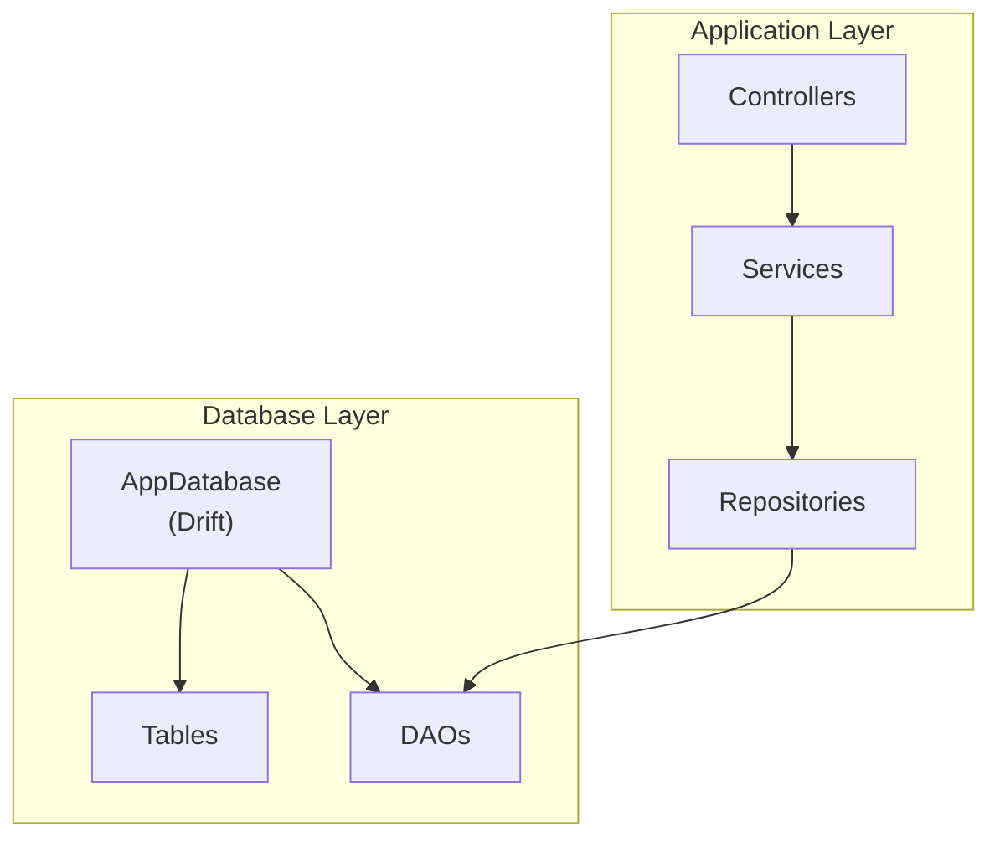
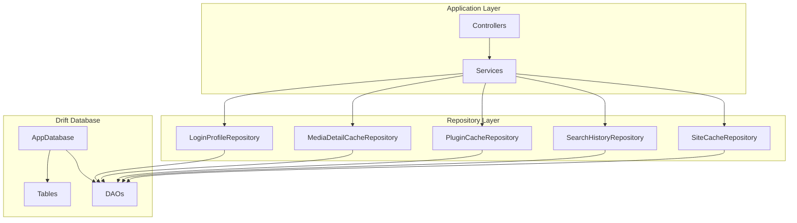
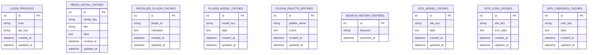
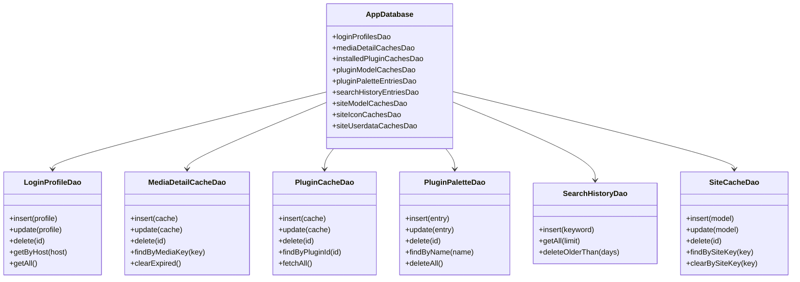
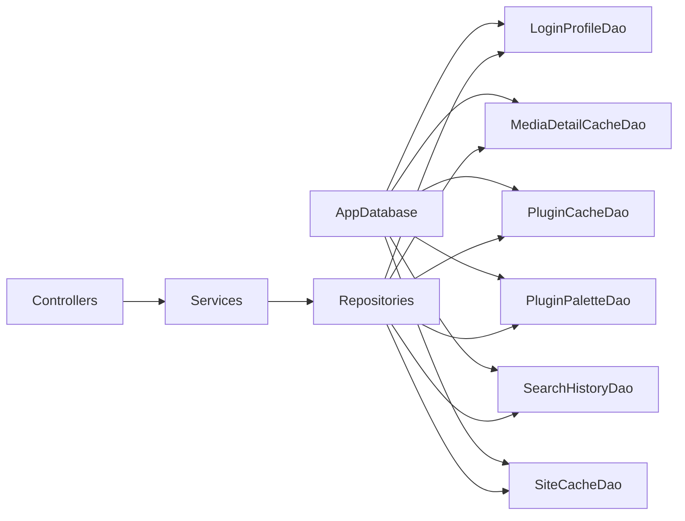

# Data Layer & Database

<cite>
**Referenced Files in This Document**
- [app_database.dart](file://lib/database/app_database.dart)
- [login_profile_dao.dart](file://lib/database/daos/login_profile_dao.dart)
- [media_detail_cache_dao.dart](file://lib/database/daos/media_detail_cache_dao.dart)
- [plugin_cache_dao.dart](file://lib/database/daos/plugin_cache_dao.dart)
- [plugin_palette_dao.dart](file://lib/database/daos/plugin_palette_dao.dart)
- [search_history_dao.dart](file://lib/database/daos/search_history_dao.dart)
- [site_cache_dao.dart](file://lib/database/daos/site_cache_dao.dart)
- [login_profiles.dart](file://lib/database/tables/login_profiles.dart)
- [media_detail_caches.dart](file://lib/database/tables/media_detail_caches.dart)
- [installed_plugin_caches.dart](file://lib/database/tables/installed_plugin_caches.dart)
- [plugin_model_caches.dart](file://lib/database/tables/plugin_model_caches.dart)
- [plugin_palette_entries.dart](file://lib/database/tables/plugin_palette_entries.dart)
- [search_history_entries.dart](file://lib/database/tables/search_history_entries.dart)
- [site_model_caches.dart](file://lib/database/tables/site_model_caches.dart)
- [site_icon_caches.dart](file://lib/database/tables/site_icon_caches.dart)
- [site_userdata_caches.dart](file://lib/database/tables/site_userdata_caches.dart)
</cite>

## Table of Contents
1. [Introduction](#introduction)
2. [Project Structure](#project-structure)
3. [Core Components](#core-components)
4. [Architecture Overview](#architecture-overview)
5. [Detailed Component Analysis](#detailed-component-analysis)
6. [Dependency Analysis](#dependency-analysis)
7. [Performance Considerations](#performance-considerations)
8. [Troubleshooting Guide](#troubleshooting-guide)
9. [Conclusion](#conclusion)

## Introduction
This document describes the data layer architecture of MoviePilot Mobile with a focus on the Drift-based database implementation. It covers the database schema, entity definitions, DAO patterns, repository abstractions, caching strategies, offline capabilities, and synchronization considerations with the MoviePilot server. The goal is to provide a clear understanding of how data is modeled, accessed, cached, and managed across the application.

## Project Structure
The data layer is organized around a central Drift database definition and a set of typed tables and DAOs grouped under the lib/database directory. The structure supports a clean separation of concerns:
- Central database definition orchestrating schema and migrations
- Typed table definitions representing persistent entities
- DAOs encapsulating CRUD and query logic per entity/table
- Optional repository layer abstractions (to be documented) that orchestrate DAO usage and caching

**Section sources**
- [app_database.dart](file://lib/database/app_database.dart)

## Core Components
This section outlines the primary building blocks of the data layer: the central database, typed tables, and DAOs.

- AppDatabase: Central Drift database definition that manages schema, migrations, and provides DAO instances.
- Tables: Typed table definitions for each entity, including primary keys, columns, and constraints.
- DAOs: Data Access Objects implementing CRUD and query operations for each table.

Key responsibilities:
- Schema management via Drift migrations
- Type-safe entity persistence and retrieval
- Efficient querying and caching strategies
- Offline-first data access with potential server sync

**Section sources**
- [app_database.dart](file://lib/database/app_database.dart)
- [login_profiles.dart](file://lib/database/tables/login_profiles.dart)
- [media_detail_caches.dart](file://lib/database/tables/media_detail_caches.dart)
- [installed_plugin_caches.dart](file://lib/database/tables/installed_plugin_caches.dart)
- [plugin_model_caches.dart](file://lib/database/tables/plugin_model_caches.dart)
- [plugin_palette_entries.dart](file://lib/database/tables/plugin_palette_entries.dart)
- [search_history_entries.dart](file://lib/database/tables/search_history_entries.dart)
- [site_model_caches.dart](file://lib/database/tables/site_model_caches.dart)
- [site_icon_caches.dart](file://lib/database/tables/site_icon_caches.dart)
- [site_userdata_caches.dart](file://lib/database/tables/site_userdata_caches.dart)
- [login_profile_dao.dart](file://lib/database/daos/login_profile_dao.dart)
- [media_detail_cache_dao.dart](file://lib/database/daos/media_detail_cache_dao.dart)
- [plugin_cache_dao.dart](file://lib/database/daos/plugin_cache_dao.dart)
- [plugin_palette_dao.dart](file://lib/database/daos/plugin_palette_dao.dart)
- [search_history_dao.dart](file://lib/database/daos/search_history_dao.dart)
- [site_cache_dao.dart](file://lib/database/daos/site_cache_dao.dart)

## Architecture Overview
The data layer follows a layered architecture:
- Drift Database: Provides schema, migrations, and DAO access
- DAO Layer: Encapsulates SQL operations per entity
- Repository Layer: Orchestrates DAO usage, applies caching, and exposes domain-focused APIs
- Application Layer: Controllers and services consume repositories for data operations

**Diagram sources**
- [app_database.dart](file://lib/database/app_database.dart)
- [login_profile_dao.dart](file://lib/database/daos/login_profile_dao.dart)
- [media_detail_cache_dao.dart](file://lib/database/daos/media_detail_cache_dao.dart)
- [plugin_cache_dao.dart](file://lib/database/daos/plugin_cache_dao.dart)
- [search_history_dao.dart](file://lib/database/daos/search_history_dao.dart)
- [site_cache_dao.dart](file://lib/database/daos/site_cache_dao.dart)

## Detailed Component Analysis

### Database Schema and Entities
The schema consists of multiple tables, each representing a distinct entity. Below is a consolidated overview of the entities and their relationships.

**Diagram sources**
- [login_profiles.dart](file://lib/database/tables/login_profiles.dart)
- [media_detail_caches.dart](file://lib/database/tables/media_detail_caches.dart)
- [installed_plugin_caches.dart](file://lib/database/tables/installed_plugin_caches.dart)
- [plugin_model_caches.dart](file://lib/database/tables/plugin_model_caches.dart)
- [plugin_palette_entries.dart](file://lib/database/tables/plugin_palette_entries.dart)
- [search_history_entries.dart](file://lib/database/tables/search_history_entries.dart)
- [site_model_caches.dart](file://lib/database/tables/site_model_caches.dart)
- [site_icon_caches.dart](file://lib/database/tables/site_icon_caches.dart)
- [site_userdata_caches.dart](file://lib/database/tables/site_userdata_caches.dart)

**Section sources**
- [login_profiles.dart](file://lib/database/tables/login_profiles.dart)
- [media_detail_caches.dart](file://lib/database/tables/media_detail_caches.dart)
- [installed_plugin_caches.dart](file://lib/database/tables/installed_plugin_caches.dart)
- [plugin_model_caches.dart](file://lib/database/tables/plugin_model_caches.dart)
- [plugin_palette_entries.dart](file://lib/database/tables/plugin_palette_entries.dart)
- [search_history_entries.dart](file://lib/database/tables/search_history_entries.dart)
- [site_model_caches.dart](file://lib/database/tables/site_model_caches.dart)
- [site_icon_caches.dart](file://lib/database/tables/site_icon_caches.dart)
- [site_userdata_caches.dart](file://lib/database/tables/site_userdata_caches.dart)

### DAO Patterns and Operations
Each table has a corresponding DAO that encapsulates CRUD and query operations. The DAOs leverage Drift’s generated code and typed queries to ensure type safety and efficient SQL generation.

Representative DAOs and their responsibilities:
- LoginProfileDao: Manages login profiles, including creation, updates, and retrieval by host/API key
- MediaDetailCacheDao: Handles media detail caching with keys and TTL-like invalidation
- PluginCacheDao: Stores plugin metadata and model caches
- PluginPaletteDao: Manages color palette entries for plugins
- SearchHistoryDao: Records and retrieves search keywords with timestamps
- SiteCacheDao: Caches site-specific models, icons, and user data

**Diagram sources**
- [app_database.dart](file://lib/database/app_database.dart)
- [login_profile_dao.dart](file://lib/database/daos/login_profile_dao.dart)
- [media_detail_cache_dao.dart](file://lib/database/daos/media_detail_cache_dao.dart)
- [plugin_cache_dao.dart](file://lib/database/daos/plugin_cache_dao.dart)
- [plugin_palette_dao.dart](file://lib/database/daos/plugin_palette_dao.dart)
- [search_history_dao.dart](file://lib/database/daos/search_history_dao.dart)
- [site_cache_dao.dart](file://lib/database/daos/site_cache_dao.dart)

**Section sources**
- [login_profile_dao.dart](file://lib/database/daos/login_profile_dao.dart)
- [media_detail_cache_dao.dart](file://lib/database/daos/media_detail_cache_dao.dart)
- [plugin_cache_dao.dart](file://lib/database/daos/plugin_cache_dao.dart)
- [plugin_palette_dao.dart](file://lib/database/daos/plugin_palette_dao.dart)
- [search_history_dao.dart](file://lib/database/daos/search_history_dao.dart)
- [site_cache_dao.dart](file://lib/database/daos/site_cache_dao.dart)

### Data Access Patterns and Caching Strategies
- Entity-centric caching: Media details, plugin metadata, and site data are cached to reduce network requests and improve responsiveness.
- Search history: Maintains recent searches for quick recall and improved UX.
- Login profiles: Stores server host and API key for seamless authentication and reduced manual input.
- Palette caching: Stores computed color palettes derived from plugin assets for UI consistency.

Caching considerations:
- Expiration policies: Implement TTL-based invalidation for cache entries to balance freshness and performance.
- Conflict resolution: Define strategies for cache updates during offline-to-online transitions.
- Storage limits: Enforce eviction policies to prevent unbounded growth of cache tables.

**Section sources**
- [media_detail_caches.dart](file://lib/database/tables/media_detail_caches.dart)
- [plugin_model_caches.dart](file://lib/database/tables/plugin_model_caches.dart)
- [site_model_caches.dart](file://lib/database/tables/site_model_caches.dart)
- [site_icon_caches.dart](file://lib/database/tables/site_icon_caches.dart)
- [site_userdata_caches.dart](file://lib/database/tables/site_userdata_caches.dart)
- [search_history_entries.dart](file://lib/database/tables/search_history_entries.dart)
- [login_profiles.dart](file://lib/database/tables/login_profiles.dart)
- [plugin_palette_entries.dart](file://lib/database/tables/plugin_palette_entries.dart)

### Offline Capabilities and Synchronization
Offline-first design:
- All critical entities are persisted locally to enable operation without network connectivity.
- DAOs provide robust local-only operations for immediate user feedback.

Synchronization with MoviePilot server:
- Pull-based updates: Repositories fetch fresh data from the server and update local caches atomically.
- Push-based changes: Local modifications are queued and applied when connectivity is restored.
- Conflict handling: Merge strategies for concurrent edits (e.g., last-write-wins or operational transforms) should be defined.

Note: The repository layer orchestrating these flows is not present in the current snapshot; however, DAOs and tables provide the foundation for implementing synchronization logic.

**Section sources**
- [app_database.dart](file://lib/database/app_database.dart)
- [login_profile_dao.dart](file://lib/database/daos/login_profile_dao.dart)
- [media_detail_cache_dao.dart](file://lib/database/daos/media_detail_cache_dao.dart)
- [plugin_cache_dao.dart](file://lib/database/daos/plugin_cache_dao.dart)
- [site_cache_dao.dart](file://lib/database/daos/site_cache_dao.dart)

### Data Lifecycle Management and Migrations
Lifecycle stages:
- Initialization: AppDatabase is constructed and migrations are executed to bring the schema up to date.
- Runtime: DAOs handle CRUD operations and queries; repositories coordinate caching and synchronization.
- Shutdown: Graceful closing of database connections to prevent data loss.

Migration strategy:
- Versioned migrations: Increment schema versions and apply additive changes (new tables/columns) while preserving existing data.
- Backward compatibility: Ensure older clients can still read migrated data.

Constraints and indexes:
- Primary keys: Each table defines a primary key for unique identification.
- Unique constraints: Enforce uniqueness for critical identifiers (e.g., host/API key, media key, plugin ID).
- Indexes: Add indexes on frequently queried columns (e.g., media_key, site_key, plugin_id) to optimize read performance.

**Section sources**
- [app_database.dart](file://lib/database/app_database.dart)
- [login_profiles.dart](file://lib/database/tables/login_profiles.dart)
- [media_detail_caches.dart](file://lib/database/tables/media_detail_caches.dart)
- [installed_plugin_caches.dart](file://lib/database/tables/installed_plugin_caches.dart)
- [plugin_model_caches.dart](file://lib/database/tables/plugin_model_caches.dart)
- [site_model_caches.dart](file://lib/database/tables/site_model_caches.dart)
- [site_icon_caches.dart](file://lib/database/tables/site_icon_caches.dart)
- [site_userdata_caches.dart](file://lib/database/tables/site_userdata_caches.dart)

### Repository Pattern Implementation
Repository layer responsibilities:
- Abstraction: Hide DAO and caching details from controllers and services.
- Business logic: Orchestrate reads/writes, cache invalidation, and synchronization triggers.
- Consistency: Ensure atomic updates across related entities.

Implementation outline:
- Define repository interfaces for each domain entity.
- Implement repositories using DAOs and cache managers.
- Inject repositories into services and controllers.

Note: The repository implementations are not included in the current snapshot; however, DAOs and tables provide the necessary building blocks.

**Section sources**
- [login_profile_dao.dart](file://lib/database/daos/login_profile_dao.dart)
- [media_detail_cache_dao.dart](file://lib/database/daos/media_detail_cache_dao.dart)
- [plugin_cache_dao.dart](file://lib/database/daos/plugin_cache_dao.dart)
- [plugin_palette_dao.dart](file://lib/database/daos/plugin_palette_dao.dart)
- [search_history_dao.dart](file://lib/database/daos/search_history_dao.dart)
- [site_cache_dao.dart](file://lib/database/daos/site_cache_dao.dart)

## Dependency Analysis
The data layer exhibits low coupling and high cohesion:
- DAOs depend on AppDatabase and typed table definitions
- Repositories depend on DAOs and cache managers
- Application layer depends on repositories

**Diagram sources**
- [app_database.dart](file://lib/database/app_database.dart)
- [login_profile_dao.dart](file://lib/database/daos/login_profile_dao.dart)
- [media_detail_cache_dao.dart](file://lib/database/daos/media_detail_cache_dao.dart)
- [plugin_cache_dao.dart](file://lib/database/daos/plugin_cache_dao.dart)
- [plugin_palette_dao.dart](file://lib/database/daos/plugin_palette_dao.dart)
- [search_history_dao.dart](file://lib/database/daos/search_history_dao.dart)
- [site_cache_dao.dart](file://lib/database/daos/site_cache_dao.dart)

**Section sources**
- [app_database.dart](file://lib/database/app_database.dart)

## Performance Considerations
- Query optimization: Use indexed columns for frequent filters and joins; avoid SELECT * in favor of projection.
- Batch operations: Group inserts/updates/deletes to minimize transaction overhead.
- Cache sizing: Implement LRU or TTL-based eviction to keep cache sizes bounded.
- Concurrency: Use Drift’s async APIs and proper transaction boundaries to avoid contention.
- Migration efficiency: Keep migrations minimal and additive to reduce downtime.

## Troubleshooting Guide
Common issues and resolutions:
- Migration failures: Validate schema versions and ensure additive changes; rollback or recreate schema if necessary.
- Cache corruption: Implement cache health checks and periodic cleanup routines.
- DAO errors: Wrap DAO calls with try/catch and log detailed error context for diagnosis.
- Sync conflicts: Establish deterministic merge strategies and conflict logs for auditability.

**Section sources**
- [app_database.dart](file://lib/database/app_database.dart)

## Conclusion
MoviePilot Mobile’s data layer leverages Drift to provide a robust, type-safe, and maintainable persistence layer. The schema is designed around core entities that support offline-first workflows, while DAOs encapsulate data access patterns. The repository layer (planned) will further abstract these concerns and orchestrate caching and synchronization with the MoviePilot server. By following the outlined migration, caching, and performance strategies, the application can achieve reliable, scalable, and responsive data management.