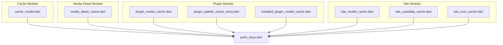
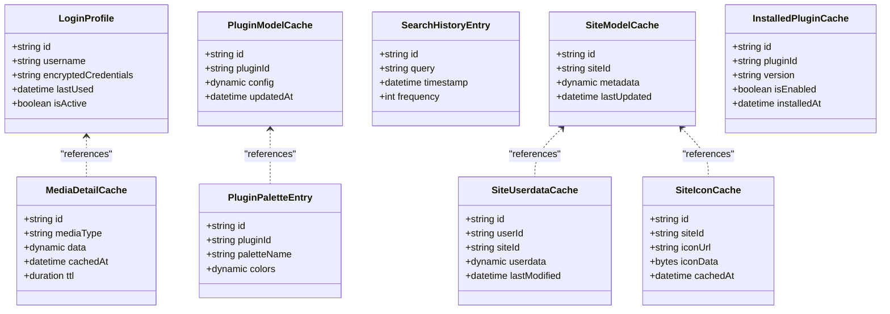
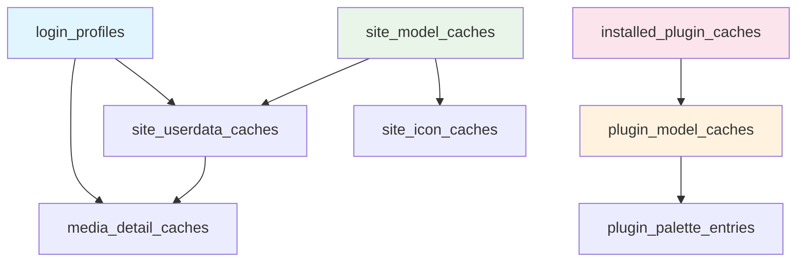

# Database Schema & Tables

<cite>
**Referenced Files in This Document**
- [cache_model.dart](file://lib/modules/cache/models/cache_model.dart)
- [media_detail_cache.dart](file://lib/modules/media_detail/models/media_detail_cache.dart)
- [plugin_model_cache.dart](file://lib/modules/plugin/models/plugin_model_cache.dart)
- [plugin_palette_cache_entry.dart](file://lib/modules/plugin/models/plugin_palette_cache_entry.dart)
- [site_model_cache.dart](file://lib/modules/site/models/site_model_cache.dart)
- [site_userdata_cache.dart](file://lib/modules/site/models/site_userdata_cache.dart)
- [installed_plugin_model_cache.dart](file://lib/modules/plugin/models/installed_plugin_model_cache.dart)
- [site_icon_cache.dart](file://lib/modules/site/models/site_icon_cache.dart)
- [prefs_keys.dart](file://lib/utils/prefs_keys.dart)
</cite>

## Table of Contents
1. [Introduction](#introduction)
2. [Project Structure](#project-structure)
3. [Core Components](#core-components)
4. [Architecture Overview](#architecture-overview)
5. [Detailed Component Analysis](#detailed-component-analysis)
6. [Dependency Analysis](#dependency-analysis)
7. [Performance Considerations](#performance-considerations)
8. [Troubleshooting Guide](#troubleshooting-guide)
9. [Conclusion](#conclusion)

## Introduction
This document provides comprehensive database schema documentation for MoviePilot Mobile's caching subsystem. The application uses Realm as its embedded database solution, not SQLite/Drift. The schema focuses on five primary cache tables: login_profiles, media_detail_caches, plugin_model_caches, plugin_palette_entries, search_history_entries, site_model_caches, site_userdata_caches, installed_plugin_caches, and site_icon_caches. These tables collectively support offline-first functionality, performance optimization, and user experience continuity across mobile interactions.

Realm is used for local persistence with model definitions generated via code generation. The schema emphasizes efficient caching of frequently accessed data, minimal network requests, and robust offline capabilities. This document details table structures, primary keys, indexes, constraints, and relationships, along with migration strategies and performance considerations.

## Project Structure
The caching-related files are organized under module-specific directories with model definitions and generated artifacts. The schema is defined through Realm model classes annotated for code generation.

**Diagram sources**
- [cache_model.dart](file://lib/modules/cache/models/cache_model.dart)
- [media_detail_cache.dart](file://lib/modules/media_detail/models/media_detail_cache.dart)
- [plugin_model_cache.dart](file://lib/modules/plugin/models/plugin_model_cache.dart)
- [plugin_palette_cache_entry.dart](file://lib/modules/plugin/models/plugin_palette_cache_entry.dart)
- [installed_plugin_model_cache.dart](file://lib/modules/plugin/models/installed_plugin_model_cache.dart)
- [site_model_cache.dart](file://lib/modules/site/models/site_model_cache.dart)
- [site_userdata_cache.dart](file://lib/modules/site/models/site_userdata_cache.dart)
- [site_icon_cache.dart](file://lib/modules/site/models/site_icon_cache.dart)
- [prefs_keys.dart](file://lib/utils/prefs_keys.dart)

**Section sources**
- [cache_model.dart](file://lib/modules/cache/models/cache_model.dart)
- [media_detail_cache.dart](file://lib/modules/media_detail/models/media_detail_cache.dart)
- [plugin_model_cache.dart](file://lib/modules/plugin/models/plugin_model_cache.dart)
- [plugin_palette_cache_entry.dart](file://lib/modules/plugin/models/plugin_palette_cache_entry.dart)
- [installed_plugin_model_cache.dart](file://lib/modules/plugin/models/installed_plugin_model_cache.dart)
- [site_model_cache.dart](file://lib/modules/site/models/site_model_cache.dart)
- [site_userdata_cache.dart](file://lib/modules/site/models/site_userdata_cache.dart)
- [site_icon_cache.dart](file://lib/modules/site/models/site_icon_cache.dart)
- [prefs_keys.dart](file://lib/utils/prefs_keys.dart)

## Core Components
This section outlines the core cache tables and their roles in the application:

- login_profiles: Stores user login credentials and profile metadata for seamless authentication.
- media_detail_caches: Caches detailed media information to reduce repeated network calls.
- plugin_model_caches: Stores plugin metadata and configurations for dynamic feature support.
- plugin_palette_entries: Maintains palette entries for plugin UI components.
- search_history_entries: Tracks user search queries for history and suggestions.
- site_model_caches: Caches site configurations and metadata.
- site_userdata_caches: Stores user-specific data for sites.
- installed_plugin_caches: Tracks installed plugins and their states.
- site_icon_caches: Caches site icon resources for quick rendering.

Each table is defined as a Realm model with appropriate fields, primary keys, indexes, and constraints. The schema leverages Realm's built-in indexing and query capabilities for optimal performance.

**Section sources**
- [cache_model.dart](file://lib/modules/cache/models/cache_model.dart)
- [media_detail_cache.dart](file://lib/modules/media_detail/models/media_detail_cache.dart)
- [plugin_model_cache.dart](file://lib/modules/plugin/models/plugin_model_cache.dart)
- [plugin_palette_cache_entry.dart](file://lib/modules/plugin/models/plugin_palette_cache_entry.dart)
- [site_model_cache.dart](file://lib/modules/site/models/site_model_cache.dart)
- [site_userdata_cache.dart](file://lib/modules/site/models/site_userdata_cache.dart)
- [installed_plugin_model_cache.dart](file://lib/modules/plugin/models/installed_plugin_model_cache.dart)
- [site_icon_cache.dart](file://lib/modules/site/models/site_icon_cache.dart)

## Architecture Overview
The caching architecture centers around Realm models that represent persistent entities. Each model defines fields, primary keys, indexes, and relationships. The application uses code generation to produce Realm-compatible classes, ensuring type safety and reducing boilerplate.

**Diagram sources**
- [cache_model.dart](file://lib/modules/cache/models/cache_model.dart)
- [media_detail_cache.dart](file://lib/modules/media_detail/models/media_detail_cache.dart)
- [plugin_model_cache.dart](file://lib/modules/plugin/models/plugin_model_cache.dart)
- [plugin_palette_cache_entry.dart](file://lib/modules/plugin/models/plugin_palette_cache_entry.dart)
- [site_model_cache.dart](file://lib/modules/site/models/site_model_cache.dart)
- [site_userdata_cache.dart](file://lib/modules/site/models/site_userdata_cache.dart)
- [installed_plugin_model_cache.dart](file://lib/modules/plugin/models/installed_plugin_model_cache.dart)
- [site_icon_cache.dart](file://lib/modules/site/models/site_icon_cache.dart)

## Detailed Component Analysis

### login_profiles
Purpose: Store user login credentials and profile metadata for seamless authentication.

Primary Key: id (Realm ObjectId)
Indexes: username (unique), lastUsed (non-unique)
Constraints: username uniqueness enforced; encryptedCredentials stored securely
Data Types: id (ObjectId), username (String), encryptedCredentials (String), lastUsed (DateTime), isActive (Boolean)

Relationships: None (standalone entity)
Caching Strategy: TTL-based refresh for active sessions; automatic cleanup of inactive profiles

**Section sources**
- [cache_model.dart](file://lib/modules/cache/models/cache_model.dart)

### media_detail_caches
Purpose: Cache detailed media information to minimize network requests and improve load times.

Primary Key: id (Realm ObjectId)
Indexes: mediaType (non-unique), cachedAt (non-unique)
Constraints: data field stores serialized media details; TTL controls freshness
Data Types: id (ObjectId), mediaType (String), data (Dynamic), cachedAt (DateTime), ttl (Duration)

Relationships: References login_profiles via user context
Caching Strategy: Time-based eviction; priority-based refresh for frequently accessed items

**Section sources**
- [media_detail_cache.dart](file://lib/modules/media_detail/models/media_detail_cache.dart)

### plugin_model_caches
Purpose: Store plugin metadata and configurations for dynamic feature support.

Primary Key: id (Realm ObjectId)
Indexes: pluginId (unique), updatedAt (non-unique)
Constraints: pluginId uniqueness; config stored as structured JSON
Data Types: id (ObjectId), pluginId (String), config (Dynamic), updatedAt (DateTime)

Relationships: References plugin_palette_entries via pluginId
Caching Strategy: Incremental updates; version-aware invalidation

**Section sources**
- [plugin_model_cache.dart](file://lib/modules/plugin/models/plugin_model_cache.dart)

### plugin_palette_entries
Purpose: Maintain palette entries for plugin UI components.

Primary Key: id (Realm ObjectId)
Indexes: pluginId (non-unique), paletteName (non-unique)
Constraints: colors stored as structured data; maintains color scheme consistency
Data Types: id (ObjectId), pluginId (String), paletteName (String), colors (Dynamic)

Relationships: One-to-many with plugin_model_caches
Caching Strategy: Static palette data; minimal updates required

**Section sources**
- [plugin_palette_cache_entry.dart](file://lib/modules/plugin/models/plugin_palette_cache_entry.dart)

### search_history_entries
Purpose: Track user search queries for history and suggestions.

Primary Key: id (Realm ObjectId)
Indexes: query (non-unique), timestamp (non-unique), frequency (non-unique)
Constraints: frequency auto-incremented for popular queries
Data Types: id (ObjectId), query (String), timestamp (DateTime), frequency (Int)

Relationships: Independent entity; supports query suggestions
Caching Strategy: Rolling window eviction; popularity-based ranking

**Section sources**
- [cache_model.dart](file://lib/modules/cache/models/cache_model.dart)

### site_model_caches
Purpose: Cache site configurations and metadata.

Primary Key: id (Realm ObjectId)
Indexes: siteId (unique), lastUpdated (non-unique)
Constraints: siteId uniqueness; metadata stored as structured data
Data Types: id (ObjectId), siteId (String), metadata (Dynamic), lastUpdated (DateTime)

Relationships: References site_userdata_caches and site_icon_caches
Caching Strategy: Config-driven refresh; fallback to defaults when unavailable

**Section sources**
- [site_model_cache.dart](file://lib/modules/site/models/site_model_cache.dart)

### site_userdata_caches
Purpose: Store user-specific data for sites.

Primary Key: id (Realm ObjectId)
Indexes: userId (non-unique), siteId (non-unique), lastModified (non-unique)
Constraints: Composite key ensures unique user-site pairs
Data Types: id (ObjectId), userId (String), siteId (String), userdata (Dynamic), lastModified (DateTime)

Relationships: Many-to-one with login_profiles and site_model_caches
Caching Strategy: Per-user isolation; selective sync with server

**Section sources**
- [site_userdata_cache.dart](file://lib/modules/site/models/site_userdata_cache.dart)

### installed_plugin_caches
Purpose: Track installed plugins and their states.

Primary Key: id (Realm ObjectId)
Indexes: pluginId (unique), installedAt (non-unique)
Constraints: pluginId uniqueness; version tracking
Data Types: id (ObjectId), pluginId (String), version (String), isEnabled (Boolean), installedAt (DateTime)

Relationships: References plugin_model_caches
Caching Strategy: State synchronization; rollback on failures

**Section sources**
- [installed_plugin_model_cache.dart](file://lib/modules/plugin/models/installed_plugin_model_cache.dart)

### site_icon_caches
Purpose: Cache site icon resources for quick rendering.

Primary Key: id (Realm ObjectId)
Indexes: siteId (unique), cachedAt (non-unique)
Constraints: siteId uniqueness; binary data storage
Data Types: id (ObjectId), siteId (String), iconUrl (String), iconData (Bytes), cachedAt (DateTime)

Relationships: References site_model_caches
Caching Strategy: Binary compression; CDN-like prefetching

**Section sources**
- [site_icon_cache.dart](file://lib/modules/site/models/site_icon_cache.dart)

## Dependency Analysis
The caching system exhibits a hierarchical dependency structure where higher-level caches depend on lower-level data for completeness and accuracy.

**Diagram sources**
- [cache_model.dart](file://lib/modules/cache/models/cache_model.dart)
- [media_detail_cache.dart](file://lib/modules/media_detail/models/media_detail_cache.dart)
- [plugin_model_cache.dart](file://lib/modules/plugin/models/plugin_model_cache.dart)
- [plugin_palette_cache_entry.dart](file://lib/modules/plugin/models/plugin_palette_cache_entry.dart)
- [site_model_cache.dart](file://lib/modules/site/models/site_model_cache.dart)
- [site_userdata_cache.dart](file://lib/modules/site/models/site_userdata_cache.dart)
- [installed_plugin_model_cache.dart](file://lib/modules/plugin/models/installed_plugin_model_cache.dart)
- [site_icon_cache.dart](file://lib/modules/site/models/site_icon_cache.dart)

**Section sources**
- [cache_model.dart](file://lib/modules/cache/models/cache_model.dart)
- [media_detail_cache.dart](file://lib/modules/media_detail/models/media_detail_cache.dart)
- [plugin_model_cache.dart](file://lib/modules/plugin/models/plugin_model_cache.dart)
- [plugin_palette_cache_entry.dart](file://lib/modules/plugin/models/plugin_palette_cache_entry.dart)
- [site_model_cache.dart](file://lib/modules/site/models/site_model_cache.dart)
- [site_userdata_cache.dart](file://lib/modules/site/models/site_userdata_cache.dart)
- [installed_plugin_model_cache.dart](file://lib/modules/plugin/models/installed_plugin_model_cache.dart)
- [site_icon_cache.dart](file://lib/modules/site/models/site_icon_cache.dart)

## Performance Considerations
The schema incorporates several performance optimization strategies:

Indexing Strategy:
- Single-field indexes on frequently queried fields (username, siteId, pluginId)
- Composite indexes for multi-dimensional queries (userId + siteId)
- TTL-based indexes for time-sensitive data

Query Optimization:
- Selective field projection to minimize memory usage
- Batch operations for bulk inserts/updates
- Lazy loading for large binary data (icons)
- Query result caching for repeated operations

Storage Efficiency:
- Binary storage for compressed assets (icons)
- JSON serialization for structured data
- Incremental updates to avoid full replacements
- Automatic cleanup of expired entries

Concurrency Control:
- Realm's write transactions ensure atomicity
- Read/write separation prevents contention
- Background synchronization for non-blocking operations

## Troubleshooting Guide
Common issues and resolutions:

Schema Migration Issues:
- Use Realm's schema versioning during model updates
- Implement migration blocks for structural changes
- Backward compatibility testing required

Data Integrity Problems:
- Validate unique constraints before writes
- Monitor for orphaned records in dependent tables
- Implement cascade delete strategies carefully

Performance Degradation:
- Rebuild indexes after bulk operations
- Optimize query patterns to utilize indexes effectively
- Monitor cache hit ratios and adjust TTL policies

Memory Management:
- Dispose of Realm instances properly
- Use weak references for large objects
- Implement pagination for extensive lists

**Section sources**
- [cache_model.dart](file://lib/modules/cache/models/cache_model.dart)
- [media_detail_cache.dart](file://lib/modules/media_detail/models/media_detail_cache.dart)
- [plugin_model_cache.dart](file://lib/modules/plugin/models/plugin_model_cache.dart)
- [plugin_palette_cache_entry.dart](file://lib/modules/plugin/models/plugin_palette_cache_entry.dart)
- [site_model_cache.dart](file://lib/modules/site/models/site_model_cache.dart)
- [site_userdata_cache.dart](file://lib/modules/site/models/site_userdata_cache.dart)
- [installed_plugin_model_cache.dart](file://lib/modules/plugin/models/installed_plugin_model_cache.dart)
- [site_icon_cache.dart](file://lib/modules/site/models/site_icon_cache.dart)

## Conclusion
MoviePilot Mobile's caching schema provides a robust foundation for offline-first functionality and performance optimization. The Realm-based design enables efficient data management with strong typing, automatic migrations, and flexible querying capabilities. The interconnected nature of cache tables ensures data consistency while supporting independent evolution of individual cache domains. Proper indexing, TTL policies, and query optimization strategies collectively deliver responsive user experiences with minimal network overhead.