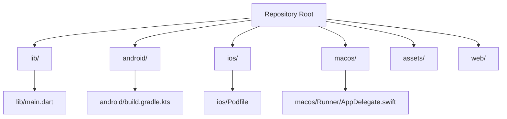
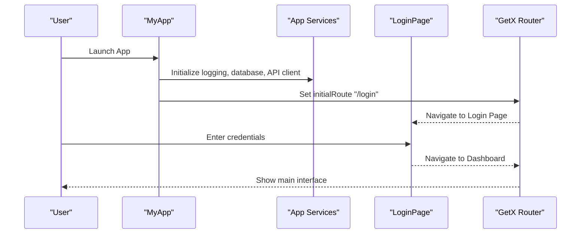
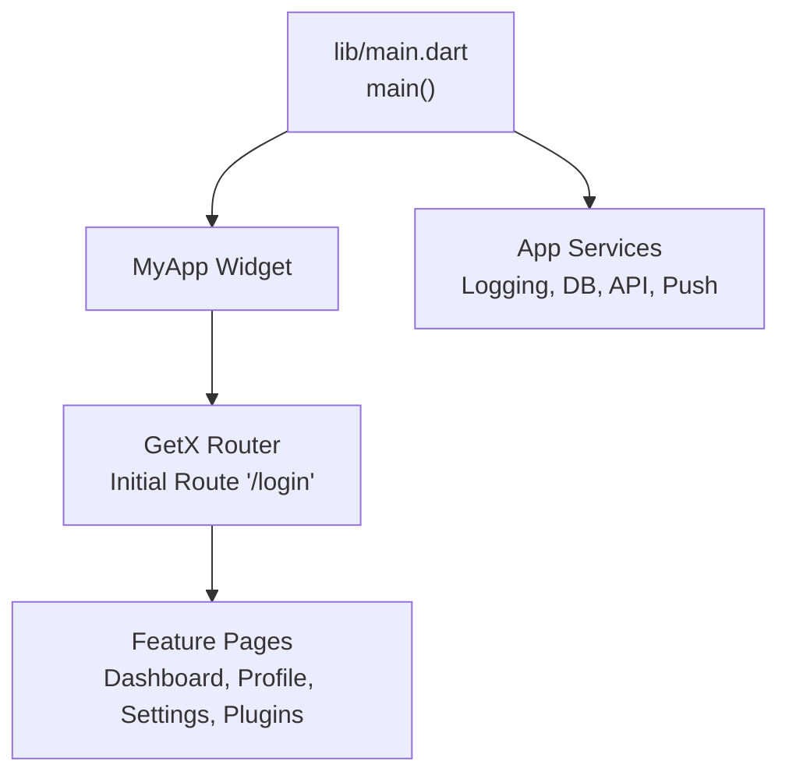

# Getting Started

<cite>
**Referenced Files in This Document**
- [pubspec.yaml](file://pubspec.yaml)
- [README.md](file://README.md)
- [lib/main.dart](file://lib/main.dart)
- [android/app/src/main/kotlin/com/example/moviepilot_mobile/MainActivity.kt](file://android/app/src/main/kotlin/com/example/moviepilot_mobile/MainActivity.kt)
- [ios/Runner/AppDelegate.swift](file://ios/Runner/AppDelegate.swift)
- [macos/Runner/AppDelegate.swift](file://macos/Runner/AppDelegate.swift)
- [android/build.gradle.kts](file://android/build.gradle.kts)
- [android/gradle.properties](file://android/gradle.properties)
- [ios/Podfile](file://ios/Podfile)
- [.fvmrc](file://.fvmrc)
- [analysis_options.yaml](file://analysis_options.yaml)
</cite>

## Table of Contents
1. [Introduction](#introduction)
2. [Project Structure](#project-structure)
3. [Prerequisites](#prerequisites)
4. [Installation](#installation)
5. [First Run Experience](#first-run-experience)
6. [Development Workflow](#development-workflow)
7. [Troubleshooting](#troubleshooting)
8. [Verification Checklist](#verification-checklist)
9. [Architecture Overview](#architecture-overview)
10. [Conclusion](#conclusion)

## Introduction
This guide helps you set up MoviePilot Mobile for development on iOS, Android, and macOS. It covers Flutter SDK requirements, environment setup, dependency installation, platform-specific configurations, and the first-run experience including server connection and authentication.

## Project Structure
MoviePilot Mobile follows a standard Flutter project layout with platform-specific folders for Android, iOS, and macOS, plus a Dart application entrypoint and modular feature organization under lib/.

**Diagram sources**
- [lib/main.dart:138-173](file://lib/main.dart#L138-L173)
- [android/build.gradle.kts:1-22](file://android/build.gradle.kts#L1-L22)
- [ios/Podfile:1-43](file://ios/Podfile#L1-L43)
- [macos/Runner/AppDelegate.swift:1-14](file://macos/Runner/AppDelegate.swift#L1-L14)

**Section sources**
- [lib/main.dart:1-173](file://lib/main.dart#L1-L173)

## Prerequisites
- Flutter SDK: The project specifies a Flutter SDK constraint and uses FVM to pin the version.
- Dart SDK: Matches the Flutter SDK requirement.
- Platform toolchains:
  - Android: Android Studio with Android SDK/NDK and Java configured.
  - iOS: Xcode 15+ and iOS 15+ deployment target.
  - macOS: Xcode for macOS app support.

Key indicators:
- Flutter SDK constraint and dependency versions are defined in pubspec.yaml.
- FVM configuration pins the Flutter version for deterministic builds.
- iOS Podfile sets platform 15.0 and Flutter pod setup.
- Android Gradle configuration enables AndroidX and Jetifier.

**Section sources**
- [pubspec.yaml:6-7](file://pubspec.yaml#L6-L7)
- [.fvmrc:1-3](file://.fvmrc#L1-L3)
- [ios/Podfile](file://ios/Podfile#L1)
- [android/build.gradle.kts:1-22](file://android/build.gradle.kts#L1-L22)

## Installation
Follow these steps to prepare your environment and run the project locally.

1) Install Flutter and Dart
- Use the Flutter SDK version specified in pubspec.yaml.
- Optionally use FVM to manage the Flutter version as per .fvmrc.

2) Clone and Prepare Dependencies
- Run dependency resolution to fetch Dart packages.
- For iOS, run CocoaPods setup to generate native project files.
- For Android, ensure Gradle wrapper and local.properties are present.

3) Configure Platform-Specific Setup
- Android: Open android/ in Android Studio, sync Gradle, and accept SDK licenses.
- iOS: Open ios/Runner.xcworkspace in Xcode, select a signing team, and run flutter pub get.
- macOS: Open macos/Runner.xcworkspace in Xcode and configure signing if needed.

4) Build and Run
- Connect a device/emulator or start an emulator.
- Run the app using your IDE or flutter run.

Environment variables and secrets:
- The project does not declare explicit environment variable placeholders in the provided files. If your server requires tokens or keys, configure them through the app's settings or plugin configuration after first run.

**Section sources**
- [pubspec.yaml:6-7](file://pubspec.yaml#L6-L7)
- [.fvmrc:1-3](file://.fvmrc#L1-L3)
- [ios/Podfile:27-36](file://ios/Podfile#L27-L36)
- [android/build.gradle.kts:1-22](file://android/build.gradle.kts#L1-L22)

## First Run Experience
When you launch the app for the first time:

1) Initial Navigation
- The app sets an initial route to the login screen.
- After successful authentication, navigation routes are registered for dashboard, profiles, settings, media, subscriptions, plugins, and more.

2) Server Connection Setup
- The app initializes networking and database services during startup.
- Authentication is handled via the login page and subsequent routes.
- On iOS, shared session storage is available for server URL and access token via a shared group, enabling widget integration.

3) Authentication Flow
- The app uses GetX for routing and state management.
- Routes are defined with lazy loading and optional permission guards.

4) Platform Integration Notes
- iOS AppDelegate integrates push notifications and handles universal links for widget navigation.
- macOS AppDelegate manages window lifecycle and secure restoration.

**Diagram sources**
- [lib/main.dart:138-173](file://lib/main.dart#L138-L173)
- [lib/main.dart](file://lib/main.dart#L194)
- [lib/main.dart](file://lib/main.dart#L211)

**Section sources**
- [lib/main.dart:138-173](file://lib/main.dart#L138-L173)
- [lib/main.dart:194-211](file://lib/main.dart#L194-L211)
- [ios/Runner/AppDelegate.swift:145-158](file://ios/Runner/AppDelegate.swift#L145-L158)

## Development Workflow
Recommended setup for smooth development:

- Linting and Analysis
  - The project uses Flutter lints via analysis_options.yaml.
  - Run flutter analyze regularly to catch issues early.

- Dependency Management
  - pubspec.yaml defines all Dart dependencies and dev_dependencies.
  - For iOS, CocoaPods is used; ensure pods are installed and up-to-date.
  - For Android, Gradle sync resolves dependencies automatically.

- IDE Configuration
  - Android Studio for Android development.
  - Xcode for iOS/macOS development.
  - Enable Flutter and Dart plugins for your IDE.

- Hot Reload and Debugging
  - Use flutter run with attached devices/emulators.
  - Leverage DevTools for performance profiling and memory inspection.

**Section sources**
- [analysis_options.yaml:8-10](file://analysis_options.yaml#L8-L10)
- [pubspec.yaml:52-62](file://pubspec.yaml#L52-L62)
- [ios/Podfile:27-36](file://ios/Podfile#L27-L36)
- [android/build.gradle.kts:1-22](file://android/build.gradle.kts#L1-L22)

## Troubleshooting
Common setup issues and resolutions:

- Flutter SDK Version Mismatch
  - Ensure your Flutter SDK matches the project requirement.
  - Use FVM to align your environment to the pinned version.

- iOS CocoaPods Issues
  - Run flutter pub get followed by cd ios && pod install.
  - Verify FLUTTER_ROOT exists in Generated.xcconfig as referenced by the Podfile.

- Android Gradle Sync Failures
  - Accept Android SDK licenses and update SDK tools.
  - Ensure ANDROID_HOME or ANDROID_SDK_ROOT is set in your environment.

- iOS Device/Signing Problems
  - Select a valid signing team in Xcode.
  - Ensure provisioning profiles are valid for your target device.

- macOS Build Issues
  - Confirm Xcode project is opened and signing is configured.
  - Clean derived data if build artifacts cause conflicts.

- Dependency Resolution Failures
  - Clear pub cache and re-run dependency resolution.
  - For iOS, delete Pods/, Podfile.lock, run flutter pub get, then pod install.

**Section sources**
- [.fvmrc:1-3](file://.fvmrc#L1-L3)
- [ios/Podfile:12-25](file://ios/Podfile#L12-L25)
- [android/gradle.properties:1-4](file://android/gradle.properties#L1-L4)

## Verification Checklist
Before declaring your setup complete, verify:

- Flutter doctor reports no critical issues.
- iOS: Xcode workspace opens without errors; signing is configured; pods installed.
- Android: Gradle sync succeeds; emulator/device reachable.
- macOS: Xcode workspace opens; signing configured if targeting macOS.
- App launches and navigates to the login screen.
- After login, core routes load without runtime exceptions.
- Database and API client initialize without errors.

## Architecture Overview
High-level startup and routing architecture:

**Diagram sources**
- [lib/main.dart:138-173](file://lib/main.dart#L138-L173)
- [lib/main.dart:194-211](file://lib/main.dart#L194-L211)

**Section sources**
- [lib/main.dart:138-173](file://lib/main.dart#L138-L173)
- [lib/main.dart:194-211](file://lib/main.dart#L194-L211)

## Conclusion
You now have the essentials to develop MoviePilot Mobile across iOS, Android, and macOS. Follow the installation steps, verify your environment with the checklist, and use the troubleshooting section to resolve common issues. For platform-specific nuances, refer to the linked files in this document.