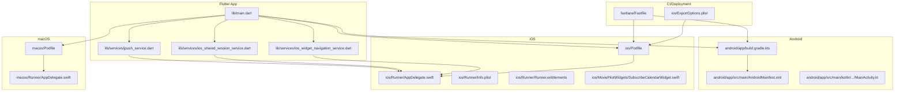
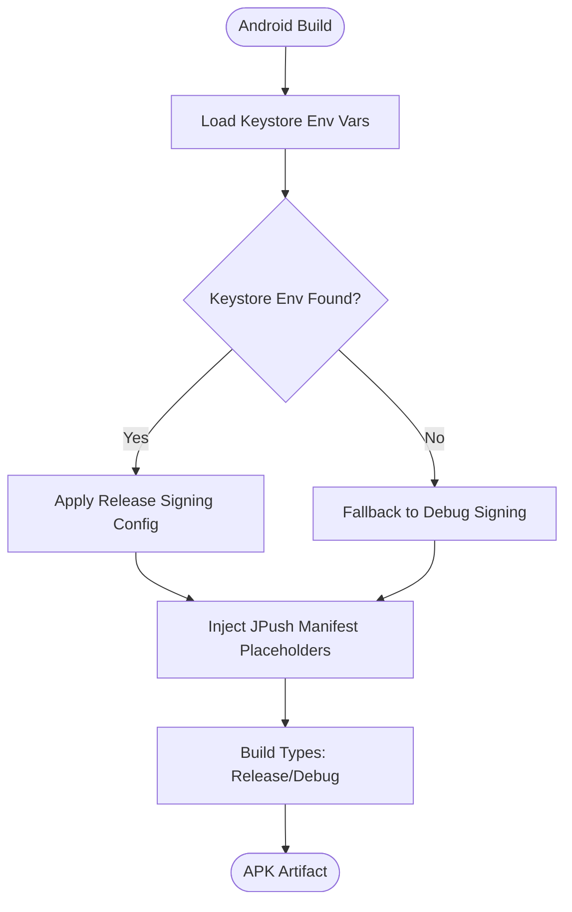
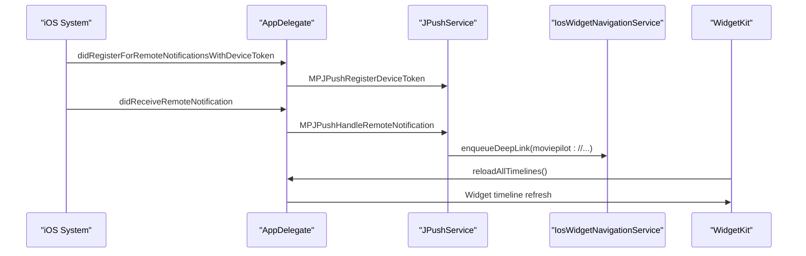
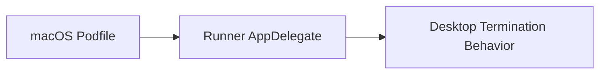
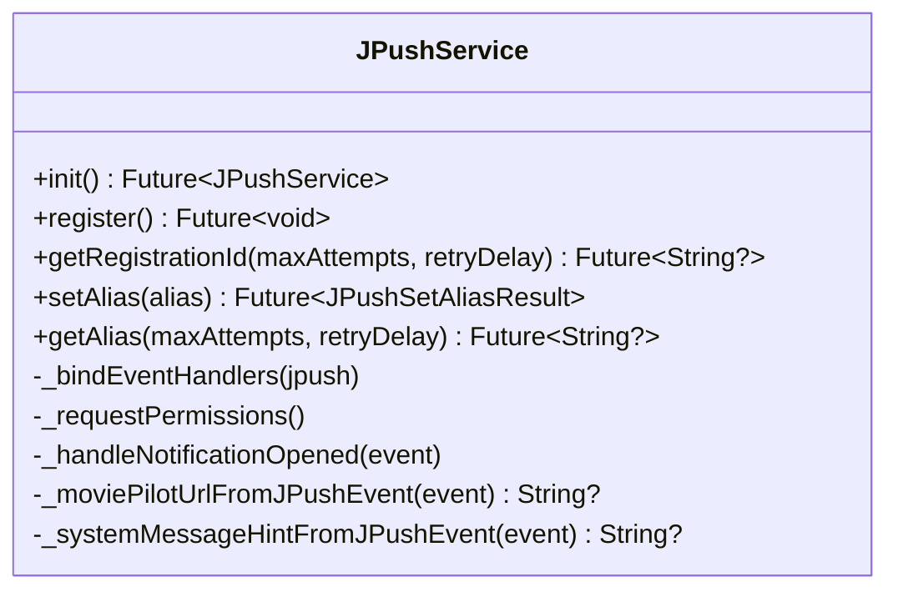
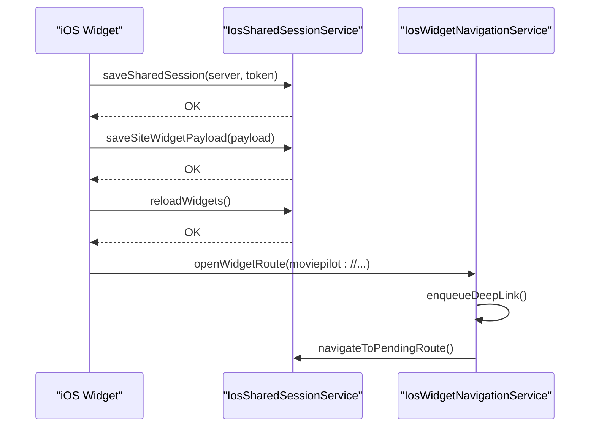
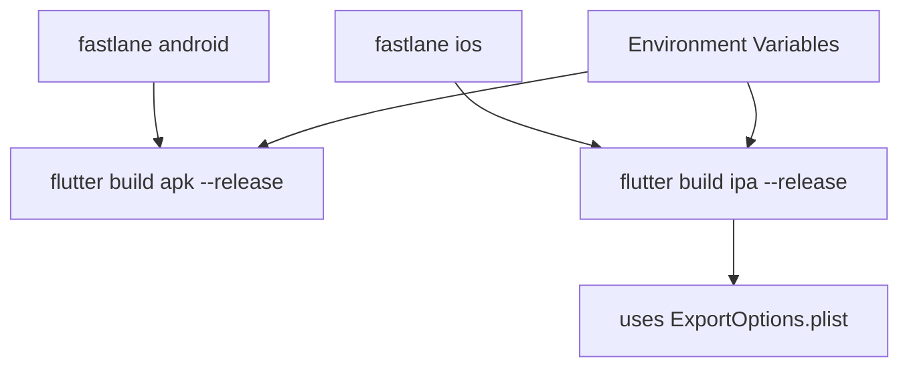
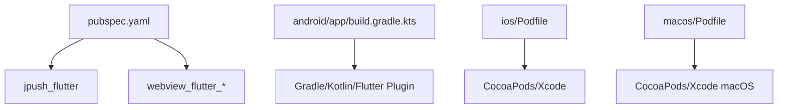

# Platform Integration

<cite>
**Referenced Files in This Document**
- [pubspec.yaml](file://pubspec.yaml)
- [lib/main.dart](file://lib/main.dart)
- [lib/services/jpush_service.dart](file://lib/services/jpush_service.dart)
- [lib/services/ios_shared_session_service.dart](file://lib/services/ios_shared_session_service.dart)
- [lib/services/ios_widget_navigation_service.dart](file://lib/services/ios_widget_navigation_service.dart)
- [android/app/build.gradle.kts](file://android/app/build.gradle.kts)
- [android/app/src/main/AndroidManifest.xml](file://android/app/src/main/AndroidManifest.xml)
- [android/app/src/main/kotlin/com/example/moviepilot_mobile/MainActivity.kt](file://android/app/src/main/kotlin/com/example/moviepilot_mobile/MainActivity.kt)
- [ios/Podfile](file://ios/Podfile)
- [ios/Runner/AppDelegate.swift](file://ios/Runner/AppDelegate.swift)
- [ios/Runner/Info.plist](file://ios/Runner/Info.plist)
- [ios/Runner/Runner.entitlements](file://ios/Runner/Runner.entitlements)
- [ios/MoviePilotWidgets/SubscribeCalendarWidget.swift](file://ios/MoviePilotWidgets/SubscribeCalendarWidget.swift)
- [macos/Podfile](file://macos/Podfile)
- [macos/Runner/AppDelegate.swift](file://macos/Runner/AppDelegate.swift)
- [fastlane/Fastfile](file://fastlane/Fastfile)
- [ios/ExportOptions.plist](file://ios/ExportOptions.plist)
</cite>

## Table of Contents
1. [Introduction](#introduction)
2. [Project Structure](#project-structure)
3. [Core Components](#core-components)
4. [Architecture Overview](#architecture-overview)
5. [Detailed Component Analysis](#detailed-component-analysis)
6. [Dependency Analysis](#dependency-analysis)
7. [Performance Considerations](#performance-considerations)
8. [Troubleshooting Guide](#troubleshooting-guide)
9. [Conclusion](#conclusion)
10. [Appendices](#appendices)

## Introduction
This document explains MoviePilot Mobile’s cross-platform integration across Android, iOS, and macOS. It covers build configuration, native code integration, permissions management, push notifications via JPush, iOS widgets, and platform-specific deployment considerations. It also documents how Flutter interacts with native platforms and how platform differences are handled.

## Project Structure
The repository follows a Flutter-centric layout with platform-specific directories under android/, ios/, and macos/. The Flutter app initializes platform services and routes, while native integrations are configured via Gradle, CocoaPods, and Xcode projects.



**Diagram sources**
- [lib/main.dart:138-166](file://lib/main.dart#L138-L166)
- [lib/services/jpush_service.dart:28-75](file://lib/services/jpush_service.dart#L28-L75)
- [lib/services/ios_shared_session_service.dart:4-49](file://lib/services/ios_shared_session_service.dart#L4-L49)
- [lib/services/ios_widget_navigation_service.dart:6-71](file://lib/services/ios_widget_navigation_service.dart#L6-L71)
- [android/app/build.gradle.kts:1-66](file://android/app/build.gradle.kts#L1-L66)
- [android/app/src/main/AndroidManifest.xml:1-56](file://android/app/src/main/AndroidManifest.xml#L1-L56)
- [android/app/src/main/kotlin/com/example/moviepilot_mobile/MainActivity.kt:1-12](file://android/app/src/main/kotlin/com/example/moviepilot_mobile/MainActivity.kt#L1-L12)
- [ios/Podfile:1-43](file://ios/Podfile#L1-L43)
- [ios/Runner/AppDelegate.swift:17-83](file://ios/Runner/AppDelegate.swift#L17-L83)
- [ios/Runner/Info.plist](file://ios/Runner/Info.plist)
- [ios/Runner/Runner.entitlements](file://ios/Runner/Runner.entitlements)
- [ios/MoviePilotWidgets/SubscribeCalendarWidget.swift:1-800](file://ios/MoviePilotWidgets/SubscribeCalendarWidget.swift#L1-L800)
- [macos/Podfile:1-43](file://macos/Podfile#L1-L43)
- [macos/Runner/AppDelegate.swift:1-14](file://macos/Runner/AppDelegate.swift#L1-L14)
- [fastlane/Fastfile:1-30](file://fastlane/Fastfile#L1-L30)
- [ios/ExportOptions.plist:1-19](file://ios/ExportOptions.plist#L1-L19)

**Section sources**
- [pubspec.yaml:1-82](file://pubspec.yaml#L1-L82)
- [lib/main.dart:138-166](file://lib/main.dart#L138-L166)

## Core Components
- Cross-platform initialization and routing are defined in the Flutter entrypoint, where platform services are registered and navigation is configured.
- Push notification service integrates JPush for Android and iOS, handling registration, permissions, and deep-link navigation from notifications.
- iOS-specific services manage shared session synchronization with widgets, method channels for widget-to-app communication, and deep-link routing.
- Android build configuration sets up signing, manifest placeholders for JPush, and SDK targets.
- iOS and macOS build configurations are managed via CocoaPods and Xcode projects.
- Deployment automation is provided via Fastlane lanes for Android APK and iOS IPA builds.

**Section sources**
- [lib/main.dart:138-166](file://lib/main.dart#L138-L166)
- [lib/services/jpush_service.dart:28-75](file://lib/services/jpush_service.dart#L28-L75)
- [lib/services/ios_shared_session_service.dart:4-49](file://lib/services/ios_shared_session_service.dart#L4-L49)
- [lib/services/ios_widget_navigation_service.dart:6-71](file://lib/services/ios_widget_navigation_service.dart#L6-L71)
- [android/app/build.gradle.kts:41-60](file://android/app/build.gradle.kts#L41-L60)
- [ios/Podfile:1-43](file://ios/Podfile#L1-L43)
- [macos/Podfile:1-43](file://macos/Podfile#L1-L43)
- [fastlane/Fastfile:12-29](file://fastlane/Fastfile#L12-L29)

## Architecture Overview
The app initializes platform services early in the lifecycle. On iOS, the AppDelegate bridges native push notification and widget interactions to Flutter via method channels. On Android, the MainActivity handles intent forwarding. Push notifications are unified through JPush, which provides a cross-platform interface.

```mermaid
sequenceDiagram
participant App as "Flutter App"
participant JP as "JPushService"
participant IOS as "iOS AppDelegate"
participant AND as "Android MainActivity"
participant Nav as "IosWidgetNavigationService"
App->>JP : init()
JP->>JP : setup(appKey, channel, production)
JP->>IOS : applyPushAuthority(ios)
JP->>AND : requestRequiredPermission(android)
IOS-->>JP : didRegisterForRemoteNotificationsWithDeviceToken
IOS-->>JP : didReceiveRemoteNotification
IOS-->>JP : userNotificationCenter willPresent/didReceive
JP->>Nav : enqueueDeepLink(moviepilot : //...)
Nav->>App : navigateToPendingRoute()
```

**Diagram sources**
- [lib/main.dart:138-166](file://lib/main.dart#L138-L166)
- [lib/services/jpush_service.dart:40-111](file://lib/services/jpush_service.dart#L40-L111)
- [ios/Runner/AppDelegate.swift:94-143](file://ios/Runner/AppDelegate.swift#L94-L143)
- [android/app/src/main/kotlin/com/example/moviepilot_mobile/MainActivity.kt:6-11](file://android/app/src/main/kotlin/com/example/moviepilot_mobile/MainActivity.kt#L6-L11)
- [lib/services/ios_widget_navigation_service.dart:37-67](file://lib/services/ios_widget_navigation_service.dart#L37-L67)

## Detailed Component Analysis

### Android Integration
- Build configuration:
  - Signing is conditionally configured from environment variables for release builds.
  - Manifest placeholders inject JPush package name, app key, and channel.
  - Java/Kotlin compatibility set to Java 11.
- Permissions:
  - Internet, network state, Wi-Fi state, camera, post notifications, read media images, and legacy external storage read are declared.
  - Cleartext traffic is enabled at the application level.
- Native activity:
  - MainActivity forwards new intents to Flutter to support deep links and app interactions.



**Diagram sources**
- [android/app/build.gradle.kts:41-60](file://android/app/build.gradle.kts#L41-L60)
- [android/app/build.gradle.kts:31-38](file://android/app/build.gradle.kts#L31-L38)
- [android/app/src/main/AndroidManifest.xml:11-43](file://android/app/src/main/AndroidManifest.xml#L11-L43)

**Section sources**
- [android/app/build.gradle.kts:1-66](file://android/app/build.gradle.kts#L1-L66)
- [android/app/src/main/AndroidManifest.xml:1-56](file://android/app/src/main/AndroidManifest.xml#L1-L56)
- [android/app/src/main/kotlin/com/example/moviepilot_mobile/MainActivity.kt:1-12](file://android/app/src/main/kotlin/com/example/moviepilot_mobile/MainActivity.kt#L1-L12)

### iOS Integration
- Push notifications with JPush:
  - Device token registration and remote notification handlers forward events to JPush.
  - Notification authorization is requested on iOS.
  - Deep links extracted from notification extras are routed to the app.
- Shared session and widgets:
  - Method channel synchronizes server URL and access token with the shared app group.
  - Widget timelines are reloaded upon session changes.
- WidgetKit calendar:
  - A calendar widget queries the MoviePilot API using shared credentials and displays upcoming TV episodes.
  - Images are proxied through the app’s cache endpoint.



**Diagram sources**
- [ios/Runner/AppDelegate.swift:94-143](file://ios/Runner/AppDelegate.swift#L94-L143)
- [lib/services/jpush_service.dart:77-111](file://lib/services/jpush_service.dart#L77-L111)
- [lib/services/ios_widget_navigation_service.dart:37-67](file://lib/services/ios_widget_navigation_service.dart#L37-L67)
- [ios/MoviePilotWidgets/SubscribeCalendarWidget.swift:149-162](file://ios/MoviePilotWidgets/SubscribeCalendarWidget.swift#L149-L162)

**Section sources**
- [ios/Runner/AppDelegate.swift:17-83](file://ios/Runner/AppDelegate.swift#L17-L83)
- [ios/Runner/AppDelegate.swift:94-143](file://ios/Runner/AppDelegate.swift#L94-L143)
- [lib/services/jpush_service.dart:165-179](file://lib/services/jpush_service.dart#L165-L179)
- [lib/services/ios_shared_session_service.dart:4-49](file://lib/services/ios_shared_session_service.dart#L4-L49)
- [ios/MoviePilotWidgets/SubscribeCalendarWidget.swift:149-162](file://ios/MoviePilotWidgets/SubscribeCalendarWidget.swift#L149-L162)

### macOS Integration
- macOS build uses CocoaPods and Flutter macOS integration.
- AppDelegate enables secure restoration and termination behavior suitable for desktop apps.



**Diagram sources**
- [macos/Podfile:1-43](file://macos/Podfile#L1-43)
- [macos/Runner/AppDelegate.swift:1-14](file://macos/Runner/AppDelegate.swift#L1-L14)

**Section sources**
- [macos/Podfile:1-43](file://macos/Podfile#L1-L43)
- [macos/Runner/AppDelegate.swift:1-14](file://macos/Runner/AppDelegate.swift#L1-L14)

### Push Notification Service (Cross-Platform)
- Initializes JPush with app key and channel, requests permissions on each platform, logs registration IDs, and exposes alias management.
- Extracts deep links from notification extras and enqueues navigation.



**Diagram sources**
- [lib/services/jpush_service.dart:28-296](file://lib/services/jpush_service.dart#L28-L296)

**Section sources**
- [lib/services/jpush_service.dart:28-296](file://lib/services/jpush_service.dart#L28-L296)

### iOS Shared Session and Navigation
- Synchronizes shared session data to the app group via a method channel.
- Handles widget-to-app navigation by storing pending routes and navigating when safe.



**Diagram sources**
- [lib/services/ios_shared_session_service.dart:7-46](file://lib/services/ios_shared_session_service.dart#L7-L46)
- [lib/services/ios_widget_navigation_service.dart:11-67](file://lib/services/ios_widget_navigation_service.dart#L11-L67)
- [ios/Runner/AppDelegate.swift:34-81](file://ios/Runner/AppDelegate.swift#L34-L81)

**Section sources**
- [lib/services/ios_shared_session_service.dart:4-49](file://lib/services/ios_shared_session_service.dart#L4-L49)
- [lib/services/ios_widget_navigation_service.dart:6-71](file://lib/services/ios_widget_navigation_service.dart#L6-L71)
- [ios/Runner/AppDelegate.swift:17-83](file://ios/Runner/AppDelegate.swift#L17-L83)

### Deployment and CI
- Fastlane lanes:
  - Android: builds a release APK using Flutter.
  - iOS: builds a release IPA using Flutter, leveraging ExportOptions.plist for App Store distribution.
- Environment variables:
  - Android signing requires keystore path, password, key alias, and key password.



**Diagram sources**
- [fastlane/Fastfile:12-29](file://fastlane/Fastfile#L12-L29)
- [ios/ExportOptions.plist:1-19](file://ios/ExportOptions.plist#L1-L19)

**Section sources**
- [fastlane/Fastfile:1-30](file://fastlane/Fastfile#L1-L30)
- [ios/ExportOptions.plist:1-19](file://ios/ExportOptions.plist#L1-L19)

## Dependency Analysis
- Flutter dependencies include jpush_flutter for push notifications and platform-specific WebView plugins.
- Android build depends on Gradle, Kotlin, and Flutter Gradle plugin.
- iOS build depends on CocoaPods and Xcode configuration; macOS build mirrors iOS setup for macOS.



**Diagram sources**
- [pubspec.yaml:43-47](file://pubspec.yaml#L43-L47)
- [android/app/build.gradle.kts:1-6](file://android/app/build.gradle.kts#L1-L6)
- [ios/Podfile:25-32](file://ios/Podfile#L25-L32)
- [macos/Podfile:25-32](file://macos/Podfile#L25-L32)

**Section sources**
- [pubspec.yaml:1-82](file://pubspec.yaml#L1-L82)
- [android/app/build.gradle.kts:1-66](file://android/app/build.gradle.kts#L1-L66)
- [ios/Podfile:1-43](file://ios/Podfile#L1-L43)
- [macos/Podfile:1-43](file://macos/Podfile#L1-L43)

## Performance Considerations
- Push notification handling defers navigation until the app is ready to avoid blocking the UI thread.
- iOS widget data fetching uses asynchronous tasks and limits the number of displayed items to reduce overhead.
- Android enables hardware acceleration and adjusts config changes to minimize layout thrashing.

## Troubleshooting Guide
- Android signing failures:
  - Ensure environment variables for keystore path, password, key alias, and key password are set before building release APKs.
- iOS push notification registration:
  - Verify device token registration callbacks and notification authorization requests are invoked.
- iOS widget timeline not updating:
  - Confirm shared session synchronization and widget reload triggers are executed after session changes.
- Fastlane build errors:
  - Check that required environment variables are present for Android and that ExportOptions.plist is correctly configured for iOS.

**Section sources**
- [android/app/build.gradle.kts:41-54](file://android/app/build.gradle.kts#L41-L54)
- [ios/Runner/AppDelegate.swift:94-143](file://ios/Runner/AppDelegate.swift#L94-L143)
- [lib/services/ios_shared_session_service.dart:4-49](file://lib/services/ios_shared_session_service.dart#L4-L49)
- [fastlane/Fastfile:7-8](file://fastlane/Fastfile#L7-L8)

## Conclusion
MoviePilot Mobile integrates Android, iOS, and macOS through Flutter with native bridges for push notifications, shared sessions, and widgets. Android focuses on Gradle-based signing and manifest configuration, while iOS leverages JPush, method channels, and WidgetKit. macOS adapts the iOS setup for desktop behavior. Deployment is automated via Fastlane with platform-specific export options.

## Appendices
- Permissions checklist:
  - Android: internet, network state, Wi-Fi state, camera, post notifications, read media images, external storage read (up to API 32).
  - iOS: push notification authorization and shared container entitlements for widgets.
- Build prerequisites:
  - Android: keystore environment variables.
  - iOS: Apple Team ID and automatic signing configuration via ExportOptions.plist.