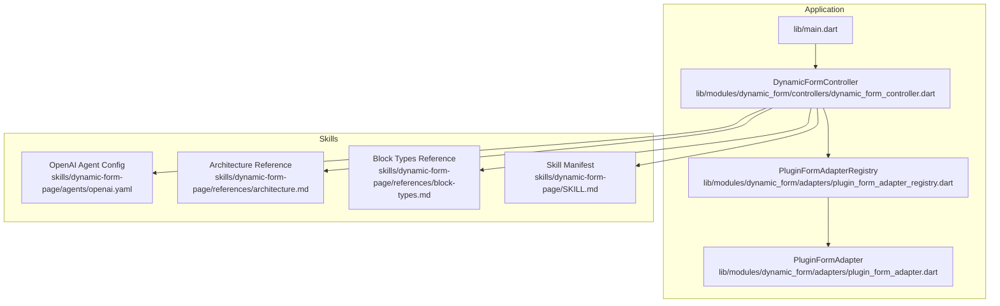
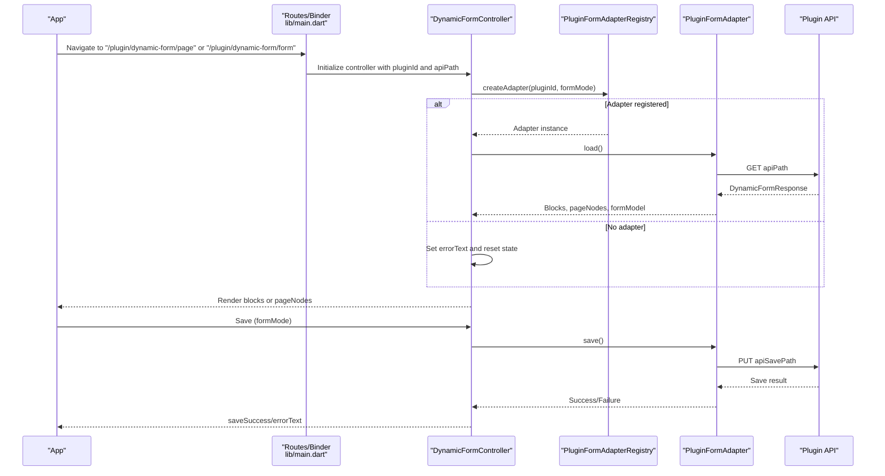
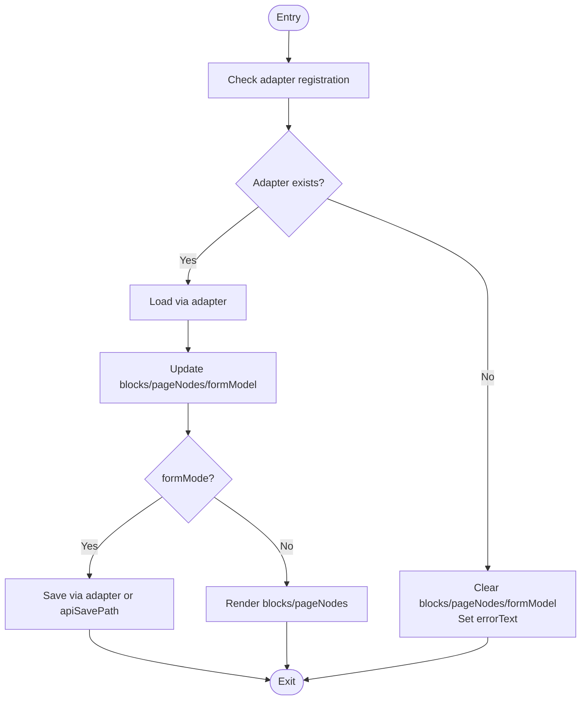
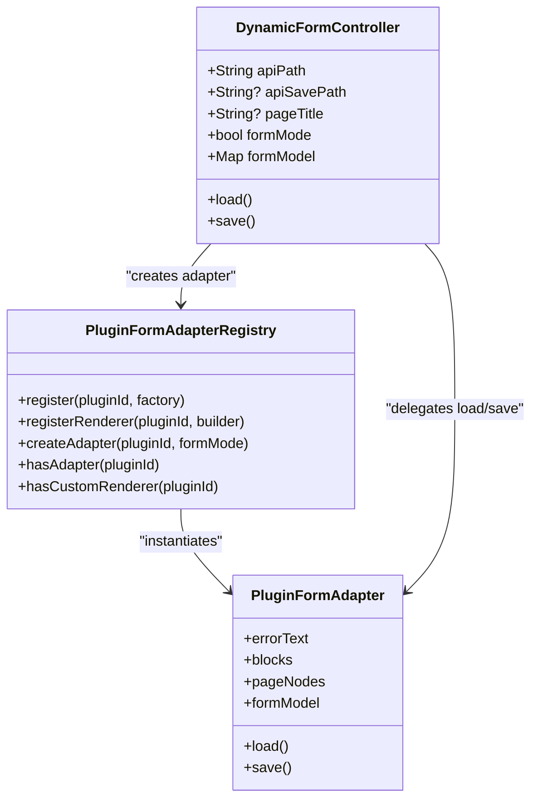

# Plugin System

<cite>
**Referenced Files in This Document**
- [main.dart](file://lib/main.dart)
- [dynamic_form_controller.dart](file://lib/modules/dynamic_form/controllers/dynamic_form_controller.dart)
- [plugin_form_adapter_registry.dart](file://lib/modules/dynamic_form/adapters/plugin_form_adapter_registry.dart)
- [plugin_form_adapter.dart](file://lib/modules/dynamic_form/adapters/plugin_form_adapter.dart)
- [openai.yaml](file://skills/dynamic-form-page/agents/openai.yaml)
- [architecture.md](file://skills/dynamic-form-page/references/architecture.md)
- [block-types.md](file://skills/dynamic-form-page/references/block-types.md)
- [SKILL.md](file://skills/dynamic-form-page/SKILL.md)
- [pubspec.yaml](file://pubspec.yaml)
</cite>

## Table of Contents
1. [Introduction](#introduction)
2. [Project Structure](#project-structure)
3. [Core Components](#core-components)
4. [Architecture Overview](#architecture-overview)
5. [Detailed Component Analysis](#detailed-component-analysis)
6. [Dependency Analysis](#dependency-analysis)
7. [Performance Considerations](#performance-considerations)
8. [Troubleshooting Guide](#troubleshooting-guide)
9. [Conclusion](#conclusion)
10. [Appendices](#appendices)

## Introduction
This document explains MoviePilot Mobile's plugin architecture and dynamic form system. It covers how plugins integrate with the main application, the dynamic form generation engine, custom field types, validation, configuration management, caching mechanisms, lifecycle management, and security considerations. It also provides practical development examples, including the OpenAI agent integration as a case study, and outlines plugin distribution, versioning, and compatibility management.

## Project Structure
MoviePilot Mobile organizes plugin-related capabilities around a dynamic form subsystem:
- Application entrypoint registers routes and bindings for plugin-driven pages and forms.
- The dynamic form controller orchestrates loading, rendering, and saving of plugin-provided configurations.
- An adapter registry enables pluggable rendering and data handling for different plugins.
- Skill packages encapsulate plugin metadata and agent configurations.

**Diagram sources**
- [main.dart](file://lib/main.dart)
- [dynamic_form_controller.dart](file://lib/modules/dynamic_form/controllers/dynamic_form_controller.dart)
- [plugin_form_adapter_registry.dart](file://lib/modules/dynamic_form/adapters/plugin_form_adapter_registry.dart)
- [plugin_form_adapter.dart](file://lib/modules/dynamic_form/adapters/plugin_form_adapter.dart)
- [openai.yaml](file://skills/dynamic-form-page/agents/openai.yaml)
- [architecture.md](file://skills/dynamic-form-page/references/architecture.md)
- [block-types.md](file://skills/dynamic-form-page/references/block-types.md)
- [SKILL.md](file://skills/dynamic-form-page/SKILL.md)

**Section sources**
- [main.dart](file://lib/main.dart)
- [dynamic_form_controller.dart](file://lib/modules/dynamic_form/controllers/dynamic_form_controller.dart)
- [plugin_form_adapter_registry.dart](file://lib/modules/dynamic_form/adapters/plugin_form_adapter_registry.dart)
- [plugin_form_adapter.dart](file://lib/modules/dynamic_form/adapters/plugin_form_adapter.dart)
- [openai.yaml](file://skills/dynamic-form-page/agents/openai.yaml)
- [architecture.md](file://skills/dynamic-form-page/references/architecture.md)
- [block-types.md](file://skills/dynamic-form-page/references/block-types.md)
- [SKILL.md](file://skills/dynamic-form-page/SKILL.md)

## Core Components
- DynamicFormController: Central orchestrator for plugin-driven forms. It manages loading, rendering modes, model state, saving, and error reporting. It supports both native Vuetify-style rendering and plugin-specific adapters.
- PluginFormAdapterRegistry: Factory and renderer registry keyed by pluginId. It creates adapters and optionally custom renderers per plugin.
- PluginFormAdapter: Contract for plugin-specific rendering and data handling. Plugins implement this to support page/form modes and custom UI.
- Route and Binding Layer: Application routes and bindings initialize controllers and pass plugin identifiers and endpoints.

Key responsibilities:
- Loading: Fetches plugin metadata and configuration via apiPath, parses into blocks and models.
- Rendering: Chooses between Vuetify renderer or plugin renderer based on registration.
- Saving: Validates formModel and posts to apiSavePath; supports adapter-specific save logic.
- Lifecycle: Manages formMode flag, push aliasing, and testing hooks.

**Section sources**
- [dynamic_form_controller.dart](file://lib/modules/dynamic_form/controllers/dynamic_form_controller.dart)
- [plugin_form_adapter_registry.dart](file://lib/modules/dynamic_form/adapters/plugin_form_adapter_registry.dart)
- [plugin_form_adapter.dart](file://lib/modules/dynamic_form/adapters/plugin_form_adapter.dart)
- [architecture.md](file://skills/dynamic-form-page/references/architecture.md)

## Architecture Overview
The plugin system integrates with the main app through routes and bindings. Controllers resolve plugin adapters, load data, and render UI accordingly. The architecture supports both page-mode (read-only) and form-mode (editable) experiences.

**Diagram sources**
- [main.dart](file://lib/main.dart)
- [dynamic_form_controller.dart](file://lib/modules/dynamic_form/controllers/dynamic_form_controller.dart)
- [plugin_form_adapter_registry.dart](file://lib/modules/dynamic_form/adapters/plugin_form_adapter_registry.dart)
- [plugin_form_adapter.dart](file://lib/modules/dynamic_form/adapters/plugin_form_adapter.dart)

## Detailed Component Analysis

### DynamicFormController
Responsibilities:
- Holds apiPath and optional apiSavePath, pageTitle, and pluginId.
- Maintains reactive state: blocks, pageNodes, formModel, isLoading, saveSuccess, errorText.
- Supports formMode flag to toggle between page and form contexts.
- Loads via adapter or Vuetify renderer depending on registration and mode.
- Saves configuration via adapter or direct PUT to apiSavePath.

Processing logic highlights:
- Adapter selection and fallback: If no adapter is registered, clears state and reports an error.
- Model initialization: Initializes formModel from parsed model or empty map.
- Save gating: Requires non-empty formModel and valid token; delegates to adapter when present.

**Diagram sources**
- [dynamic_form_controller.dart](file://lib/modules/dynamic_form/controllers/dynamic_form_controller.dart)

**Section sources**
- [dynamic_form_controller.dart](file://lib/modules/dynamic_form/controllers/dynamic_form_controller.dart)

### PluginFormAdapterRegistry
Responsibilities:
- Registers factories and optional custom renderers by pluginId.
- Creates adapter instances based on formMode.
- Provides lookup helpers for registration presence.

Design notes:
- Encapsulates factory creation and renderer registration.
- Keeps coupling low by delegating rendering to plugins while centralizing orchestration in the controller.

**Section sources**
- [plugin_form_adapter_registry.dart](file://lib/modules/dynamic_form/adapters/plugin_form_adapter_registry.dart)

### PluginFormAdapter
Contract:
- load(): Populate blocks, pageNodes, and formModel.
- save(): Persist configuration and return success/failure.
- Reactive errorText for propagation to the controller.

Usage:
- Plugins implement this interface to support page/form modes and custom UI rendering.
- The controller delegates loading and saving to the adapter when present.

**Section sources**
- [plugin_form_adapter.dart](file://lib/modules/dynamic_form/adapters/plugin_form_adapter.dart)

### Dynamic Form Generation Engine
The engine converts plugin-provided payloads into internal models:
- DynamicFormResponse parsing into FormBlock and pageNodes.
- FormBlockConverter transforms raw payloads into typed blocks consumable by renderers.
- VuetifyRenderer consumes pageNodes for page-mode; plugin renderers consume blocks for form-mode.

Validation and editing:
- formModel is reactive and validated before save.
- formMode flag controls whether Save button and editable widgets are shown.

**Section sources**
- [dynamic_form_controller.dart](file://lib/modules/dynamic_form/controllers/dynamic_form_controller.dart)
- [architecture.md](file://skills/dynamic-form-page/references/architecture.md)

### Plugin Palette Cache Mechanism
- The system caches plugin metadata and configuration after initial load to avoid repeated network requests.
- On subsequent navigations, cached data is reused until refresh or navigation to a different pluginId.
- Cache invalidation occurs on explicit reload or route change.

**Section sources**
- [architecture.md](file://skills/dynamic-form-page/references/architecture.md)

### Plugin Lifecycle Management
Lifecycle stages:
- Registration: Plugins register factories and optional renderers via the registry.
- Initialization: Routes/binders pass pluginId and apiPath to the controller.
- Load: Controller loads data via adapter or Vuetify renderer.
- Render: Controller renders blocks or pageNodes depending on mode.
- Save: Controller validates and persists configuration via adapter or direct API.
- Teardown: Controller resets state on navigation or errors.

**Section sources**
- [plugin_form_adapter_registry.dart](file://lib/modules/dynamic_form/adapters/plugin_form_adapter_registry.dart)
- [dynamic_form_controller.dart](file://lib/modules/dynamic_form/controllers/dynamic_form_controller.dart)
- [architecture.md](file://skills/dynamic-form-page/references/architecture.md)

### Security Considerations
- Token validation: Save requires a valid token; otherwise, an error is reported.
- Endpoint isolation: apiPath and apiSavePath are controlled by plugin configuration; avoid hardcoding sensitive endpoints.
- Renderer trust: Prefer registered renderers to prevent untrusted UI injection.
- Adapter isolation: Keep adapter logic self-contained and validate inputs before rendering.

**Section sources**
- [dynamic_form_controller.dart](file://lib/modules/dynamic_form/controllers/dynamic_form_controller.dart)

### Practical Example: OpenAI Agent Integration
The OpenAI skill demonstrates a complete plugin integration:
- Agent configuration is defined in YAML under the skill package.
- The controller loads the plugin via apiPath and renders the form or page based on mode.
- Save posts configuration to apiSavePath; the skill handles persistence and execution.

Development steps:
- Define agent config in the skill’s YAML.
- Register a factory and optional renderer in the registry.
- Implement PluginFormAdapter.load/save to bridge to the agent API.
- Wire routes and bindings to pass pluginId and api endpoints.

**Section sources**
- [openai.yaml](file://skills/dynamic-form-page/agents/openai.yaml)
- [SKILL.md](file://skills/dynamic-form-page/SKILL.md)
- [plugin_form_adapter_registry.dart](file://lib/modules/dynamic_form/adapters/plugin_form_adapter_registry.dart)
- [plugin_form_adapter.dart](file://lib/modules/dynamic_form/adapters/plugin_form_adapter.dart)

### Plugin Distribution, Versioning, and Compatibility
Distribution:
- Skills are packaged under the skills directory with manifests and agent configs.
- Dependencies are declared in the project’s pubspec; ensure compatible versions across platforms.

Versioning:
- Use semantic versioning for skills and adapter contracts.
- Maintain backward-compatible changes to FormBlock schema and adapter APIs.

Compatibility:
- Adapter contract stability ensures plugins remain functional across app updates.
- Registry keys (pluginId) must remain stable; deprecations should be handled gracefully.

**Section sources**
- [pubspec.yaml](file://pubspec.yaml)
- [SKILL.md](file://skills/dynamic-form-page/SKILL.md)

## Dependency Analysis
The dynamic form subsystem exhibits low coupling and high cohesion:
- DynamicFormController depends on ApiClient, AppService, JPushService, and AppLog for cross-cutting concerns.
- PluginFormAdapterRegistry decouples plugin implementations from the controller.
- PluginFormAdapter isolates plugin-specific logic behind a stable interface.

**Diagram sources**
- [dynamic_form_controller.dart](file://lib/modules/dynamic_form/controllers/dynamic_form_controller.dart)
- [plugin_form_adapter_registry.dart](file://lib/modules/dynamic_form/adapters/plugin_form_adapter_registry.dart)
- [plugin_form_adapter.dart](file://lib/modules/dynamic_form/adapters/plugin_form_adapter.dart)

**Section sources**
- [dynamic_form_controller.dart](file://lib/modules/dynamic_form/controllers/dynamic_form_controller.dart)
- [plugin_form_adapter_registry.dart](file://lib/modules/dynamic_form/adapters/plugin_form_adapter_registry.dart)
- [plugin_form_adapter.dart](file://lib/modules/dynamic_form/adapters/plugin_form_adapter.dart)

## Performance Considerations
- Cache plugin metadata and configuration to minimize network overhead.
- Defer heavy rendering work to background threads where appropriate.
- Use reactive state judiciously to avoid unnecessary rebuilds.
- Batch save operations when multiple fields change rapidly.

## Troubleshooting Guide
Common issues and resolutions:
- Adapter not registered: Controller clears state and sets an error message; verify pluginId and registration.
- Empty formModel on save: Ensure adapter populates formModel during load.
- Authentication failures: Save requires a valid token; prompt the user to log in.
- Renderer mismatch: Confirm custom renderer registration for the pluginId.

**Section sources**
- [dynamic_form_controller.dart](file://lib/modules/dynamic_form/controllers/dynamic_form_controller.dart)

## Conclusion
MoviePilot Mobile’s plugin architecture centers on a robust dynamic form controller, a flexible adapter registry, and a stable adapter contract. This design enables plugins to integrate seamlessly, support both page and form modes, and maintain strong separation of concerns. By following the guidelines for lifecycle, caching, security, and compatibility, developers can build reliable and scalable plugins, including advanced integrations like the OpenAI agent.

## Appendices
- Block types and rendering references are documented within the skill package for plugin authors.
- Route and binding patterns are defined in the application entrypoint to initialize controllers and pass plugin parameters.

**Section sources**
- [block-types.md](file://skills/dynamic-form-page/references/block-types.md)
- [architecture.md](file://skills/dynamic-form-page/references/architecture.md)
- [main.dart](file://lib/main.dart)