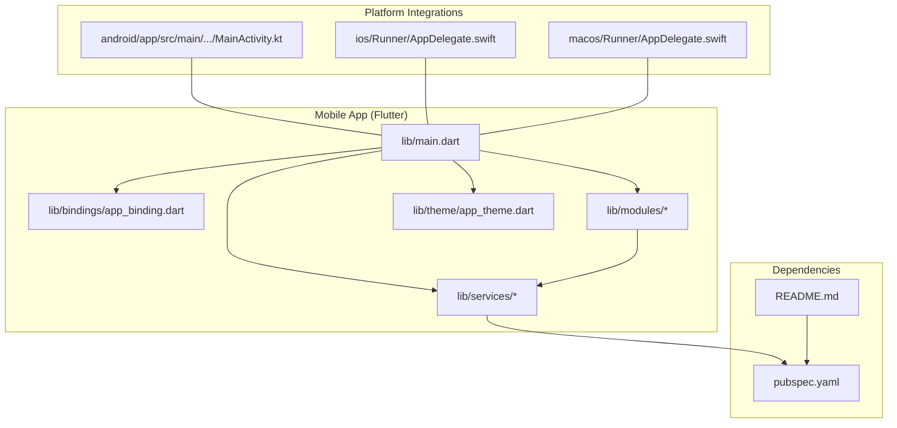
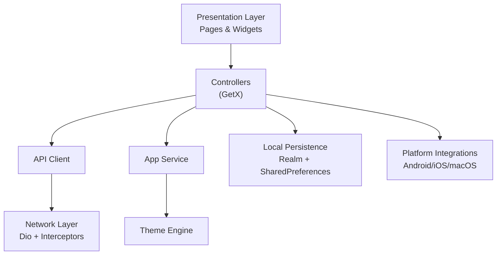
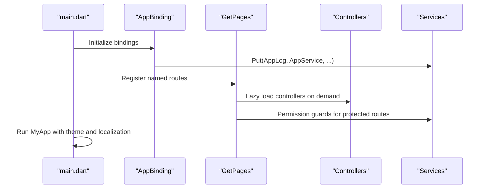
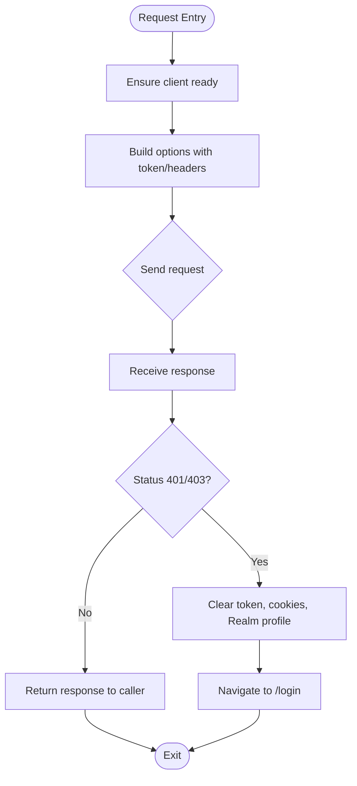
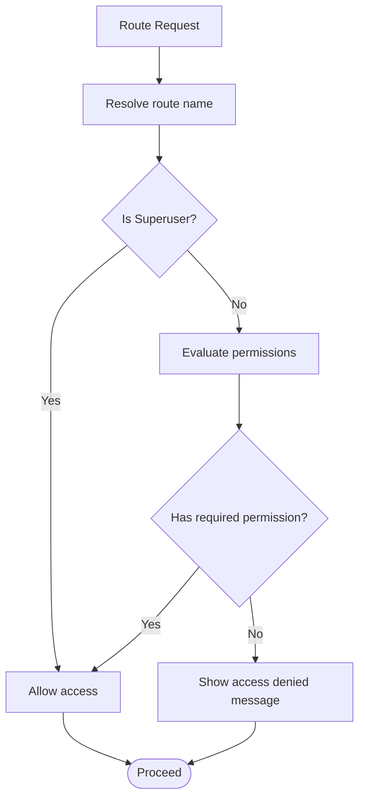
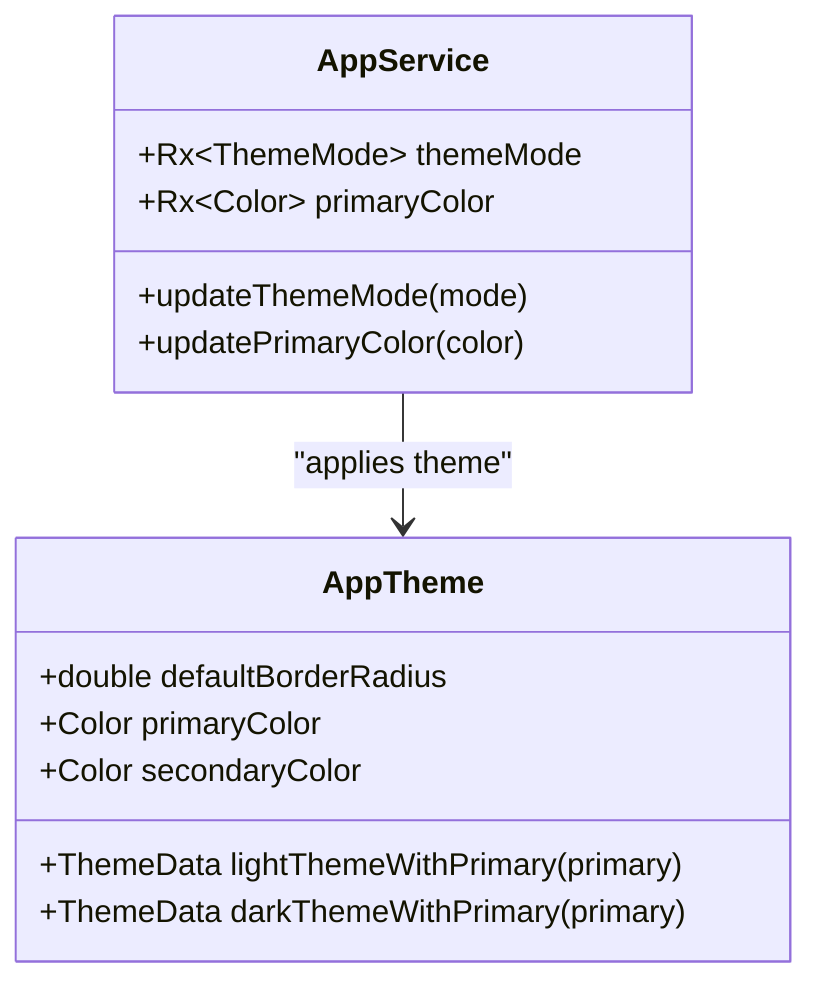
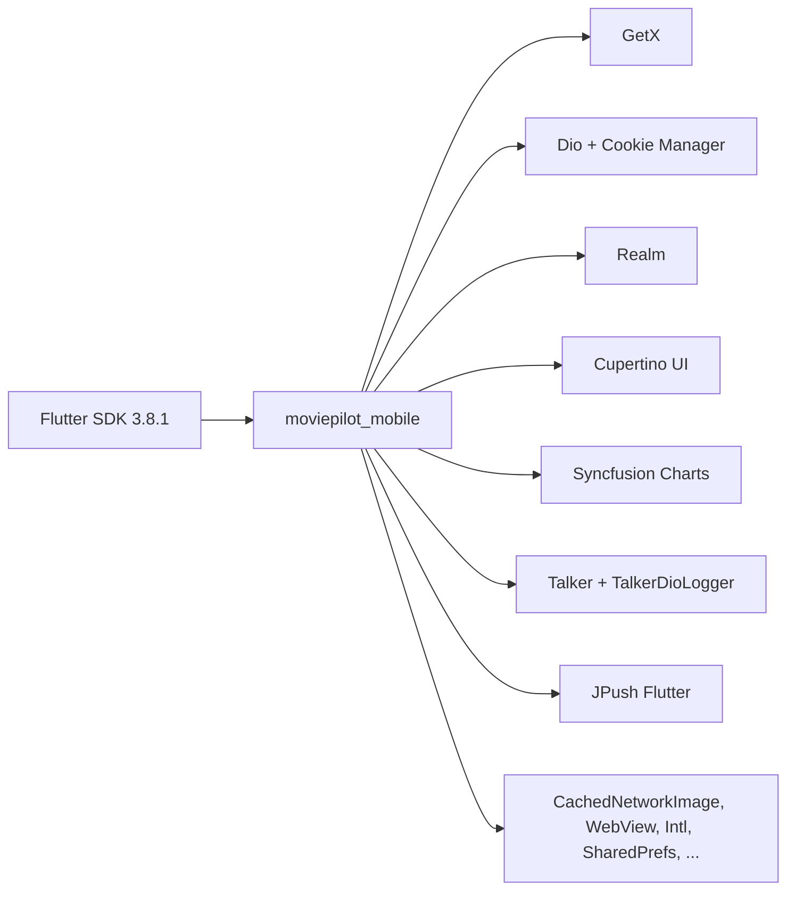

# Project Overview

<cite>
**Referenced Files in This Document**
- [README.md](file://README.md)
- [pubspec.yaml](file://pubspec.yaml)
- [lib/main.dart](file://lib/main.dart)
- [lib/bindings/app_binding.dart](file://lib/bindings/app_binding.dart)
- [lib/services/api_client.dart](file://lib/services/api_client.dart)
- [lib/services/app_service.dart](file://lib/services/app_service.dart)
- [lib/theme/app_theme.dart](file://lib/theme/app_theme.dart)
- [lib/modules/index.dart](file://lib/modules/index.dart)
- [android/app/src/main/kotlin/com/example/moviepilot_mobile/MainActivity.kt](file://android/app/src/main/kotlin/com/example/moviepilot_mobile/MainActivity.kt)
- [ios/Runner/AppDelegate.swift](file://ios/Runner/AppDelegate.swift)
- [macos/Runner/AppDelegate.swift](file://macos/Runner/AppDelegate.swift)
</cite>

## Table of Contents
1. [Introduction](#introduction)
2. [Project Structure](#project-structure)
3. [Core Components](#core-components)
4. [Architecture Overview](#architecture-overview)
5. [Detailed Component Analysis](#detailed-component-analysis)
6. [Dependency Analysis](#dependency-analysis)
7. [Performance Considerations](#performance-considerations)
8. [Troubleshooting Guide](#troubleshooting-guide)
9. [Conclusion](#conclusion)
10. [Appendices](#appendices)

## Introduction
MoviePilot Mobile is a Flutter-based mobile client for the MoviePilot media management ecosystem. It extends the desktop experience to mobile devices, enabling users to monitor dashboards, manage media libraries, configure plugins, and control downloads while maintaining a consistent interface across iOS, Android, and macOS. The project emphasizes a modern UI with iOS-style Cupertino widgets, robust state management via GetX, and a modular architecture that cleanly separates concerns across features such as dashboard monitoring, media discovery, subscriptions, plugin management, and system settings.

Target audience includes home media server administrators and power users who want centralized control over their MoviePilot instance from mobile devices. The app supports push notifications (via JPush), integrates with native platform capabilities, and provides extensive customization through themes, background imagery, and per-feature permissions derived from the MoviePilot server.

## Project Structure
The repository follows a conventional Flutter layout with platform-specific configurations under android/, ios/, and macos/. The Dart application code resides primarily under lib/, organized by functional modules (e.g., dashboard, plugin, settings) and supporting layers (services, controllers, models, widgets). The main entry point initializes global services, routes, and bindings, while pubspec.yaml defines the Flutter SDK, dependencies, and platform assets.

**Diagram sources**
- [lib/main.dart:138-166](file://lib/main.dart#L138-L166)
- [lib/bindings/app_binding.dart:12-24](file://lib/bindings/app_binding.dart#L12-L24)
- [lib/modules/index.dart:21-340](file://lib/modules/index.dart#L21-L340)
- [lib/services/api_client.dart:45-645](file://lib/services/api_client.dart#L45-L645)
- [lib/services/app_service.dart:17-683](file://lib/services/app_service.dart#L17-L683)
- [lib/theme/app_theme.dart:1-284](file://lib/theme/app_theme.dart#L1-L284)
- [android/app/src/main/kotlin/com/example/moviepilot_mobile/MainActivity.kt](file://android/app/src/main/kotlin/com/example/moviepilot_mobile/MainActivity.kt)
- [ios/Runner/AppDelegate.swift](file://ios/Runner/AppDelegate.swift)
- [macos/Runner/AppDelegate.swift](file://macos/Runner/AppDelegate.swift)
- [pubspec.yaml:1-82](file://pubspec.yaml#L1-L82)
- [README.md:1-107](file://README.md#L1-L107)

**Section sources**
- [lib/main.dart:138-166](file://lib/main.dart#L138-L166)
- [lib/bindings/app_binding.dart:12-24](file://lib/bindings/app_binding.dart#L12-L24)
- [lib/modules/index.dart:21-340](file://lib/modules/index.dart#L21-L340)
- [lib/services/api_client.dart:45-645](file://lib/services/api_client.dart#L45-L645)
- [lib/services/app_service.dart:17-683](file://lib/services/app_service.dart#L17-L683)
- [lib/theme/app_theme.dart:1-284](file://lib/theme/app_theme.dart#L1-L284)
- [pubspec.yaml:1-82](file://pubspec.yaml#L1-L82)
- [README.md:1-107](file://README.md#L1-L107)

## Core Components
- Application bootstrap and routing: Initializes global services, registers middleware, and defines named routes for all major screens.
- Global state and permissions: Centralized service managing theme, background imagery, session state, and feature access controls based on server-provided permissions.
- API client: Unified HTTP client with cookie/session handling, token injection, interceptors, and streaming support for server-sent events.
- Theme engine: Material-inspired theme with customizable primary/secondary colors, light/dark variants, and consistent typography and component styling.
- Modular UI: Feature-driven modules for dashboard, discovery, recommendations, subscriptions, plugins, settings, and more, each with dedicated controllers and pages.
- Platform integrations: Native Android/iOS/macOS entry points and entitlements for push notifications, widgets, and shared sessions.

Key implementation references:
- App initialization and route registration: [lib/main.dart:138-166](file://lib/main.dart#L138-L166), [lib/main.dart:192-800](file://lib/main.dart#L192-L800)
- Binding initialization: [lib/bindings/app_binding.dart:12-24](file://lib/bindings/app_binding.dart#L12-L24)
- Permissions and session management: [lib/services/app_service.dart:17-683](file://lib/services/app_service.dart#L17-L683)
- HTTP client and interceptors: [lib/services/api_client.dart:45-645](file://lib/services/api_client.dart#L45-L645)
- Theme definitions: [lib/theme/app_theme.dart:1-284](file://lib/theme/app_theme.dart#L1-L284)
- Tabbed index and navigation: [lib/modules/index.dart:21-340](file://lib/modules/index.dart#L21-L340)

**Section sources**
- [lib/main.dart:138-166](file://lib/main.dart#L138-L166)
- [lib/main.dart:192-800](file://lib/main.dart#L192-L800)
- [lib/bindings/app_binding.dart:12-24](file://lib/bindings/app_binding.dart#L12-L24)
- [lib/services/app_service.dart:17-683](file://lib/services/app_service.dart#L17-L683)
- [lib/services/api_client.dart:45-645](file://lib/services/api_client.dart#L45-L645)
- [lib/theme/app_theme.dart:1-284](file://lib/theme/app_theme.dart#L1-L284)
- [lib/modules/index.dart:21-340](file://lib/modules/index.dart#L21-L340)

## Architecture Overview
The app adopts a layered architecture:
- Presentation layer: Pages and widgets organized by feature modules, using GetX controllers for state and lifecycle management.
- Domain layer: Services encapsulate cross-cutting concerns such as API communication, theme management, and session handling.
- Infrastructure layer: Platform-specific entry points and native integrations (Android/iOS/macOS), plus third-party packages for networking, persistence, and UI.

**Diagram sources**
- [lib/main.dart:138-166](file://lib/main.dart#L138-L166)
- [lib/services/api_client.dart:45-645](file://lib/services/api_client.dart#L45-L645)
- [lib/services/app_service.dart:17-683](file://lib/services/app_service.dart#L17-L683)
- [lib/theme/app_theme.dart:1-284](file://lib/theme/app_theme.dart#L1-L284)
- [lib/modules/index.dart:21-340](file://lib/modules/index.dart#L21-L340)

**Section sources**
- [lib/main.dart:138-166](file://lib/main.dart#L138-L166)
- [lib/services/api_client.dart:45-645](file://lib/services/api_client.dart#L45-L645)
- [lib/services/app_service.dart:17-683](file://lib/services/app_service.dart#L17-L683)
- [lib/theme/app_theme.dart:1-284](file://lib/theme/app_theme.dart#L1-L284)
- [lib/modules/index.dart:21-340](file://lib/modules/index.dart#L21-L340)

## Detailed Component Analysis

### Application Bootstrap and Routing
The app initializes essential services (logging, push notifications, session, API client, theme) and sets up named routes for all major features. Middleware enforces permission checks for protected routes. The main app widget configures localization, theme modes, and the bottom navigation shell.

**Diagram sources**
- [lib/main.dart:138-166](file://lib/main.dart#L138-L166)
- [lib/main.dart:192-800](file://lib/main.dart#L192-L800)
- [lib/bindings/app_binding.dart:12-24](file://lib/bindings/app_binding.dart#L12-L24)

**Section sources**
- [lib/main.dart:138-166](file://lib/main.dart#L138-L166)
- [lib/main.dart:192-800](file://lib/main.dart#L192-L800)
- [lib/bindings/app_binding.dart:12-24](file://lib/bindings/app_binding.dart#L12-L24)

### API Client and Session Management
The API client centralizes HTTP requests, cookie/session handling, and unauthorized handling. It injects tokens, manages persistent cookies on non-web platforms, logs requests/responses, and supports streaming for server-sent events. Unauthorized responses trigger session cleanup and navigation to the login route.

**Diagram sources**
- [lib/services/api_client.dart:45-645](file://lib/services/api_client.dart#L45-L645)

**Section sources**
- [lib/services/api_client.dart:45-645](file://lib/services/api_client.dart#L45-L645)

### Permissions and Access Control
The AppService evaluates user permissions against multiple sources (current session, stored profile, server JSON) and exposes booleans for feature gating. Route-level checks enforce access to sensitive areas like settings, system messages, and management features.

**Diagram sources**
- [lib/services/app_service.dart:452-567](file://lib/services/app_service.dart#L452-L567)

**Section sources**
- [lib/services/app_service.dart:452-567](file://lib/services/app_service.dart#L452-L567)

### Theme and UI Consistency
The theme engine defines primary/secondary colors, light/dark palettes, typography, and component styles. The app dynamically applies the configured primary color and toggles between light/dark modes.

**Diagram sources**
- [lib/theme/app_theme.dart:1-284](file://lib/theme/app_theme.dart#L1-L284)
- [lib/services/app_service.dart:17-113](file://lib/services/app_service.dart#L17-L113)

**Section sources**
- [lib/theme/app_theme.dart:1-284](file://lib/theme/app_theme.dart#L1-L284)
- [lib/services/app_service.dart:17-113](file://lib/services/app_service.dart#L17-L113)

### Platform Integrations
- Android: MainActivity.kt serves as the Flutter entry point for the Android app.
- iOS: AppDelegate.swift integrates with the iOS app lifecycle and native capabilities.
- macOS: AppDelegate.swift enables macOS support alongside iOS.

These files are registered automatically by Flutter and coordinate with the Flutter engine during app startup.

**Section sources**
- [android/app/src/main/kotlin/com/example/moviepilot_mobile/MainActivity.kt](file://android/app/src/main/kotlin/com/example/moviepilot_mobile/MainActivity.kt)
- [ios/Runner/AppDelegate.swift](file://ios/Runner/AppDelegate.swift)
- [macos/Runner/AppDelegate.swift](file://macos/Runner/AppDelegate.swift)

## Dependency Analysis
The project relies on Flutter SDK 3.8.1 and a curated set of packages for networking (Dio), state management (GetX), UI (Cupertino, Syncfusion charts), persistence (Realm), logging (Talker), and platform integrations (JPush). The pubspec also includes development tools and asset generation.

**Diagram sources**
- [pubspec.yaml:6-47](file://pubspec.yaml#L6-L47)

**Section sources**
- [pubspec.yaml:6-47](file://pubspec.yaml#L6-L47)

## Performance Considerations
- Use lazy loading for controllers and pages to minimize initial memory footprint.
- Leverage caching for background images and plugin caches scoped to user/server contexts.
- Stream large responses incrementally (e.g., server-sent events) to avoid blocking the UI thread.
- Apply theme updates efficiently using reactive variables to avoid unnecessary rebuilds.
- Keep cookie/session caches fresh but bounded to reduce overhead.

## Troubleshooting Guide
Common issues and remedies:
- Authentication errors: Unauthorized responses clear tokens and cookies, then navigate to the login screen. Verify server URL and credentials.
- Session persistence: On non-web platforms, tokens and cookies are persisted locally; clearing them forces re-authentication.
- Route access denied: Inspect permission evaluation for the requested route and ensure the user has appropriate roles.
- Push notifications: Follow platform-specific setup steps for iOS and Android; ensure correct configuration and release builds for reliable delivery.

**Section sources**
- [lib/services/api_client.dart:596-643](file://lib/services/api_client.dart#L596-L643)
- [lib/services/app_service.dart:452-567](file://lib/services/app_service.dart#L452-L567)
- [README.md:22-68](file://README.md#L22-L68)

## Conclusion
MoviePilot Mobile delivers a cohesive, feature-rich mobile experience for the MoviePilot media management ecosystem. Its modular architecture, robust state management, and platform-native integrations provide a scalable foundation for ongoing enhancements. By leveraging permissions-aware routing, a flexible theme engine, and a unified API client, the app maintains consistency with the server while offering intuitive mobile workflows for dashboard monitoring, media discovery, plugin management, and administrative tasks.

## Appendices
- Supported platforms: iOS, Android, macOS (as indicated by platform directories and Runner entries).
- Technology stack highlights: Flutter SDK, GetX, Dio, Realm, Cupertino UI, Syncfusion Charts, Talker logging, JPush.