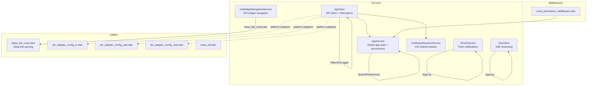
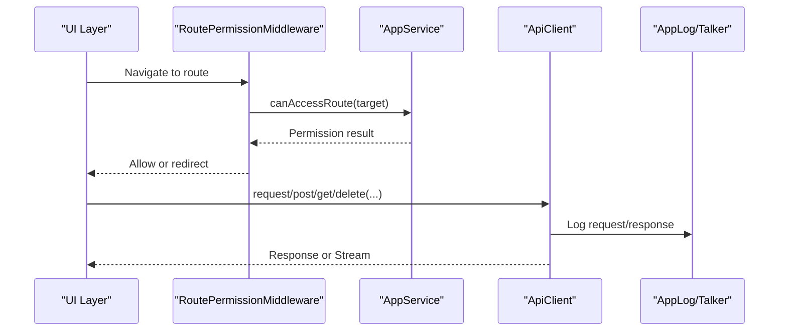
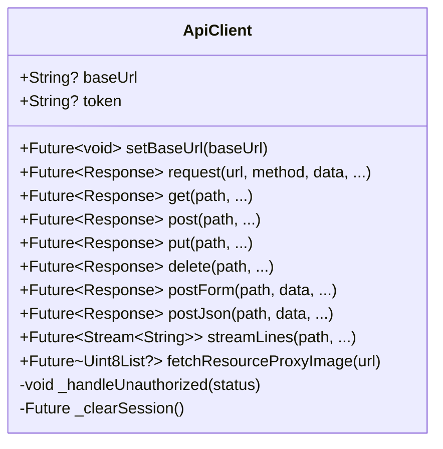
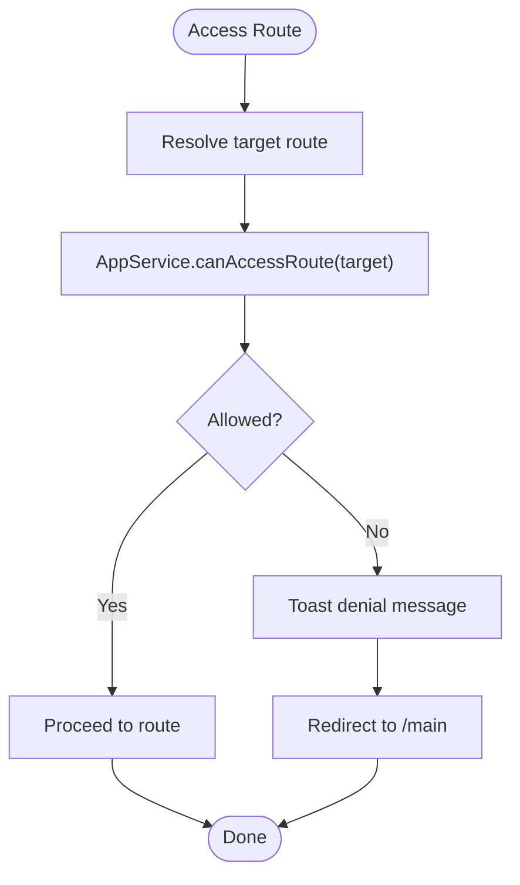
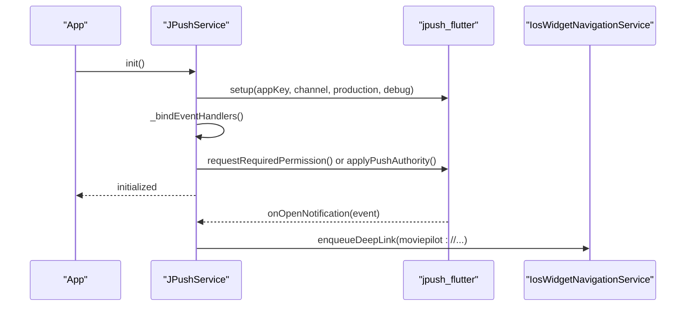
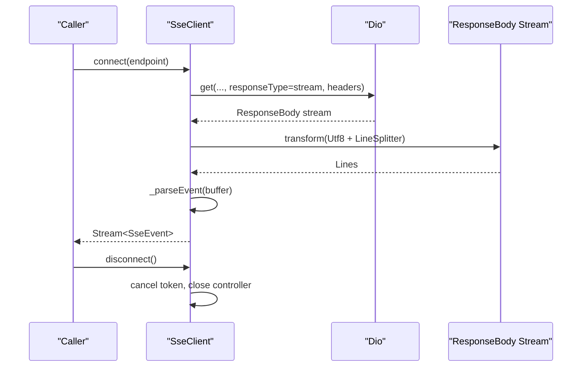
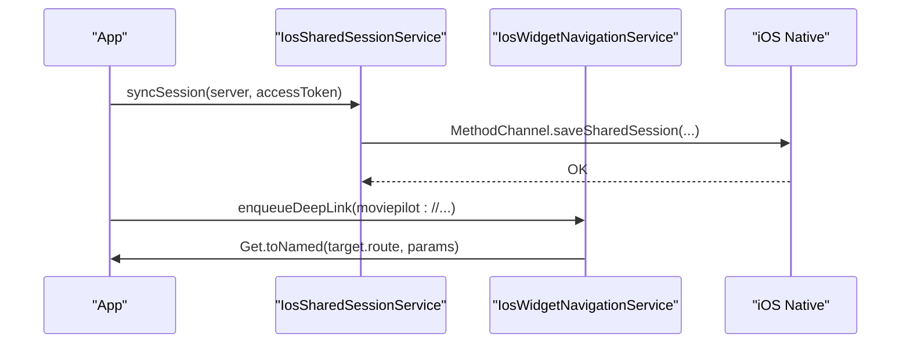
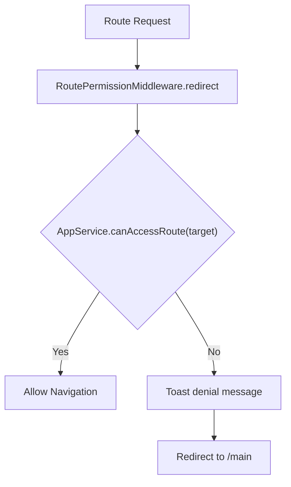
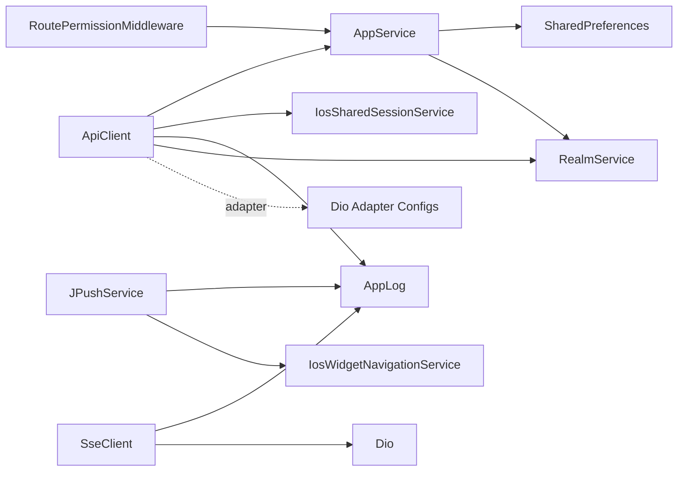

# Services & Utilities

<cite>
**Referenced Files in This Document**
- [api_client.dart](file://lib/services/api_client.dart)
- [app_service.dart](file://lib/services/app_service.dart)
- [jpush_service.dart](file://lib/services/jpush_service.dart)
- [sse_client.dart](file://lib/services/sse_client.dart)
- [ios_shared_session_service.dart](file://lib/services/ios_shared_session_service.dart)
- [ios_widget_navigation_service.dart](file://lib/services/ios_widget_navigation_service.dart)
- [route_permission_middleware.dart](file://lib/middlewares/route_permission_middleware.dart)
- [deep_link_route.dart](file://lib/utils/deep_link_route.dart)
- [dio_adapter_config_io.dart](file://lib/utils/dio_adapter_config_io.dart)
- [dio_adapter_config_stub.dart](file://lib/utils/dio_adapter_config_stub.dart)
- [dio_adapter_config_web.dart](file://lib/utils/dio_adapter_config_web.dart)
- [toast_util.dart](file://lib/utils/toast_util.dart)
</cite>

## Table of Contents
1. [Introduction](#introduction)
2. [Project Structure](#project-structure)
3. [Core Components](#core-components)
4. [Architecture Overview](#architecture-overview)
5. [Detailed Component Analysis](#detailed-component-analysis)
6. [Dependency Analysis](#dependency-analysis)
7. [Performance Considerations](#performance-considerations)
8. [Troubleshooting Guide](#troubleshooting-guide)
9. [Conclusion](#conclusion)

## Introduction
This document describes the service layer and utility functions of MoviePilot Mobile with a focus on:
- API client integration and request/response handling
- Authentication and session management
- Push notification handling via JPush
- Server-Sent Events (SSE) streaming
- Middleware for route permission checks
- Logging and error handling
- Utility functions for deep linking, HTTP adapters, and UI feedback

It also covers service initialization, dependency injection patterns using GetX, and lifecycle management of services.

## Project Structure
The service layer resides under lib/services and integrates with lib/utils and lib/middlewares. Key responsibilities:
- lib/services: Core services for API, authentication, push notifications, SSE, and platform-specific integrations
- lib/utils: Cross-platform utilities for HTTP adapters, deep links, toasts, and preferences keys
- lib/middlewares: Route protection middleware using AppService permission checks

**Diagram sources**
- [api_client.dart:45-196](file://lib/services/api_client.dart#L45-L196)
- [app_service.dart:17-94](file://lib/services/app_service.dart#L17-L94)
- [jpush_service.dart:28-75](file://lib/services/jpush_service.dart#L28-L75)
- [sse_client.dart:9-69](file://lib/services/sse_client.dart#L9-L69)
- [ios_shared_session_service.dart:4-21](file://lib/services/ios_shared_session_service.dart#L4-L21)
- [ios_widget_navigation_service.dart:6-21](file://lib/services/ios_widget_navigation_service.dart#L6-L21)
- [deep_link_route.dart](file://lib/utils/deep_link_route.dart)
- [dio_adapter_config_io.dart](file://lib/utils/dio_adapter_config_io.dart)
- [dio_adapter_config_stub.dart](file://lib/utils/dio_adapter_config_stub.dart)
- [dio_adapter_config_web.dart](file://lib/utils/dio_adapter_config_web.dart)
- [route_permission_middleware.dart:6-23](file://lib/middlewares/route_permission_middleware.dart#L6-L23)

**Section sources**
- [api_client.dart:45-196](file://lib/services/api_client.dart#L45-L196)
- [app_service.dart:17-94](file://lib/services/app_service.dart#L17-L94)
- [jpush_service.dart:28-75](file://lib/services/jpush_service.dart#L28-L75)
- [sse_client.dart:9-69](file://lib/services/sse_client.dart#L9-L69)
- [ios_shared_session_service.dart:4-21](file://lib/services/ios_shared_session_service.dart#L4-L21)
- [ios_widget_navigation_service.dart:6-21](file://lib/services/ios_widget_navigation_service.dart#L6-L21)
- [route_permission_middleware.dart:6-23](file://lib/middlewares/route_permission_middleware.dart#L6-L23)
- [deep_link_route.dart](file://lib/utils/deep_link_route.dart)
- [dio_adapter_config_io.dart](file://lib/utils/dio_adapter_config_io.dart)
- [dio_adapter_config_stub.dart](file://lib/utils/dio_adapter_config_stub.dart)
- [dio_adapter_config_web.dart](file://lib/utils/dio_adapter_config_web.dart)
- [toast_util.dart](file://lib/utils/toast_util.dart)

## Core Components
- ApiClient: Centralized HTTP client built on Dio with interceptors for authentication handling, cookie management, logging, and platform-specific adapter configuration. Provides typed request helpers (GET/POST/PUT/DELETE), form submission, JSON posting, and SSE streaming.
- AppService: Global application service managing theme, preferences, background image caching, login state, user info, permissions, and route access control. Also handles cookie persistence on web and session clearing across platforms.
- JPushService: Push notification integration for Android/iOS using jpush_flutter, including event handlers, alias management, and registration ID retrieval.
- SseClient: Lightweight SSE client for connecting to server-sent event endpoints, parsing events, and broadcasting them to listeners.
- IosSharedSessionService: iOS-specific service for synchronizing session data and widget payloads with native code via MethodChannel.
- IosWidgetNavigationService: iOS widget navigation bridge that receives pending routes and navigates accordingly.
- RoutePermissionMiddleware: GetX middleware enforcing route access based on AppService permissions.

**Section sources**
- [api_client.dart:45-645](file://lib/services/api_client.dart#L45-L645)
- [app_service.dart:17-683](file://lib/services/app_service.dart#L17-L683)
- [jpush_service.dart:28-297](file://lib/services/jpush_service.dart#L28-L297)
- [sse_client.dart:9-256](file://lib/services/sse_client.dart#L9-L256)
- [ios_shared_session_service.dart:4-51](file://lib/services/ios_shared_session_service.dart#L4-L51)
- [ios_widget_navigation_service.dart:6-72](file://lib/services/ios_widget_navigation_service.dart#L6-L72)
- [route_permission_middleware.dart:6-23](file://lib/middlewares/route_permission_middleware.dart#L6-L23)

## Architecture Overview
The service layer follows a layered architecture:
- Presentation layer uses GetX routing and middleware
- Business logic is encapsulated in services
- Data transport is handled by ApiClient and SseClient
- Platform integrations are isolated behind service interfaces
- Utilities provide cross-cutting concerns (logging, HTTP adapters, deep links)

**Diagram sources**
- [route_permission_middleware.dart:11-22](file://lib/middlewares/route_permission_middleware.dart#L11-L22)
- [app_service.dart:506-567](file://lib/services/app_service.dart#L506-L567)
- [api_client.dart:316-555](file://lib/services/api_client.dart#L316-L555)
- [app_service.dart:494-499](file://lib/services/app_service.dart#L494-L499)

## Detailed Component Analysis

### ApiClient
Responsibilities:
- Initialize Dio with platform-specific adapters and timeouts
- Manage base URL and token updates
- Provide unified request methods with optional token/header overrides
- Handle unauthorized responses by clearing session and navigating to login
- Support SSE streaming for real-time updates
- Cache and resolve cookie headers for efficient reuse

Key behaviors:
- Interceptors handle unauthorized responses globally and trigger session cleanup
- On web, decodes raw string bodies into JSON and normalizes errors
- Cookie header caching reduces repeated disk reads
- Logging via TalkerDioLogger enabled for debug builds

**Diagram sources**
- [api_client.dart:45-645](file://lib/services/api_client.dart#L45-L645)

**Section sources**
- [api_client.dart:45-196](file://lib/services/api_client.dart#L45-L196)
- [api_client.dart:198-374](file://lib/services/api_client.dart#L198-L374)
- [api_client.dart:375-555](file://lib/services/api_client.dart#L375-L555)
- [api_client.dart:556-645](file://lib/services/api_client.dart#L556-L645)

### AppService
Responsibilities:
- Store and manage global UI and feature flags
- Persist preferences via SharedPreferences
- Cache background images from server URLs with cache-busting
- Manage login state, user info, and permissions
- Enforce route access control and produce denial messages
- Provide cookie storage for web and clear login state

Important logic:
- Permission resolution supports multiple sources (user, login response, stored profile)
- Route access checks map normalized route names to capability gates
- Background image caching uses explicit cache-control headers

**Diagram sources**
- [route_permission_middleware.dart:11-22](file://lib/middlewares/route_permission_middleware.dart#L11-L22)
- [app_service.dart:506-567](file://lib/services/app_service.dart#L506-L567)

**Section sources**
- [app_service.dart:17-94](file://lib/services/app_service.dart#L17-L94)
- [app_service.dart:237-258](file://lib/services/app_service.dart#L237-L258)
- [app_service.dart:259-261](file://lib/services/app_service.dart#L259-L261)
- [app_service.dart:494-567](file://lib/services/app_service.dart#L494-L567)
- [app_service.dart:618-682](file://lib/services/app_service.dart#L618-L682)

### JPushService
Responsibilities:
- Initialize jpush_flutter with app key and channel
- Register event handlers for notifications, messages, and device token
- Request platform-specific permissions
- Retrieve registration ID with retries
- Set and get alias with validation and error reporting

**Diagram sources**
- [jpush_service.dart:40-102](file://lib/services/jpush_service.dart#L40-L102)
- [jpush_service.dart:104-111](file://lib/services/jpush_service.dart#L104-L111)
- [ios_widget_navigation_service.dart:37-47](file://lib/services/ios_widget_navigation_service.dart#L37-L47)

**Section sources**
- [jpush_service.dart:28-75](file://lib/services/jpush_service.dart#L28-L75)
- [jpush_service.dart:77-102](file://lib/services/jpush_service.dart#L77-L102)
- [jpush_service.dart:165-179](file://lib/services/jpush_service.dart#L165-L179)
- [jpush_service.dart:188-217](file://lib/services/jpush_service.dart#L188-L217)
- [jpush_service.dart:219-263](file://lib/services/jpush_service.dart#L219-L263)
- [jpush_service.dart:265-295](file://lib/services/jpush_service.dart#L265-L295)

### SseClient
Responsibilities:
- Establish SSE connections with Accept: text/event-stream
- Transform byte streams into UTF-8 lines
- Parse individual events separated by blank lines
- Emit structured SseEvent objects to listeners
- Disconnect gracefully and cancel tokens

**Diagram sources**
- [sse_client.dart:21-70](file://lib/services/sse_client.dart#L21-L70)
- [sse_client.dart:72-113](file://lib/services/sse_client.dart#L72-L113)
- [sse_client.dart:115-165](file://lib/services/sse_client.dart#L115-L165)
- [sse_client.dart:167-181](file://lib/services/sse_client.dart#L167-L181)

**Section sources**
- [sse_client.dart:9-69](file://lib/services/sse_client.dart#L9-L69)
- [sse_client.dart:72-113](file://lib/services/sse_client.dart#L72-L113)
- [sse_client.dart:115-165](file://lib/services/sse_client.dart#L115-L165)
- [sse_client.dart:167-181](file://lib/services/sse_client.dart#L167-L181)

### iOS Integrations
- IosSharedSessionService: Syncs server and access token to native iOS via MethodChannel and can clear sessions or reload widgets.
- IosWidgetNavigationService: Receives pending routes from iOS widgets and navigates immediately when safe.

**Diagram sources**
- [ios_shared_session_service.dart:7-21](file://lib/services/ios_shared_session_service.dart#L7-L21)
- [ios_widget_navigation_service.dart:37-67](file://lib/services/ios_widget_navigation_service.dart#L37-L67)

**Section sources**
- [ios_shared_session_service.dart:4-51](file://lib/services/ios_shared_session_service.dart#L4-L51)
- [ios_widget_navigation_service.dart:6-72](file://lib/services/ios_widget_navigation_service.dart#L6-L72)

### Middleware and Utilities
- RoutePermissionMiddleware: Uses AppService.canAccessRoute to guard routes and redirects unauthorized users to the main screen while showing a toast.
- Deep Link Routing: Utilities parse and normalize deep links for navigation.
- HTTP Adapters: Platform-specific Dio adapters selected via conditional imports.
- Toast Utility: Centralized toast notifications for user feedback.

**Diagram sources**
- [route_permission_middleware.dart:11-22](file://lib/middlewares/route_permission_middleware.dart#L11-L22)
- [app_service.dart:506-567](file://lib/services/app_service.dart#L506-L567)

**Section sources**
- [route_permission_middleware.dart:6-23](file://lib/middlewares/route_permission_middleware.dart#L6-L23)
- [deep_link_route.dart](file://lib/utils/deep_link_route.dart)
- [dio_adapter_config_io.dart](file://lib/utils/dio_adapter_config_io.dart)
- [dio_adapter_config_stub.dart](file://lib/utils/dio_adapter_config_stub.dart)
- [dio_adapter_config_web.dart](file://lib/utils/dio_adapter_config_web.dart)
- [toast_util.dart](file://lib/utils/toast_util.dart)

## Dependency Analysis
- ApiClient depends on:
  - AppService for base URL and cookie
  - IosSharedSessionService for session clearing
  - RealmService for persisted login profile updates
  - AppLog/Talker for logging
  - Platform-specific Dio adapters
- AppService depends on:
  - SharedPreferences for persistence
  - RealmService for stored profiles
  - GetX for reactive state
- JPushService depends on:
  - jpush_flutter SDK
  - AppLog for telemetry
  - IosWidgetNavigationService for navigation after notification open
- SseClient depends on:
  - Dio for streaming
  - AppLog for diagnostics

**Diagram sources**
- [api_client.dart:46-50](file://lib/services/api_client.dart#L46-L50)
- [app_service.dart:315-318](file://lib/services/app_service.dart#L315-L318)
- [jpush_service.dart:32-32](file://lib/services/jpush_service.dart#L32-L32)
- [sse_client.dart:10-11](file://lib/services/sse_client.dart#L10-L11)
- [route_permission_middleware.dart:13-13](file://lib/middlewares/route_permission_middleware.dart#L13-L13)

**Section sources**
- [api_client.dart:46-50](file://lib/services/api_client.dart#L46-L50)
- [app_service.dart:315-318](file://lib/services/app_service.dart#L315-L318)
- [jpush_service.dart:32-32](file://lib/services/jpush_service.dart#L32-L32)
- [sse_client.dart:10-11](file://lib/services/sse_client.dart#L10-L11)
- [route_permission_middleware.dart:13-13](file://lib/middlewares/route_permission_middleware.dart#L13-L13)

## Performance Considerations
- Cookie header caching: ApiClient caches resolved cookie headers per host with a TTL to reduce filesystem reads.
- Streaming: SSEClient transforms streams incrementally and parses events line-by-line; avoid long-lived listeners without cancellation.
- Logging overhead: TalkerDioLogger is enabled in debug mode; disable or throttle in production if needed.
- Network timeouts: ApiClient sets connect/receive timeouts; adjust per endpoint needs to balance responsiveness and reliability.
- Platform adapters: Selecting the correct adapter avoids unnecessary overhead on each platform.

[No sources needed since this section provides general guidance]

## Troubleshooting Guide
Common issues and remedies:
- Unauthorized responses:
  - Symptom: Automatic logout and redirection to login
  - Cause: 401/403 responses handled by ApiClient’s interceptor
  - Action: Verify token validity and re-authenticate
- SSE connection failures:
  - Symptom: Stream closes with HTTP error or connection error
  - Cause: Server-side issues or network interruptions
  - Action: Retry with backoff; check server logs and CORS configuration
- Push notifications not received:
  - Symptom: No onOpenNotification handling
  - Cause: Permissions not granted or setup not called
  - Action: Call register(), ensure permissions requested, and verify registration ID
- Deep link navigation not working:
  - Symptom: Widget taps do nothing
  - Cause: Pending route not set or current route blocked
  - Action: Ensure enqueueDeepLink is called and navigation conditions are met

**Section sources**
- [api_client.dart:596-643](file://lib/services/api_client.dart#L596-L643)
- [sse_client.dart:47-67](file://lib/services/sse_client.dart#L47-L67)
- [jpush_service.dart:165-179](file://lib/services/jpush_service.dart#L165-L179)
- [ios_widget_navigation_service.dart:49-67](file://lib/services/ios_widget_navigation_service.dart#L49-L67)

## Conclusion
MoviePilot Mobile’s service layer provides a robust foundation for API communication, authentication, real-time updates, and platform integrations. The design leverages GetX for dependency injection and reactive state, Dio for HTTP transport, and platform-specific adapters and channels for native capabilities. Middleware and utilities ensure secure, user-friendly navigation and consistent logging across environments.