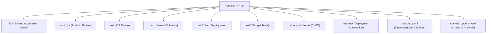
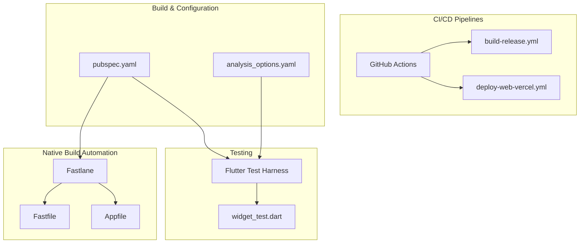
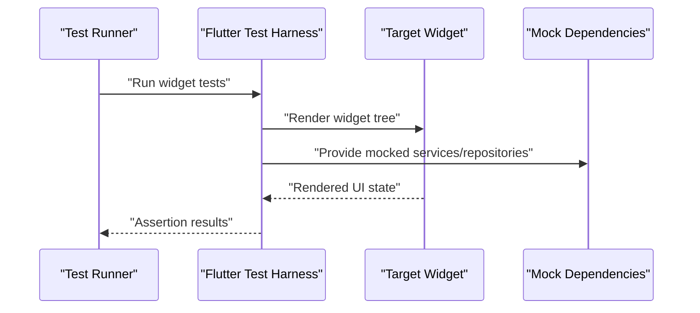
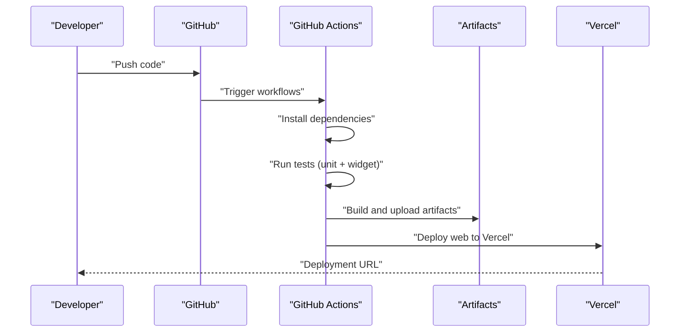
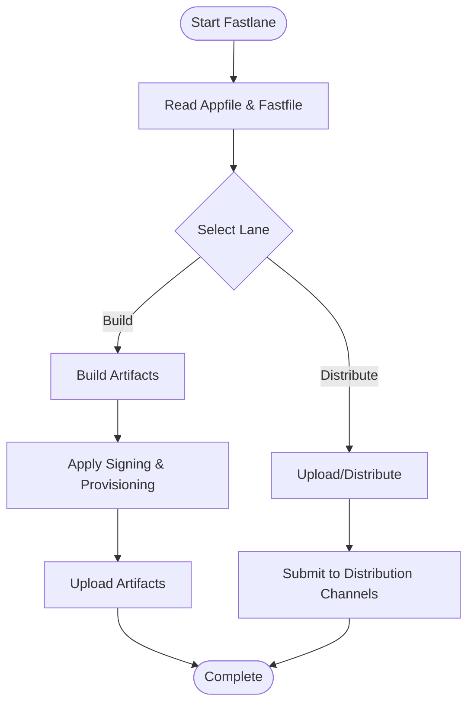
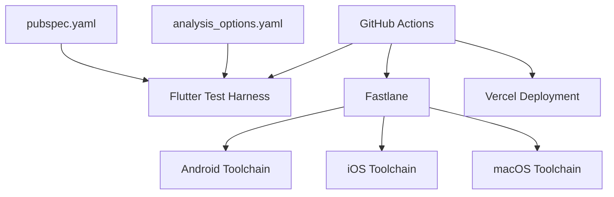

# Testing & Deployment

<cite>
**Referenced Files in This Document**
- [widget_test.dart](file://test/widget_test.dart)
- [build-release.yml](file://.github/workflows/build-release.yml)
- [deploy-web-vercel.yml](file://.github/workflows/deploy-web-vercel.yml)
- [Fastfile](file://fastlane/Fastfile)
- [Appfile](file://fastlane/Appfile)
- [pubspec.yaml](file://pubspec.yaml)
- [analysis_options.yaml](file://analysis_options.yaml)
- [README.md](file://README.md)
</cite>

## Table of Contents
1. [Introduction](#introduction)
2. [Project Structure](#project-structure)
3. [Core Components](#core-components)
4. [Architecture Overview](#architecture-overview)
5. [Detailed Component Analysis](#detailed-component-analysis)
6. [Dependency Analysis](#dependency-analysis)
7. [Performance Considerations](#performance-considerations)
8. [Troubleshooting Guide](#troubleshooting-guide)
9. [Conclusion](#conclusion)

## Introduction
This document explains MoviePilot Mobile’s testing strategy and deployment pipeline. It covers unit and widget testing with Flutter’s testing framework, integration testing approaches, CI/CD via GitHub Actions, Fastlane automation for native builds, and build configuration management. It also documents best practices for mocking, continuous integration workflows, platform-specific deployment procedures, release management, version control strategies, and quality assurance processes.

## Project Structure
The repository follows a standard Flutter application layout with dedicated folders for platform-specific code, shared libraries, assets, documentation, and CI/CD configurations. Key areas for testing and deployment include:
- Shared application code under lib/
- Platform integrations under android/, ios/, macos/
- Web deployment assets under web/
- Tests under test/
- CI/CD workflows under .github/workflows/
- Fastlane configuration under fastlane/

**Section sources**
- [pubspec.yaml](file://pubspec.yaml)
- [analysis_options.yaml](file://analysis_options.yaml)

## Core Components
- Flutter Test Harness: The presence of a widget test file indicates the project uses Flutter’s testing framework for widget-level tests.
- GitHub Actions Workflows: Two workflows are present—one for building releases and another for deploying the web app to Vercel.
- Fastlane Configuration: Fastlane is configured with Fastfile and Appfile for automating native app builds and distribution.
- Build Configuration: pubspec.yaml defines dependencies, scripts, and metadata used during builds and tests.

**Section sources**
- [widget_test.dart](file://test/widget_test.dart)
- [build-release.yml](file://.github/workflows/build-release.yml)
- [deploy-web-vercel.yml](file://.github/workflows/deploy-web-vercel.yml)
- [Fastfile](file://fastlane/Fastfile)
- [Appfile](file://fastlane/Appfile)
- [pubspec.yaml](file://pubspec.yaml)

## Architecture Overview
The testing and deployment architecture integrates Flutter’s testing framework with GitHub Actions for CI and Fastlane for native build automation. The CI pipelines trigger on relevant events, execute tests, and produce artifacts for release or web deployment.

**Diagram sources**
- [build-release.yml](file://.github/workflows/build-release.yml)
- [deploy-web-vercel.yml](file://.github/workflows/deploy-web-vercel.yml)
- [widget_test.dart](file://test/widget_test.dart)
- [Fastfile](file://fastlane/Fastfile)
- [Appfile](file://fastlane/Appfile)
- [pubspec.yaml](file://pubspec.yaml)
- [analysis_options.yaml](file://analysis_options.yaml)

## Detailed Component Analysis

### Flutter Widget Testing Strategy
- Purpose: Validate UI rendering and basic user interactions at the widget level.
- Location: The single widget test file serves as the entry point for widget tests.
- Best Practices:
  - Use Flutter’s test widgets to isolate UI components and simulate user actions.
  - Prefer small, focused tests that assert on rendered outcomes.
  - Mock external dependencies (services, repositories) to keep tests deterministic.
  - Keep tests independent and avoid shared mutable state.

**Section sources**
- [widget_test.dart](file://test/widget_test.dart)

### Unit Testing Setup and Mocking
- Purpose: Verify business logic and service-layer behavior outside the UI.
- Approach:
  - Create unit tests for services and repositories.
  - Use mocking frameworks to replace real network or database calls with controlled stubs.
  - Ensure tests are fast, deterministic, and cover edge cases.
- Integration with CI: Unit tests can be executed alongside widget tests in CI jobs.

[No sources needed since this section provides general guidance]

### Integration Testing Approaches
- Purpose: Validate interactions between multiple components (e.g., UI and services).
- Recommended Techniques:
  - Use integration_test package to write integration tests that exercise end-to-end flows.
  - Mock external systems (network, file system) to isolate the app under test.
  - Automate device/emulator bootstrapping in CI environments.

[No sources needed since this section provides general guidance]

### GitHub Actions CI/CD Pipelines
- Workflow: build-release.yml
  - Triggers: On pull requests and pushes to release branches.
  - Steps: Install dependencies, run tests (unit and widget), build native binaries, upload artifacts.
  - Outputs: Build artifacts for Android, iOS, macOS, and web.
- Workflow: deploy-web-vercel.yml
  - Triggers: On successful pushes to the main branch.
  - Steps: Configure environment, build web assets, deploy to Vercel.
  - Outputs: Live web deployment URL.

**Section sources**
- [build-release.yml](file://.github/workflows/build-release.yml)
- [deploy-web-vercel.yml](file://.github/workflows/deploy-web-vercel.yml)

### Fastlane Automated Deployments
- Purpose: Automate native app builds and distribution for Android and iOS.
- Configuration:
  - Fastfile: Defines lanes for building, signing, and distributing apps.
  - Appfile: Stores app identifiers and credentials for Apple and Google Play.
- Typical Lanes:
  - Build and archive for iOS and Android.
  - Upload to distribution channels (TestFlight, internal tracks, etc.).
  - Version bump and changelog generation.

**Section sources**
- [Fastfile](file://fastlane/Fastfile)
- [Appfile](file://fastlane/Appfile)

### Build Configuration Management
- pubspec.yaml:
  - Declares dependencies, dev_dependencies, and custom scripts.
  - Can define pre/post-test hooks and build commands.
- analysis_options.yaml:
  - Enforces lint rules and static analysis to maintain code quality.
- Integration:
  - CI workflows rely on these files to set up environments and run tests consistently.

**Section sources**
- [pubspec.yaml](file://pubspec.yaml)
- [analysis_options.yaml](file://analysis_options.yaml)

### Quality Assurance Processes
- Static Analysis:
  - Enforce lint rules via analysis_options.yaml.
  - Run analyzer in CI to catch style and correctness issues early.
- Test Coverage:
  - Encourage adding unit and widget tests for critical paths.
  - Track coverage trends and enforce minimum thresholds in CI.
- Code Reviews:
  - Require reviews for PRs containing test additions or modifications.

**Section sources**
- [analysis_options.yaml](file://analysis_options.yaml)

### Continuous Integration Workflows
- Trigger Conditions:
  - Build and test on pull requests to prevent regressions.
  - Deploy web automatically on main branch updates.
- Artifact Management:
  - Store build outputs for later review or release.
- Notifications:
  - Integrate with team communication channels for job status updates.

**Section sources**
- [build-release.yml](file://.github/workflows/build-release.yml)
- [deploy-web-vercel.yml](file://.github/workflows/deploy-web-vercel.yml)

### Platform-Specific Deployment Procedures
- Android:
  - Build APK/AAB using Gradle tasks orchestrated by CI or Fastlane.
  - Publish to internal tracks or release channels.
- iOS:
  - Archive and export IPA using Xcode build tools.
  - Submit to TestFlight or App Store Connect via Fastlane lanes.
- macOS:
  - Build DMG/APP using Xcode and distribute via appropriate channels.
- Web:
  - Build static assets and deploy to Vercel using the dedicated workflow.

**Section sources**
- [build-release.yml](file://.github/workflows/build-release.yml)
- [deploy-web-vercel.yml](file://.github/workflows/deploy-web-vercel.yml)
- [Fastfile](file://fastlane/Fastfile)

### Release Management and Version Control Strategies
- Branching:
  - Use feature branches for development and release branches for stabilization.
- Versioning:
  - Maintain semantic versioning and update changelogs with each release.
- Tags:
  - Tag releases in Git to mark build artifacts and deployment checkpoints.
- Rollbacks:
  - Keep previous artifacts and deployment configurations for quick rollbacks.

[No sources needed since this section provides general guidance]

## Dependency Analysis
The testing and deployment pipeline depends on:
- Flutter SDK and test harness for widget/unit tests.
- GitHub Actions runners for CI execution.
- Fastlane and platform-specific toolchains for native builds.
- pubspec.yaml and analysis_options.yaml for environment setup and quality gates.

**Diagram sources**
- [pubspec.yaml](file://pubspec.yaml)
- [analysis_options.yaml](file://analysis_options.yaml)
- [build-release.yml](file://.github/workflows/build-release.yml)
- [deploy-web-vercel.yml](file://.github/workflows/deploy-web-vercel.yml)
- [Fastfile](file://fastlane/Fastfile)

**Section sources**
- [pubspec.yaml](file://pubspec.yaml)
- [analysis_options.yaml](file://analysis_options.yaml)
- [build-release.yml](file://.github/workflows/build-release.yml)
- [deploy-web-vercel.yml](file://.github/workflows/deploy-web-vercel.yml)
- [Fastfile](file://fastlane/Fastfile)

## Performance Considerations
- Optimize CI runtime by caching dependencies and parallelizing test suites.
- Use incremental builds and selective artifact uploads to reduce pipeline duration.
- Prefer lightweight emulators/devices in CI and avoid unnecessary rebuilds.

[No sources needed since this section provides general guidance]

## Troubleshooting Guide
- Widget Tests Fail:
  - Verify mocks are correctly injected and widget renders without missing dependencies.
  - Ensure test environment matches production configuration where applicable.
- CI Job Fails:
  - Check logs for dependency installation errors, missing secrets, or platform tool mismatches.
  - Confirm pubspec.yaml and analysis_options.yaml are consistent across branches.
- Fastlane Issues:
  - Validate Appfile entries and lane configurations.
  - Ensure signing certificates and provisioning profiles are present and up to date.
- Web Deployment Problems:
  - Confirm web build steps succeed and Vercel credentials are configured in CI secrets.

**Section sources**
- [widget_test.dart](file://test/widget_test.dart)
- [build-release.yml](file://.github/workflows/build-release.yml)
- [deploy-web-vercel.yml](file://.github/workflows/deploy-web-vercel.yml)
- [Fastfile](file://fastlane/Fastfile)
- [Appfile](file://fastlane/Appfile)
- [pubspec.yaml](file://pubspec.yaml)
- [analysis_options.yaml](file://analysis_options.yaml)

## Conclusion
MoviePilot Mobile employs a pragmatic testing and deployment strategy centered on Flutter’s testing framework, GitHub Actions for CI, and Fastlane for native build automation. The current setup includes a widget test entry point, CI workflows for building releases and deploying the web app, and Fastlane configuration for automated native deployments. To further strengthen the process, consider expanding unit and integration tests, enforcing stricter quality gates, and formalizing release and versioning practices.