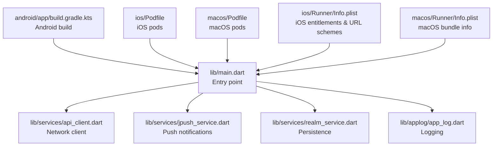
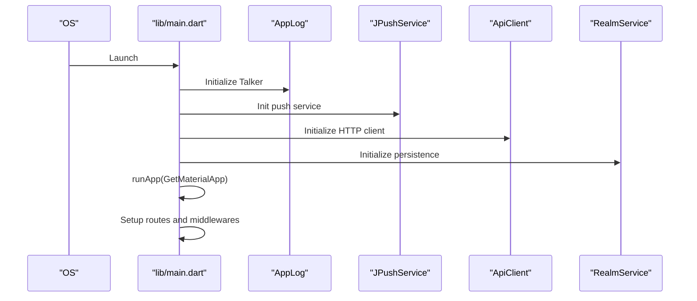
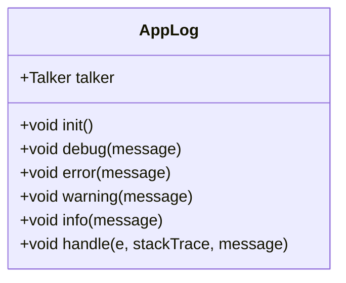
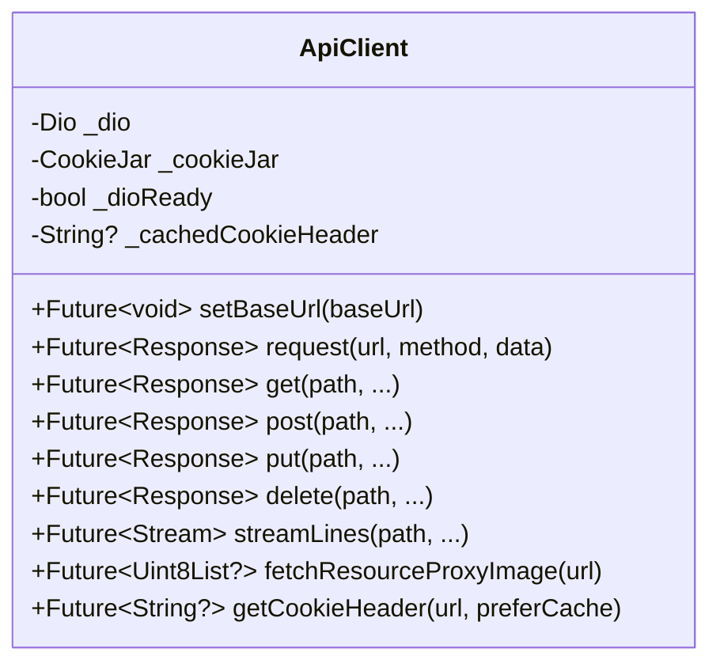
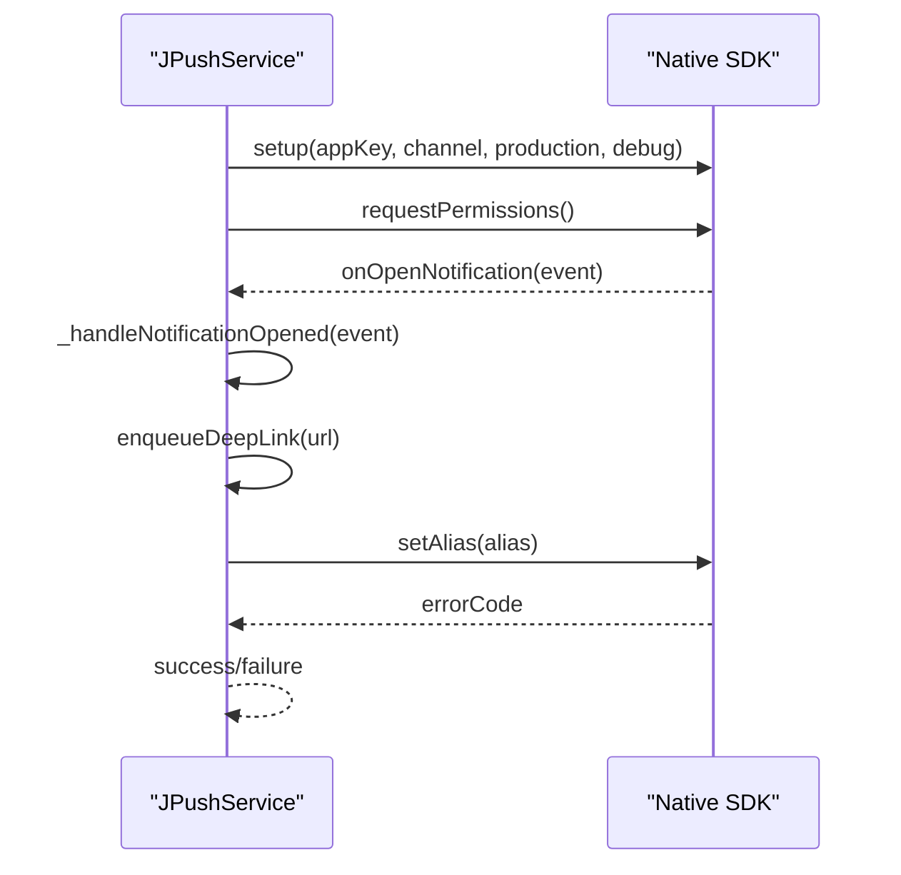
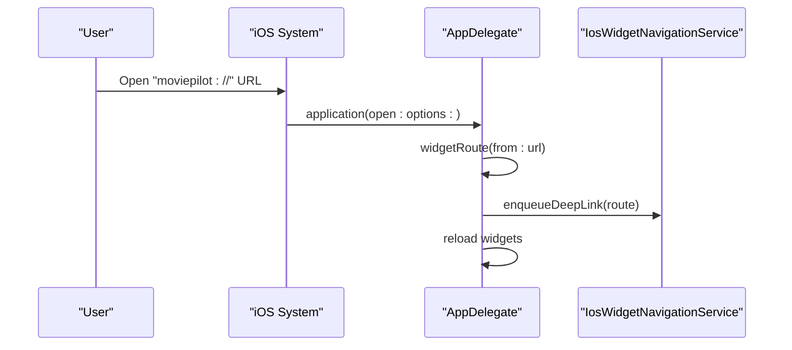
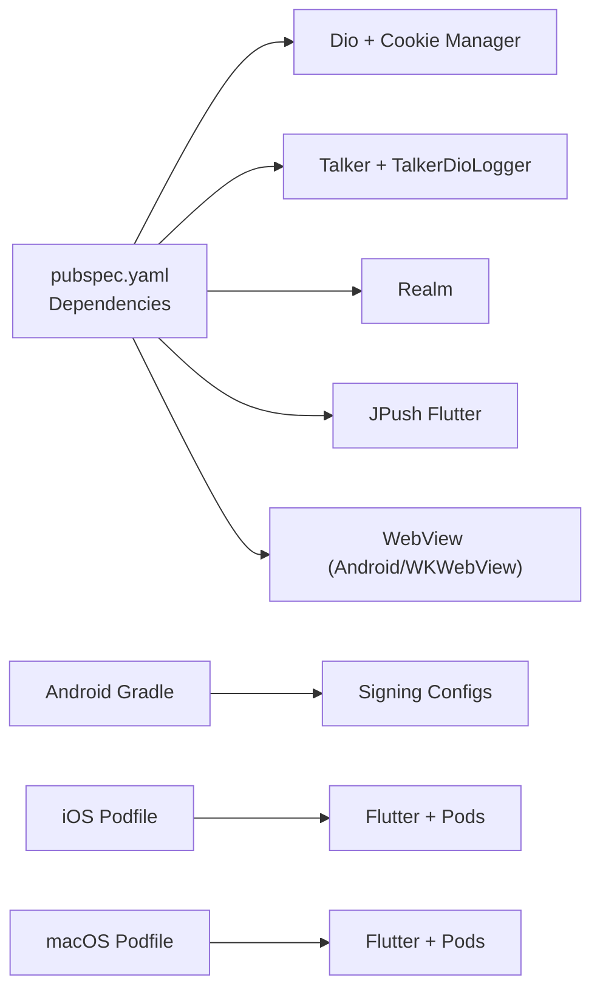

# Troubleshooting & FAQ

<cite>
**Referenced Files in This Document**
- [pubspec.yaml](file://pubspec.yaml)
- [main.dart](file://lib/main.dart)
- [app_log.dart](file://lib/applog/app_log.dart)
- [api_client.dart](file://lib/services/api_client.dart)
- [jpush_service.dart](file://lib/services/jpush_service.dart)
- [realm_service.dart](file://lib/services/realm_service.dart)
- [android/app/build.gradle.kts](file://android/app/build.gradle.kts)
- [android/local.properties](file://android/local.properties)
- [ios/Podfile](file://ios/Podfile)
- [ios/Runner/Info.plist](file://ios/Runner/Info.plist)
- [ios/Runner/AppDelegate.swift](file://ios/Runner/AppDelegate.swift)
- [macos/Podfile](file://macos/Podfile)
- [macos/Runner/Info.plist](file://macos/Runner/Info.plist)
- [macos/Runner/AppDelegate.swift](file://macos/Runner/AppDelegate.swift)
</cite>

## Table of Contents
1. [Introduction](#introduction)
2. [Project Structure](#project-structure)
3. [Core Components](#core-components)
4. [Architecture Overview](#architecture-overview)
5. [Detailed Component Analysis](#detailed-component-analysis)
6. [Dependency Analysis](#dependency-analysis)
7. [Performance Considerations](#performance-considerations)
8. [Troubleshooting Guide](#troubleshooting-guide)
9. [Conclusion](#conclusion)
10. [Appendices](#appendices)

## Introduction
This document provides comprehensive troubleshooting and Frequently Asked Questions for MoviePilot Mobile. It focuses on diagnosing and resolving build issues, runtime errors, platform-specific problems, and network connectivity concerns across Android, iOS, and macOS. It also covers logging, diagnostics, performance optimization, memory management, and escalation procedures.

## Project Structure
MoviePilot Mobile is a Flutter application with platform-specific native integrations:
- Flutter application entrypoint initializes services and routes.
- Android/iOS/macOS targets configured via Gradle/Kotlin, CocoaPods, and Xcode projects.
- Services include API client, push notifications (JPush), Realm persistence, and logging.

**Diagram sources**
- [main.dart:138-166](file://lib/main.dart#L138-L166)
- [api_client.dart:45-72](file://lib/services/api_client.dart#L45-L72)
- [jpush_service.dart:28-43](file://lib/services/jpush_service.dart#L28-L43)
- [realm_service.dart:1-2](file://lib/services/realm_service.dart#L1-L2)
- [app_log.dart:4-13](file://lib/applog/app_log.dart#L4-L13)
- [android/app/build.gradle.kts:1-66](file://android/app/build.gradle.kts#L1-L66)
- [ios/Podfile:1-43](file://ios/Podfile#L1-L43)
- [macos/Podfile:1-43](file://macos/Podfile#L1-L43)
- [ios/Runner/Info.plist:1-79](file://ios/Runner/Info.plist#L1-L79)
- [macos/Runner/Info.plist:1-33](file://macos/Runner/Info.plist#L1-L33)

**Section sources**
- [main.dart:138-166](file://lib/main.dart#L138-L166)
- [pubspec.yaml:1-82](file://pubspec.yaml#L1-L82)

## Core Components
- Logging: Centralized Talker-based logger with history and console control.
- API Client: Dio-based HTTP client with cookie management, interceptors, and session handling.
- Push Notifications: JPush integration for Android and iOS with event handling and alias management.
- Persistence: Realm service abstraction for local storage.
- Routing and Initialization: App initialization registers services and sets up routes.

**Section sources**
- [app_log.dart:4-39](file://lib/applog/app_log.dart#L4-L39)
- [api_client.dart:45-196](file://lib/services/api_client.dart#L45-L196)
- [jpush_service.dart:28-102](file://lib/services/jpush_service.dart#L28-L102)
- [realm_service.dart:1-2](file://lib/services/realm_service.dart#L1-L2)
- [main.dart:138-166](file://lib/main.dart#L138-L166)

## Architecture Overview
High-level runtime flow for startup, routing, and network interactions.

**Diagram sources**
- [main.dart:138-166](file://lib/main.dart#L138-L166)
- [app_log.dart:4-13](file://lib/applog/app_log.dart#L4-L13)
- [jpush_service.dart:40-75](file://lib/services/jpush_service.dart#L40-L75)
- [api_client.dart:74-196](file://lib/services/api_client.dart#L74-L196)
- [realm_service.dart:1-2](file://lib/services/realm_service.dart#L1-L2)

## Detailed Component Analysis

### Logging and Diagnostics
- AppLog wraps Talker with configurable history and console logging disabled by default.
- Use TalkerRouteObserver to capture navigation logs.
- Review Talker logs for errors, warnings, and info messages during troubleshooting.

**Diagram sources**
- [app_log.dart:4-39](file://lib/applog/app_log.dart#L4-L39)

**Section sources**
- [app_log.dart:4-39](file://lib/applog/app_log.dart#L4-L39)
- [main.dart:176-191](file://lib/main.dart#L176-L191)

### API Client and Network Connectivity
- Dio client initialized with timeouts, headers, and cookie management.
- Interceptors handle unauthorized responses and forward to login.
- Cookie caching reduces redundant lookups.
- Web vs native differences handled for JSON decoding and credentials.

**Diagram sources**
- [api_client.dart:45-644](file://lib/services/api_client.dart#L45-L644)

**Section sources**
- [api_client.dart:74-196](file://lib/services/api_client.dart#L74-L196)
- [api_client.dart:297-308](file://lib/services/api_client.dart#L297-L308)
- [api_client.dart:316-374](file://lib/services/api_client.dart#L316-L374)
- [api_client.dart:557-594](file://lib/services/api_client.dart#L557-L594)

### Push Notifications (JPush)
- Registers handlers for notifications, opened events, and device token updates.
- Supports Android permissions and iOS notification settings.
- Alias management with retries and validation.

**Diagram sources**
- [jpush_service.dart:45-102](file://lib/services/jpush_service.dart#L45-L102)
- [jpush_service.dart:104-111](file://lib/services/jpush_service.dart#L104-L111)
- [jpush_service.dart:219-263](file://lib/services/jpush_service.dart#L219-L263)

**Section sources**
- [jpush_service.dart:40-75](file://lib/services/jpush_service.dart#L40-L75)
- [jpush_service.dart:165-179](file://lib/services/jpush_service.dart#L165-L179)
- [jpush_service.dart:188-217](file://lib/services/jpush_service.dart#L188-L217)
- [jpush_service.dart:219-263](file://lib/services/jpush_service.dart#L219-L263)

### iOS Deep Linking and Widget Integration
- AppDelegate handles URL schemes and routes deep links to internal pages.
- Shared UserDefaults group for server URL and access token synchronization with widgets.
- Remote notification handling integrates with push SDK.

**Diagram sources**
- [ios/Runner/AppDelegate.swift:85-143](file://ios/Runner/AppDelegate.swift#L85-L143)
- [ios/Runner/AppDelegate.swift:166-205](file://ios/Runner/AppDelegate.swift#L166-L205)
- [ios/Runner/Info.plist:25-35](file://ios/Runner/Info.plist#L25-L35)

**Section sources**
- [ios/Runner/AppDelegate.swift:16-14](file://ios/Runner/AppDelegate.swift#L16-L14)
- [ios/Runner/AppDelegate.swift:21-83](file://ios/Runner/AppDelegate.swift#L21-L83)
- [ios/Runner/AppDelegate.swift:166-205](file://ios/Runner/AppDelegate.swift#L166-L205)
- [ios/Runner/Info.plist:25-35](file://ios/Runner/Info.plist#L25-L35)

### macOS Application Lifecycle
- Minimal AppDelegate with secure restoration support and termination behavior.

**Section sources**
- [macos/Runner/AppDelegate.swift:1-14](file://macos/Runner/AppDelegate.swift#L1-L14)
- [macos/Runner/Info.plist:1-33](file://macos/Runner/Info.plist#L1-L33)

## Dependency Analysis
External libraries and platform configurations impact stability and behavior.

**Diagram sources**
- [pubspec.yaml:8-47](file://pubspec.yaml#L8-L47)
- [android/app/build.gradle.kts:41-54](file://android/app/build.gradle.kts#L41-L54)
- [ios/Podfile:27-42](file://ios/Podfile#L27-L42)
- [macos/Podfile:27-42](file://macos/Podfile#L27-L42)

**Section sources**
- [pubspec.yaml:8-47](file://pubspec.yaml#L8-L47)
- [android/app/build.gradle.kts:41-54](file://android/app/build.gradle.kts#L41-L54)
- [ios/Podfile:27-42](file://ios/Podfile#L27-L42)
- [macos/Podfile:27-42](file://macos/Podfile#L27-L42)

## Performance Considerations
- Network timeouts: Tune connect/receive/send timeouts per operation to balance responsiveness and reliability.
- Cookie caching: Leverage cached cookie headers to reduce repeated disk reads.
- Streaming: Use streamLines for SSE-like long-lived connections; ensure proper cancellation on route changes.
- Memory: Avoid retaining large image buffers; prefer lazy loading and cache eviction policies.
- WebView: On web contexts, ensure lightweight rendering and avoid blocking UI thread.
- Logging overhead: Keep Talker history bounded; disable console logs in production builds.

[No sources needed since this section provides general guidance]

## Troubleshooting Guide

### Build Problems

- Android Signing Failures
  - Symptom: Build fails with missing keystore or invalid credentials.
  - Cause: Environment variables not set or incorrect paths.
  - Resolution: Set ANDROID_KEYSTORE_PATH, KEYSTORE_PASSWORD, KEY_ALIAS, KEY_PASSWORD; verify keystore exists and passwords are correct.
  - Validation: Confirm signingConfigs block resolves values and release type uses the configured signingConfig.

  **Section sources**
  - [android/app/build.gradle.kts:41-54](file://android/app/build.gradle.kts#L41-L54)
  - [android/app/build.gradle.kts:56-60](file://android/app/build.gradle.kts#L56-L60)

- Android SDK/Gradle Mismatch
  - Symptom: Build errors related to compile/target SDK or Java compatibility.
  - Cause: local.properties or Gradle settings mismatch Flutter SDK version.
  - Resolution: Align compileSdk/targetSdk/minSdk with Flutter SDK expectations; ensure Java 11 compatibility.

  **Section sources**
  - [android/app/build.gradle.kts:8-20](file://android/app/build.gradle.kts#L8-L20)
  - [android/local.properties:1-5](file://android/local.properties#L1-L5)

- iOS CocoaPods Issues
  - Symptom: Pod install failures or missing Generated.xcconfig.
  - Cause: Flutter root not detected or missing flutter pub get.
  - Resolution: Run flutter pub get; ensure FLUTTER_ROOT is present; re-run pod install.

  **Section sources**
  - [ios/Podfile:12-23](file://ios/Podfile#L12-L23)
  - [ios/Podfile:27-42](file://ios/Podfile#L27-L42)

- macOS CocoaPods Issues
  - Symptom: Similar CocoaPods errors on macOS target.
  - Cause: Missing Generated config or Flutter root path.
  - Resolution: Run flutter pub get; verify ephemeral Flutter-Generated.xcconfig exists.

  **Section sources**
  - [macos/Podfile:12-23](file://macos/Podfile#L12-L23)
  - [macos/Podfile:27-42](file://macos/Podfile#L27-L42)

### Runtime Errors

- Session Expired / Unauthorized
  - Symptom: Immediate redirect to login after API 401/403.
  - Cause: Token invalid or expired; automatic cleanup clears cookies and stored tokens.
  - Resolution: Re-authenticate; verify token propagation and cookie jar state.

  **Section sources**
  - [api_client.dart:596-607](file://lib/services/api_client.dart#L596-L607)
  - [api_client.dart:615-643](file://lib/services/api_client.dart#L615-L643)

- Network Requests Hang or Timeout
  - Symptom: Long delays or timeouts on API calls.
  - Cause: Server-side slowness, DNS issues, or insufficient timeouts.
  - Resolution: Increase timeout parameters; check baseUrl and proxy settings; review TalkerDioLogger output.

  **Section sources**
  - [api_client.dart:79-84](file://lib/services/api_client.dart#L79-L84)
  - [api_client.dart:407-412](file://lib/services/api_client.dart#L407-L412)
  - [api_client.dart:502-514](file://lib/services/api_client.dart#L502-L514)

- WebView/Web Context Issues
  - Symptom: Blank pages or CORS errors in web context.
  - Cause: JSON parsing or CORS misconfiguration.
  - Resolution: Verify withCredentials for web; ensure server supports CORS; inspect TalkerDioLogger output.

  **Section sources**
  - [api_client.dart:136-195](file://lib/services/api_client.dart#L136-L195)

- Push Notifications Not Working
  - Symptom: No notifications received; alias setting fails.
  - Cause: Permissions not granted; platform not supported; registration ID empty.
  - Resolution: Request permissions; verify platform support; retry alias with delay; check Talker logs for errors.

  **Section sources**
  - [jpush_service.dart:165-179](file://lib/services/jpush_service.dart#L165-L179)
  - [jpush_service.dart:188-217](file://lib/services/jpush_service.dart#L188-L217)
  - [jpush_service.dart:219-263](file://lib/services/jpush_service.dart#L219-L263)

- iOS Deep Links and Widgets
  - Symptom: URLs not opening internal pages; widget timelines not updating.
  - Cause: Incorrect URL scheme/host/path; missing shared session values.
  - Resolution: Validate URL host/path; ensure shared UserDefaults entries; reload widget timelines.

  **Section sources**
  - [ios/Runner/AppDelegate.swift:179-205](file://ios/Runner/AppDelegate.swift#L179-L205)
  - [ios/Runner/AppDelegate.swift:145-164](file://ios/Runner/AppDelegate.swift#L145-L164)

### Platform-Specific Troubleshooting

- Android
  - Signing: Ensure keystore environment variables are set; confirm signingConfig selection.
  - Permissions: Verify app manifest and Gradle minSdk align with target devices.
  - WebView: Confirm webview_flutter dependencies are included.

  **Section sources**
  - [android/app/build.gradle.kts:41-54](file://android/app/build.gradle.kts#L41-L54)
  - [android/app/build.gradle.kts:27-28](file://android/app/build.gradle.kts#L27-L28)
  - [pubspec.yaml:38-39](file://pubspec.yaml#L38-L39)

- iOS
  - URL Schemes: Confirm CFBundleURLSchemes and CFBundleURLName in Info.plist.
  - Push: Ensure app groups and entitlements are configured; verify remote notification delegates.
  - Widgets: Validate shared UserDefaults keys and timeline reloads.

  **Section sources**
  - [ios/Runner/Info.plist:25-35](file://ios/Runner/Info.plist#L25-L35)
  - [ios/Runner/AppDelegate.swift:145-164](file://ios/Runner/AppDelegate.swift#L145-L164)
  - [ios/Runner/AppDelegate.swift:166-205](file://ios/Runner/AppDelegate.swift#L166-L205)

- macOS
  - Bundle Info: Verify CFBundleIdentifier and deployment target.
  - Lifecycle: Confirm AppDelegate termination behavior and secure restoration.

  **Section sources**
  - [macos/Runner/Info.plist:11-22](file://macos/Runner/Info.plist#L11-L22)
  - [macos/Runner/AppDelegate.swift:6-12](file://macos/Runner/AppDelegate.swift#L6-L12)

### Network Connectivity Problems
- Symptoms: Frequent 401/403, timeouts, CORS errors.
- Checks:
  - Verify baseUrl and token propagation.
  - Inspect cookie header caching and cookie jar persistence.
  - Review TalkerDioLogger output for request/response details.
- Actions:
  - Clear session and re-login if unauthorized.
  - Adjust timeouts and validate server availability.

**Section sources**
- [api_client.dart:63-66](file://lib/services/api_client.dart#L63-L66)
- [api_client.dart:237-264](file://lib/services/api_client.dart#L237-L264)
- [api_client.dart:596-607](file://lib/services/api_client.dart#L596-L607)
- [api_client.dart:123-135](file://lib/services/api_client.dart#L123-L135)

### Logging and Diagnostics
- Enable Talker logs and review TalkerRouteObserver entries.
- Use TalkerDioLogger to capture HTTP traffic.
- For push issues, monitor JPush logs for registration and alias events.

**Section sources**
- [app_log.dart:4-13](file://lib/applog/app_log.dart#L4-L13)
- [main.dart:176-191](file://lib/main.dart#L176-L191)
- [api_client.dart:123-135](file://lib/services/api_client.dart#L123-L135)
- [jpush_service.dart:77-102](file://lib/services/jpush_service.dart#L77-L102)

### Frequently Asked Questions

- Installation
  - Q: How do I run locally?
    - A: Install dependencies, then run the platform target. Ensure Flutter SDK and platform toolchains are installed.

  - Q: How do I build a release?
    - A: Configure keystore for Android; ensure proper signingConfig; for iOS/macOS, follow platform-specific distribution steps.

- Configuration
  - Q: How do I change the base URL?
    - A: Use the API client’s setBaseUrl method; it updates the Dio base URL and adapter configuration.

  - Q: How do I manage tokens?
    - A: Set token via API client; it is automatically added to Authorization headers for requests.

  - Q: How do I enable push notifications?
    - A: Initialize JPush service; on iOS, request notification permissions; on Android, ensure permissions are requested.

- Usage
  - Q: Why am I redirected to login?
    - A: The app detects 401/403 and clears session state; re-authenticate.

  - Q: How do I deep link from widgets?
    - A: Use supported URL schemes; the AppDelegate resolves routes and enqueues navigation.

- Performance Optimization
  - Q: How can I improve network performance?
    - A: Tune timeouts, leverage cookie caching, and avoid unnecessary redirects.

  - Q: How do I reduce memory usage?
    - A: Avoid retaining large image buffers; prefer lazy loading; clear caches periodically.

- Escalation Procedures
  - Q: What logs should I collect?
    - A: Capture Talker logs, TalkerDioLogger HTTP traces, and platform-specific logs (Xcode Console, Android logcat).

  - Q: Who do I contact for platform-specific issues?
    - A: For Android, verify Gradle and signing; for iOS/macOS, verify CocoaPods and entitlements.

**Section sources**
- [api_client.dart:297-308](file://lib/services/api_client.dart#L297-L308)
- [api_client.dart:311-314](file://lib/services/api_client.dart#L311-L314)
- [jpush_service.dart:40-75](file://lib/services/jpush_service.dart#L40-L75)
- [ios/Runner/AppDelegate.swift:166-205](file://ios/Runner/AppDelegate.swift#L166-L205)
- [app_log.dart:4-13](file://lib/applog/app_log.dart#L4-L13)
- [api_client.dart:123-135](file://lib/services/api_client.dart#L123-L135)

## Conclusion
This guide consolidates actionable steps to troubleshoot MoviePilot Mobile across platforms, focusing on build, runtime, networking, and platform-specific issues. Use the provided diagnostics and escalation procedures to isolate and resolve problems efficiently.

[No sources needed since this section summarizes without analyzing specific files]

## Appendices

### Quick Reference: Common Commands and Locations
- Flutter dependencies: flutter pub get
- Android build: ./gradlew assembleRelease
- iOS build: xcodebuild with configured scheme
- macOS build: xcodebuild with macOS target
- Logs:
  - iOS: Xcode Console
  - Android: logcat
  - App: Talker logs and TalkerDioLogger output

[No sources needed since this section provides general guidance]