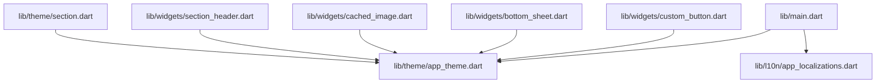
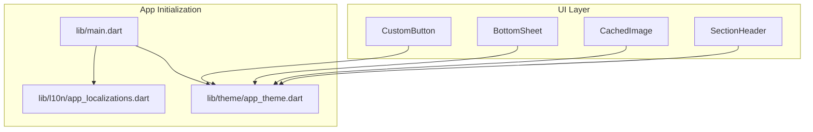
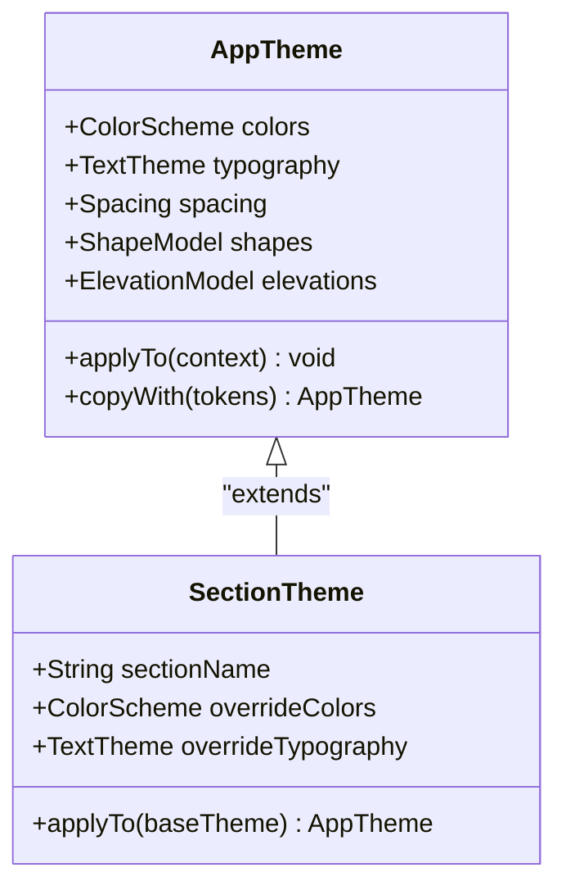
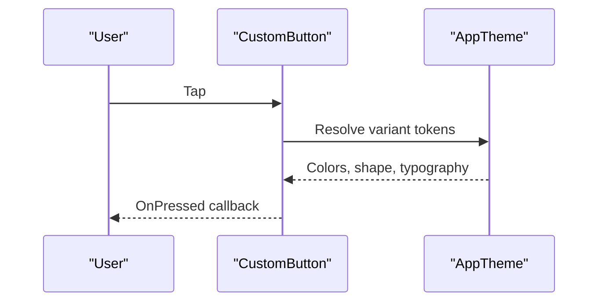
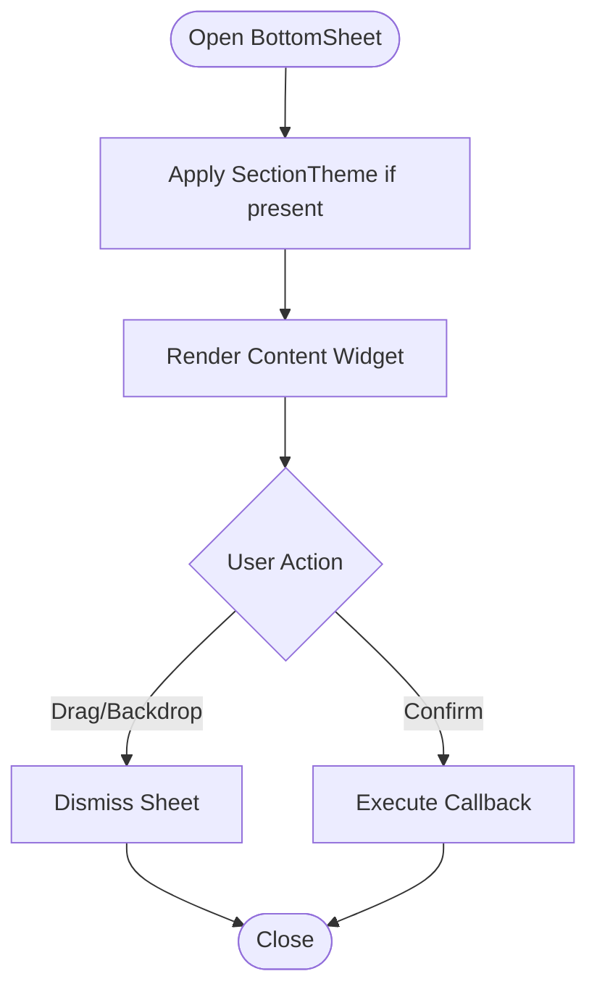
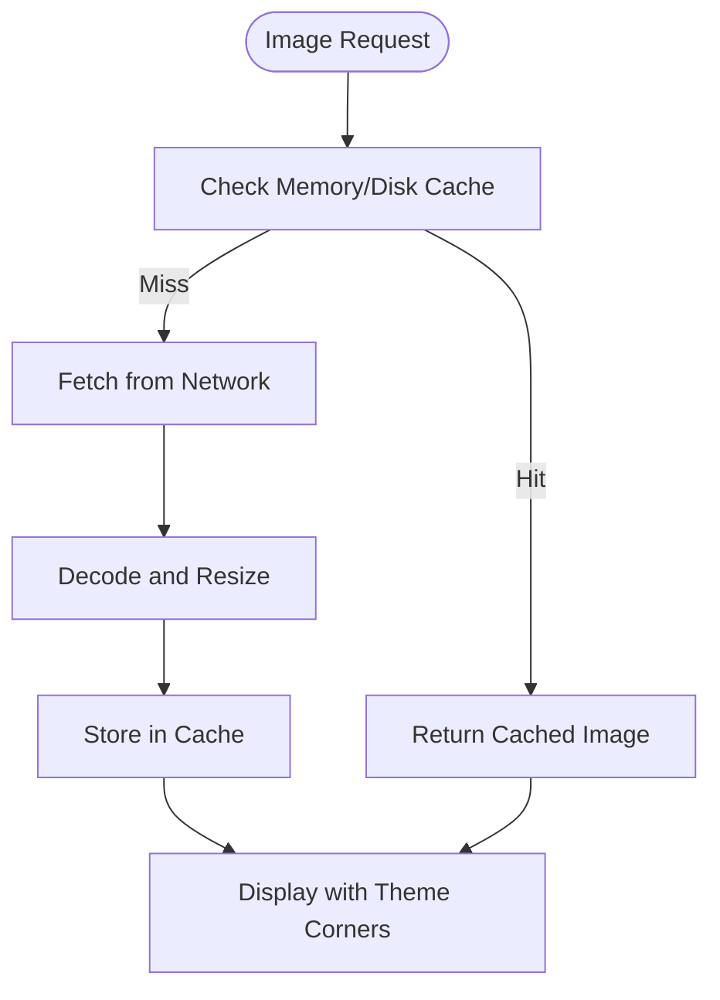
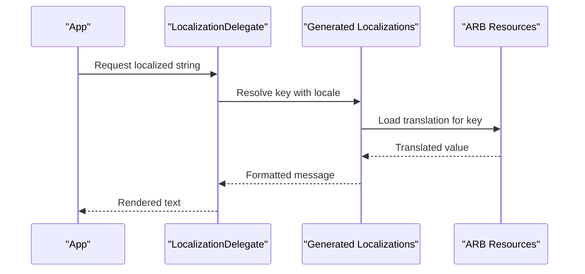
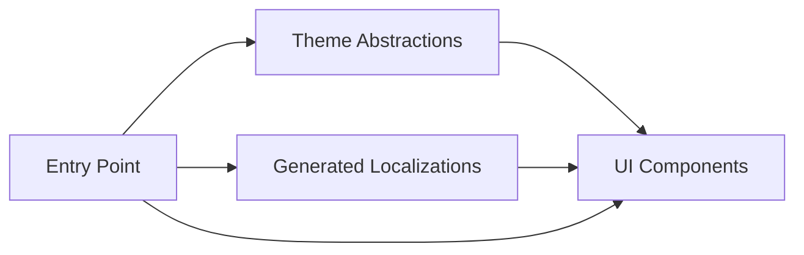

# UI Components & Theming

<cite>
**Referenced Files in This Document**
- [lib/main.dart](file://lib/main.dart)
- [lib/theme/app_theme.dart](file://lib/theme/app_theme.dart)
- [lib/theme/section.dart](file://lib/theme/section.dart)
- [lib/widgets/custom_button.dart](file://lib/widgets/custom_button.dart)
- [lib/widgets/bottom_sheet.dart](file://lib/widgets/bottom_sheet.dart)
- [lib/widgets/cached_image.dart](file://lib/widgets/cached_image.dart)
- [lib/widgets/section_header.dart](file://lib/widgets/section_header.dart)
- [lib/l10n/app_localizations.dart](file://lib/l10n/app_localizations.dart)
- [lib/l10n/app_en.arb](file://lib/l10n/app_en.arb)
- [lib/l10n/app_zh.arb](file://lib/l10n/app_zh.arb)
- [l10n.yaml](file://l10n.yaml)
</cite>

## Table of Contents
1. [Introduction](#introduction)
2. [Project Structure](#project-structure)
3. [Core Components](#core-components)
4. [Architecture Overview](#architecture-overview)
5. [Detailed Component Analysis](#detailed-component-analysis)
6. [Dependency Analysis](#dependency-analysis)
7. [Performance Considerations](#performance-considerations)
8. [Troubleshooting Guide](#troubleshooting-guide)
9. [Conclusion](#conclusion)

## Introduction
This document describes the user interface components and theming system of MoviePilot Mobile. It covers the component architecture, reusable UI elements, design system implementation, theme configuration, localization and internationalization, and practical guidance for customization, accessibility, cross-platform consistency, and performance optimization.

## Project Structure
MoviePilot Mobile organizes UI-related code under dedicated folders:
- Theme definitions and design tokens live in the theme module.
- Reusable UI widgets are centralized in the widgets module.
- Localization resources and generated code reside in the l10n module.
- The application entry point initializes the app and applies global theme and localization settings.

**Diagram sources**
- [lib/main.dart](file://lib/main.dart)
- [lib/theme/app_theme.dart](file://lib/theme/app_theme.dart)
- [lib/theme/section.dart](file://lib/theme/section.dart)
- [lib/widgets/custom_button.dart](file://lib/widgets/custom_button.dart)
- [lib/widgets/bottom_sheet.dart](file://lib/widgets/bottom_sheet.dart)
- [lib/widgets/cached_image.dart](file://lib/widgets/cached_image.dart)
- [lib/widgets/section_header.dart](file://lib/widgets/section_header.dart)
- [lib/l10n/app_localizations.dart](file://lib/l10n/app_localizations.dart)

**Section sources**
- [lib/main.dart](file://lib/main.dart)
- [lib/theme/app_theme.dart](file://lib/theme/app_theme.dart)
- [lib/theme/section.dart](file://lib/theme/section.dart)
- [lib/widgets/custom_button.dart](file://lib/widgets/custom_button.dart)
- [lib/widgets/bottom_sheet.dart](file://lib/widgets/bottom_sheet.dart)
- [lib/widgets/cached_image.dart](file://lib/widgets/cached_image.dart)
- [lib/widgets/section_header.dart](file://lib/widgets/section_header.dart)
- [lib/l10n/app_localizations.dart](file://lib/l10n/app_localizations.dart)

## Core Components
This section documents the primary UI components and their roles in the design system.

- CustomButton
  - Purpose: A reusable button component that encapsulates styling, states, and interaction behavior.
  - Typical usage: Used across screens for actions like confirm, cancel, navigation, and controls.
  - Customization: Supports variants, sizes, and disabled states via constructor parameters.

- BottomSheet
  - Purpose: A flexible bottom sheet container for presenting contextual actions or forms.
  - Typical usage: Settings panels, filters, quick actions, and secondary content overlays.
  - Customization: Accepts content widgets, sizing constraints, and presentation modes.

- CachedImage
  - Purpose: An optimized image loader with caching to improve performance and reduce network usage.
  - Typical usage: Posters, avatars, backgrounds, and media thumbnails.
  - Customization: Supports placeholders, error fallbacks, and resize configurations.

- SectionHeader
  - Purpose: A header component for grouping related items or content sections.
  - Typical usage: Lists, grids, and content panes with labeled subsections.
  - Customization: Text label, optional actions, and alignment options.

These components rely on the shared theme to maintain consistent appearance and behavior across platforms.

**Section sources**
- [lib/widgets/custom_button.dart](file://lib/widgets/custom_button.dart)
- [lib/widgets/bottom_sheet.dart](file://lib/widgets/bottom_sheet.dart)
- [lib/widgets/cached_image.dart](file://lib/widgets/cached_image.dart)
- [lib/widgets/section_header.dart](file://lib/widgets/section_header.dart)

## Architecture Overview
The UI architecture follows a layered pattern:
- Entry point initializes the app, sets up localization delegates, and applies the global theme.
- Widgets consume theme data to render consistent visuals.
- Localization resources are generated from ARB files and exposed via generated code.

**Diagram sources**
- [lib/main.dart](file://lib/main.dart)
- [lib/l10n/app_localizations.dart](file://lib/l10n/app_localizations.dart)
- [lib/theme/app_theme.dart](file://lib/theme/app_theme.dart)
- [lib/widgets/custom_button.dart](file://lib/widgets/custom_button.dart)
- [lib/widgets/bottom_sheet.dart](file://lib/widgets/bottom_sheet.dart)
- [lib/widgets/cached_image.dart](file://lib/widgets/cached_image.dart)
- [lib/widgets/section_header.dart](file://lib/widgets/section_header.dart)

## Detailed Component Analysis

### Theme System
The theme module defines the design system and provides a unified palette and typographic scale.

- Design Tokens
  - Color scheme: Includes primary, secondary, surface, background, and status colors for light and dark modes.
  - Typography: Defines headline, body, and caption scales with font weights and line heights.
  - Spacing: Establishes a consistent spacing scale for margins, paddings, and gaps.
  - Shapes: Provides radius presets for cards, buttons, and interactive elements.
  - Elevation: Specifies shadow levels for modals, sheets, and floating elements.

- Theme Application
  - Global theme: Applied at the app root to ensure all widgets inherit consistent styles.
  - Mode switching: Supports dynamic light/dark mode updates without rebuilding the tree.
  - Section-specific themes: Specialized sections can override parts of the base theme locally.

- Extensibility
  - Variant creation: New button variants, text styles, and component appearances can be added by extending theme data.
  - Token overrides: Components can customize individual tokens while preserving overall coherence.

**Diagram sources**
- [lib/theme/app_theme.dart](file://lib/theme/app_theme.dart)
- [lib/theme/section.dart](file://lib/theme/section.dart)

**Section sources**
- [lib/theme/app_theme.dart](file://lib/theme/app_theme.dart)
- [lib/theme/section.dart](file://lib/theme/section.dart)

### CustomButton Component
- Purpose: Encapsulates button styling and behavior using theme tokens.
- States: Normal, hover, focus, pressed, disabled.
- Variants: Primary, secondary, outline, ghost, icon, and text.
- Sizing: Small, medium, large.
- Accessibility: Supports semantic labels and keyboard navigation.

**Diagram sources**
- [lib/widgets/custom_button.dart](file://lib/widgets/custom_button.dart)
- [lib/theme/app_theme.dart](file://lib/theme/app_theme.dart)

**Section sources**
- [lib/widgets/custom_button.dart](file://lib/widgets/custom_button.dart)
- [lib/theme/app_theme.dart](file://lib/theme/app_theme.dart)

### BottomSheet Component
- Purpose: Presents content from the bottom with smooth transitions and backdrop interactions.
- Behavior: Supports draggable dismissal, persistent content, and safe area insets.
- Theming: Adapts background, elevation, and corner radii from the current theme.

**Diagram sources**
- [lib/widgets/bottom_sheet.dart](file://lib/widgets/bottom_sheet.dart)
- [lib/theme/section.dart](file://lib/theme/section.dart)

**Section sources**
- [lib/widgets/bottom_sheet.dart](file://lib/widgets/bottom_sheet.dart)
- [lib/theme/section.dart](file://lib/theme/section.dart)

### CachedImage Component
- Purpose: Efficiently loads and caches remote images with placeholder and error handling.
- Optimization: Uses memory and disk caching, resize constraints, and progressive loading indicators.
- Theming: Respects rounded corners and shadows from the current theme context.

**Diagram sources**
- [lib/widgets/cached_image.dart](file://lib/widgets/cached_image.dart)
- [lib/theme/app_theme.dart](file://lib/theme/app_theme.dart)

**Section sources**
- [lib/widgets/cached_image.dart](file://lib/widgets/cached_image.dart)
- [lib/theme/app_theme.dart](file://lib/theme/app_theme.dart)

### SectionHeader Component
- Purpose: Provides a consistent header for grouping content sections.
- Theming: Uses headline typography and accent colors from the current theme.
- Interaction: Optional action button or menu for filtering or sorting.

**Section sources**
- [lib/widgets/section_header.dart](file://lib/widgets/section_header.dart)
- [lib/theme/app_theme.dart](file://lib/theme/app_theme.dart)

### Localization and Internationalization
- Resources: ARB files define localized messages for supported languages.
- Generation: The build process generates strongly-typed localization delegates.
- Delegates: App delegates are configured at startup to resolve locale-specific strings.
- Language Switching: The app can update locale dynamically and rebuild affected subtrees.

**Diagram sources**
- [lib/l10n/app_localizations.dart](file://lib/l10n/app_localizations.dart)
- [lib/l10n/app_en.arb](file://lib/l10n/app_en.arb)
- [lib/l10n/app_zh.arb](file://lib/l10n/app_zh.arb)
- [l10n.yaml](file://l10n.yaml)

**Section sources**
- [lib/l10n/app_localizations.dart](file://lib/l10n/app_localizations.dart)
- [lib/l10n/app_en.arb](file://lib/l10n/app_en.arb)
- [lib/l10n/app_zh.arb](file://lib/l10n/app_zh.arb)
- [l10n.yaml](file://l10n.yaml)

## Dependency Analysis
The UI stack exhibits low coupling and high cohesion:
- Widgets depend on theme abstractions rather than hardcoded values.
- Theme depends on design tokens and platform-specific adaptations.
- Localization is decoupled from UI logic via generated delegates.
- Entry point composes theme and localization into a cohesive app shell.

**Diagram sources**
- [lib/main.dart](file://lib/main.dart)
- [lib/theme/app_theme.dart](file://lib/theme/app_theme.dart)
- [lib/l10n/app_localizations.dart](file://lib/l10n/app_localizations.dart)
- [lib/widgets/custom_button.dart](file://lib/widgets/custom_button.dart)
- [lib/widgets/bottom_sheet.dart](file://lib/widgets/bottom_sheet.dart)
- [lib/widgets/cached_image.dart](file://lib/widgets/cached_image.dart)
- [lib/widgets/section_header.dart](file://lib/widgets/section_header.dart)

**Section sources**
- [lib/main.dart](file://lib/main.dart)
- [lib/theme/app_theme.dart](file://lib/theme/app_theme.dart)
- [lib/l10n/app_localizations.dart](file://lib/l10n/app_localizations.dart)
- [lib/widgets/custom_button.dart](file://lib/widgets/custom_button.dart)
- [lib/widgets/bottom_sheet.dart](file://lib/widgets/bottom_sheet.dart)
- [lib/widgets/cached_image.dart](file://lib/widgets/cached_image.dart)
- [lib/widgets/section_header.dart](file://lib/widgets/section_header.dart)

## Performance Considerations
- Theme Rendering
  - Prefer theme-based styling to avoid per-widget recomputation.
  - Use theme copyWith sparingly; batch updates when changing multiple tokens.
- Image Loading
  - Leverage CachedImage for reduced network requests and improved perceived performance.
  - Set appropriate cache keys and resize targets to minimize memory footprint.
- Bottom Sheets
  - Keep content lightweight; defer heavy computations until opened.
  - Use scrollable regions judiciously to prevent layout thrashing.
- Localization
  - Avoid frequent locale switches during animations; batch UI rebuilds.
  - Use selective rebuilds for subtree updates when toggling language.

[No sources needed since this section provides general guidance]

## Troubleshooting Guide
- Theme Not Applying
  - Verify the theme is applied at the app root and inherited by target widgets.
  - Ensure section-specific overrides do not conflict with global tokens.
- Button Styles Incorrect
  - Confirm variant and size parameters match theme definitions.
  - Check for disabled state conflicts with hover/focus styling.
- Images Not Showing
  - Validate URLs and cache keys; confirm network permissions.
  - Inspect error fallbacks and placeholder visibility.
- Bottom Sheet Behaviors Unexpected
  - Review drag sensitivity and backdrop dismiss settings.
  - Ensure content does not exceed viewport constraints.
- Localization Issues
  - Confirm ARB keys exist and delegates are registered.
  - Check locale resolution order and fallbacks.

**Section sources**
- [lib/theme/app_theme.dart](file://lib/theme/app_theme.dart)
- [lib/widgets/custom_button.dart](file://lib/widgets/custom_button.dart)
- [lib/widgets/cached_image.dart](file://lib/widgets/cached_image.dart)
- [lib/widgets/bottom_sheet.dart](file://lib/widgets/bottom_sheet.dart)
- [lib/l10n/app_localizations.dart](file://lib/l10n/app_localizations.dart)

## Conclusion
MoviePilot Mobile’s UI system emphasizes consistency, reusability, and scalability. The theme module centralizes design decisions, while reusable widgets enforce coherent behavior across screens. Localization and internationalization are integrated via generated delegates and ARB resources. Following the customization and performance guidelines ensures maintainable, accessible, and efficient user experiences across platforms.